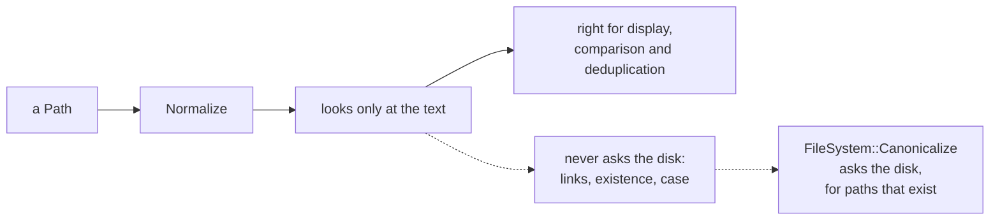

# Path normalize

::note
<!-- sync:needs:start -->

**You'll need**: [Path join](/docs/learn/path-join)
<!-- sync:needs:end -->

::

The same place can be spelled many ways: `Bin/reports`, `Bin//reports`, `Bin/./reports`, `Bin/old/../reports`. That makes paths awkward to compare, to show to a person, or to use as keys. `Path::Normalize` rewrites a path into one tidy spelling — and the most important thing to learn about it is what it _cannot_ know.

## Three rewrites

```rux
func Normalize(allocator, path: Path) -> PathBuffer ! TextError
```

Like `Join`, it builds a new `PathBuffer` and is fallible only because that needs memory. It applies three rules:

- every run of separators becomes one preferred separator — `\` on Windows, `/` elsewhere;
- `.` segments go, because `.` means "right here";
- `..` removes the segment before it.

The lesson's `Tidy` helper converts text and normalizes it, and `Show` prints the before and after side by side:

```rux
func Tidy(allocator: Allocator, text: char8[..]) -> PathBuffer ! TextError {
    var holder = OsString::FromText(allocator, text)?;
    return Normalize(allocator, Path::FromView(holder.View()));
}
```

The output on the page is from Windows; on Linux and macOS the separators are `/`.

| Written                       | Normalized (Windows)  | What happened                           |
| ----------------------------- | --------------------- | --------------------------------------- |
| `Bin//reports/./2026`         | `Bin\reports\2026`    | `//` became one separator, `.` went     |
| `Bin/old/../reports`          | `Bin\reports`         | `..` cancelled `old`                    |
| `Bin/reports/2026/../../logs` | `Bin\logs`            | two `..` cancelled two segments         |
| `../shared/./notes.txt`       | `..\shared\notes.txt` | a leading `..` has nothing to cancel    |
| `/../etc`                     | `\etc`                | at the root there is nowhere further up |
| `Bin/reports/`                | `Bin\reports`         | the trailing separator went             |

## Lexical, not real



The work is **lexical**: it looks only at the text, and never asks the filesystem. That is why it is fast and cannot fail for lack of a file — and it is also the source of its limits:

- `link/..` is dropped even when `link` is a symbolic link to somewhere else entirely, where the real parent is a different directory. The text cannot know.
- The result is not made absolute, and not checked to exist.
- On Windows it is not case-folded, so `bin` and `Bin` still differ although they name one folder.

Use `Normalize` to display, compare or deduplicate paths. When the true answer matters — "are these the same file?" — ask the filesystem: `FileSystem::Canonicalize` resolves links, but only for paths that exist.

## Comparing paths

`Equals` compares two paths unit by unit, exactly as written, so two spellings of one place differ until both are normalized:

```rux
PrintLine("equal as written    {}", one.Equals(two));

let tidyOne = Normalize(allocator, one)?;
let tidyTwo = Normalize(allocator, two)?;
PrintLine("equal normalized    {}", tidyOne.AsPath().Equals(tidyTwo.AsPath()));
```

`Bin//reports` and `Bin/old/../reports` are not equal as written, and are equal once tidied. `Equals` is a method of `Path`, so the two buffers are lent out with `AsPath` first.

## A helper that can fail

`Show` itself is fallible — it calls `Tidy`, which can fail — so every call in `Main` ends in `?`:

```rux
Show(allocator, "Bin//reports/./2026")?;
```

A fallible call that stands alone as a statement must be dealt with, even when its success carries no value. That is the rule from [Discard](/docs/learn/discard), and the next lesson leans on it at every step.

## The program

The whole lesson is one package in the [Examples repository](https://github.com/rux-lang/Examples/tree/main/Files/PathNormalize). Its comments explain every step.

<!-- sync:program:start -->

```rux [Src/Main.rux]
// The same place can be spelled many ways: `Bin/reports`, `Bin//reports`, `Bin/./reports` and
// `Bin/old/../reports`. `Path::Normalize` rewrites a path into one tidy spelling:
//
//     func Normalize(allocator, path: Path) -> PathBuffer ! TextError
//
// - every run of separators becomes one preferred separator: `\` on Windows, `/` elsewhere;
// - `.` segments go, because `.` means "right here";
// - `..` removes the segment before it.
//
// The work is lexical: it looks only at the text and never asks the disk. That is the source of
// its limits, and they are the point of this lesson.
//
// - A leading `..` in a relative path has nothing to cancel, so it stays.
// - At the root there is nowhere further up, so `/..` simply vanishes.
// - `link/..` is dropped even when `link` is a symbolic link to somewhere else entirely, where
//   the real parent is not the same directory. The text cannot know.
// - The result is not made absolute, not checked to exist, and on Windows not case-folded, so
//   `bin` and `Bin` still differ although they name one folder.
//
// Use it to display, compare or deduplicate paths. When the true answer matters, ask the
// filesystem: `FileSystem::Canonicalize` resolves links, but only for paths that exist.
import Allocator::{ Allocator, SystemAllocator };
import Io::PrintLine;
import Path::{ Normalize, OsString, Path, PathBuffer };
import Text::TextError;

func Tidy(allocator: Allocator, text: char8[..]) -> PathBuffer ! TextError {
    var holder = OsString::FromText(allocator, text)?;
    return Normalize(allocator, Path::FromView(holder.View()));
}

func Show(allocator: Allocator, text: char8[..]) -> ! TextError {
    let tidy = Tidy(allocator, text)?;
    PrintLine("{:28} {}", text, tidy.AsPath());
}

func Main() -> ! TextError {
    var system = SystemAllocator();
    let allocator: Allocator = system;

    Show(allocator, "Bin//reports/./2026")?;
    Show(allocator, "Bin/old/../reports")?;
    Show(allocator, "Bin/reports/2026/../../logs")?;
    Show(allocator, "../shared/./notes.txt")?;
    Show(allocator, "/../etc")?;
    Show(allocator, "Bin/reports/")?;
    PrintLine();

    // `Equals` compares units exactly, so two spellings of one place differ until both are
    // normalized.
    var oneHolder = OsString::FromText(allocator, "Bin//reports")?;
    var twoHolder = OsString::FromText(allocator, "Bin/old/../reports")?;
    let one = Path::FromView(oneHolder.View());
    let two = Path::FromView(twoHolder.View());
    PrintLine("equal as written    {}", one.Equals(two));

    let tidyOne = Normalize(allocator, one)?;
    let tidyTwo = Normalize(allocator, two)?;
    PrintLine("equal normalized    {}", tidyOne.AsPath().Equals(tidyTwo.AsPath()));
}
```

Besides `Io`, its `Rux.toml` lists `Allocator`, `Path` and `Text` under `[Dependencies]`.
<!-- sync:program:end -->

## Run it

```sh
cd Examples/Files/PathNormalize
rux run
```

<!-- sync:output:start -->

```
Bin//reports/./2026          Bin\reports\2026
Bin/old/../reports           Bin\reports
Bin/reports/2026/../../logs  Bin\logs
../shared/./notes.txt        ..\shared\notes.txt
/../etc                      \etc
Bin/reports/                 Bin\reports

equal as written    false
equal normalized    true
```

<!-- sync:output:end -->

## Common mistakes

::warning
**Comparing paths with `==`.**\
`one == two` fails with `error: structural equality for 'Path' is unavailable because element type …` — a path holds the system's units, which have no `==` here. Use `one.Equals(two)`, after normalizing both if the spelling may differ.
::

::warning
**Calling `Equals` on a buffer.**\
`tidyOne.Equals(tidyTwo)` fails with `error: struct 'PathBuffer' has no field 'Equals'`. Compare the paths the buffers lend: `tidyOne.AsPath().Equals(tidyTwo.AsPath())`.
::

::warning
**Dropping the `?` on a fallible helper.**\
`Show(allocator, "/../etc");` without the `?` fails with `error: fallible result of type '! TextError' is discarded`, and a note: `a failure that nothing handles is lost`.
::

::warning
**Trusting a normalized path to be safe.**\
`../shared/notes.txt` stays `..\shared\notes.txt`: normalizing does not stop a path from leaving a directory. And `link/..` is tidied away without looking at where `link` points. For security decisions, ask the filesystem.
::

## Try it yourself

1. Normalize `./a/./b/.` and `a/b/../../..`. Predict both before running.
2. Write `func SamePlace(allocator: Allocator, left: char8[..], right: char8[..]) -> bool ! TextError` that normalizes both and compares them.
3. Normalize `Bin` and `bin`, and compare the results. Then ask yourself whether they name the same folder on your system.
4. Join `Bin` and `../secrets.txt` as in [Path join](/docs/learn/path-join), then normalize the result.

## Learn more

- [Path join](/docs/learn/path-join) — `PathBuffer`, which `Normalize` returns
- [Path](/docs/learn/path) — components, which are what `Normalize` rewrites
- [Discard](/docs/learn/discard) — why a fallible statement cannot simply be left alone
- [Metadata](/docs/learn/metadata) — asking the filesystem about a path, instead of reading its text
