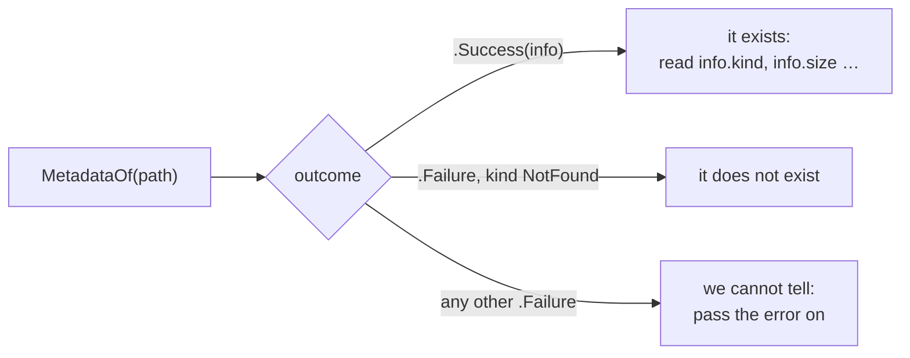

# Metadata

::note
<!-- sync:needs:start -->

**You'll need**: [File](/docs/learn/file), [Enum](/docs/learn/enum), [Match expression](/docs/learn/match-expression)
<!-- sync:needs:end -->

::

**Metadata** is what the filesystem knows about a name without reading the contents: what kind of thing it is, how long it is, whether it may be written and when it last changed. One call asks all of it, and the same call is how a program answers the most common question about a path — does it exist?

## One call

```rux
func MetadataOf(allocator, path: Path, followLinks: bool) -> Metadata ! IoError
```

`followLinks` decides what a symbolic link at the end of the path means. `true` describes the file the link points to — usually what you want — and `false` describes the link itself, which is the only way you will ever see a `SymbolicLink` reported.

An open `File` answers the same question through its own `Metadata` method. That answer is about the file the handle holds, even if the name has since been moved or replaced.

## The answer is a plain struct

| Field         | Type          | Holds                                               |
| ------------- | ------------- | --------------------------------------------------- |
| `kind`        | `FileKind`    | `File`, `Directory`, `SymbolicLink` or `Other`      |
| `size`        | `uint64`      | the length in bytes; zero for a directory           |
| `permissions` | `Permissions` | whether the owner may write: `IsWritable()`         |
| `modified`    | `Timestamp`   | when the contents last changed                      |
| `accessed`    | `Timestamp`   | when the contents were last read                    |
| `linkCount`   | `uint64`      | how many names the contents have; one on most files |

A directory's `size` is zero because what it would mean differs from system to system. `Timestamp` comes from the `Time` package, which has its own lesson in [Date and time](/docs/learn/date-time).

`kind` is an [enum](/docs/learn/enum), and a [match expression](/docs/learn/match-expression) turns it into words. Every case is covered, so the match needs no `else`:

```rux
func KindName(kind: FileKind) -> char8[..] {
    return match kind {
        FileKind::File => "file",
        FileKind::Directory => "directory",
        FileKind::SymbolicLink => "symbolic link",
        FileKind::Other => "other"
    };
}
```

`Other` is a device, a socket, a pipe — anything the filesystem holds that is none of the other three.

## A time that changes on every run

The file is written a moment before it is described, so its modification time is "just now" — a different number on every run. The program prints only whether that was within the last minute, so the output stays the same:

```rux
let age = Timestamp::Now().UnixSeconds() - info.modified.UnixSeconds();
PrintLine("  recent       {}", age < 60);
```

`UnixSeconds` counts seconds since the start of 1970, so subtracting two of them gives the age in seconds.

## "Not found" is an answer

Asking about a name that is not there is not a crash, and not a struct full of zeros. It is a failure whose kind is `NotFound`, which is what makes `MetadataOf` the way to ask "does this exist?". `Describe` matches all three outcomes:

```rux
match MetadataOf(allocator, path, true) {
    .Success(info) => {
        PrintLine("{}", path);
        PrintLine("  kind         {}", KindName(info.kind));
        // …
    },
    .Failure(error) if error.kind == IoErrorKind::NotFound => PrintLine("{}: not found", path),
    .Failure(error) => fail error
}
```



The third arm matters. A `PermissionDenied` does not mean the file is missing — only that this program may not look. Treating every failure as "not there" would turn a permissions problem into a wrong answer.

The program describes the file, then the `Bin` directory it lives in, then deletes the file and asks again, which takes the `NotFound` arm.

## The program

The whole lesson is one package in the [Examples repository](https://github.com/rux-lang/Examples/tree/main/Files/Metadata). Its comments explain every step.

<!-- sync:program:start -->

```rux [Src/Main.rux]
// Metadata is what the filesystem knows about a name without reading the contents: what kind of
// thing it is, how long it is, who may write it and when it last changed. One call asks:
//
//     func MetadataOf(allocator, path: Path, followLinks: bool) -> Metadata ! IoError
//
// `followLinks` decides what a symbolic link at the end of the path means: `true` describes the
// file the link points to, `false` the link itself. An open `File` answers the same question
// through its `Metadata` method, about the file it holds even if the name has since moved.
//
// The answer is a plain struct. `kind` is a `FileKind` enum, `size` is in bytes (and zero for a
// directory, where it means nothing portable), `permissions` says whether the owner may write,
// and `modified` is a `Timestamp` from the `Time` package, which has its own lesson later on.
//
// Asking about a name that is not there is not a crash and not a zero-filled struct: it is a
// failure whose kind is `NotFound`, which makes `MetadataOf` the way to ask "does this exist?".
import Allocator::{ Allocator, SystemAllocator };
import FileSystem::{ DeleteFile, File, FileKind, MetadataOf, OpenOptions };
import Io::{ IoError, IoErrorKind, PrintLine, WriteAll };
import Path::{ OsString, Path };
import Text::TextError;
import Time::Timestamp;

func KindName(kind: FileKind) -> char8[..] {
    return match kind {
        FileKind::File => "file",
        FileKind::Directory => "directory",
        FileKind::SymbolicLink => "symbolic link",
        FileKind::Other => "other"
    };
}

func Describe(allocator: Allocator, text: char8[..]) -> ! IoError | TextError {
    var holder = OsString::FromText(allocator, text)?;
    let path = Path::FromView(holder.View());
    match MetadataOf(allocator, path, true) {
        .Success(info) => {
            PrintLine("{}", path);
            PrintLine("  kind         {}", KindName(info.kind));
            PrintLine("  size         {} bytes", info.size);
            PrintLine("  writable     {}", info.permissions.IsWritable());
            // The seconds since the last change differ on every run, so only whether that was
            // within the last minute is shown.
            let age = Timestamp::Now().UnixSeconds() - info.modified.UnixSeconds();
            PrintLine("  recent       {}", age < 60);
        },
        .Failure(error) if error.kind == IoErrorKind::NotFound => PrintLine("{}: not found", path),
        .Failure(error) => fail error
    }
}

func Main() -> ! IoError | TextError {
    var system = SystemAllocator();
    let allocator: Allocator = system;

    var holder = OsString::FromText(allocator, "Bin/sample.txt")?;
    let path = Path::FromView(holder.View());
    var file = File::Open(allocator, path, OpenOptions::Writing())?;
    WriteAll(file, "0123456789")?;
    file.Close()?;

    Describe(allocator, "Bin/sample.txt")?;
    Describe(allocator, "Bin")?;
    DeleteFile(allocator, path)?;
    Describe(allocator, "Bin/sample.txt")?;
}
```

Besides `Io`, its `Rux.toml` lists `Allocator`, `FileSystem`, `Path`, `Text` and `Time` under `[Dependencies]`.
<!-- sync:program:end -->

## Run it

```sh
cd Examples/Files/Metadata
rux run
```

<!-- sync:output:start -->

```
Bin/sample.txt
  kind         file
  size         10 bytes
  writable     true
  recent       true
Bin
  kind         directory
  size         0 bytes
  writable     true
  recent       true
Bin/sample.txt: not found
```

<!-- sync:output:end -->

## Common mistakes

::warning
**Leaving out a kind.**\
Drop the `FileKind::Other` arm and the match fails with `error: match on 'FileKind' is not exhaustive; missing FileKind::Other`. A file kind you have not thought of is still a file kind.
::

::warning
**Forgetting `followLinks`.**\
`MetadataOf(allocator, path)` fails with `error: call to 'MetadataOf' expects 3 arguments, but 2 were provided`. There is no default: say whether a link at the end of the path should be followed.
::

::warning
**Asking "does it exist?" with `?`.**\
`let info = MetadataOf(allocator, path, true)?;` works while the file is there, and ends the whole program with exit status 1 the moment it is not. When absence is an answer you expect, match the failure, as `Describe` does.
::

::warning
**Reading every failure as "missing".**\
A `.Failure(_) => PrintLine("not found")` arm also catches `PermissionDenied` and every other failure. Check `error.kind == IoErrorKind::NotFound`, and pass the rest on.
::

## Try it yourself

1. Print `info.linkCount` and `info.accessed.UnixSeconds()` for both paths.
2. Describe a path that does not exist at all, such as `Bin/nothing/here.txt`. Which arm runs?
3. Open the file and call its `Metadata` method instead of `MetadataOf`. What does it report for `size`?
4. Write `func Exists(allocator: Allocator, path: Path) -> bool ! IoError` that returns `false` for `NotFound`, `true` for success, and passes any other failure on.

## Learn more

- [Enum](/docs/learn/enum) and [Match expression](/docs/learn/match-expression) — turning a `FileKind` into words
- [Guard](/docs/learn/guard) — the `if` on a match arm that picks out `NotFound`
- [Temporary file](/docs/learn/temporary-file) — which uses `MetadataOf` to check that a file is gone
- [Date and time](/docs/learn/date-time) — `Timestamp` and what else it can do
