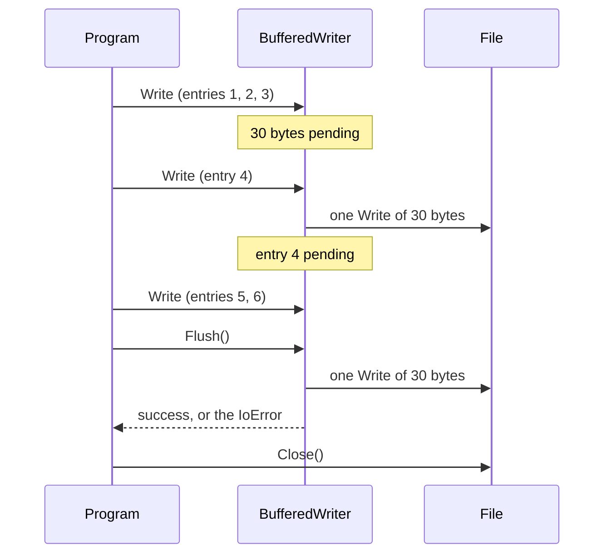

# Buffered I/O

::note
<!-- sync:needs:start -->

**You'll need**: [File](/docs/learn/file), [Interface value](/docs/learn/interface-value), [Destructor](/docs/learn/destructor)
<!-- sync:needs:end -->

::

Every `File::Write` is a request to the operating system, and a request costs about the same for ten bytes as for ten thousand. A program that writes a log line at a time pays that cost per line. `Io::BufferedWriter` stands in between: it gathers small writes in memory and sends them to the file in one large write when its buffer would overflow. The price is a new question — has this byte actually reached the file yet? — and this lesson makes the answer visible.

## A writer in front of the file

```rux
var file = File::Open(allocator, path, OpenOptions::Writing())?;
let sink: Writer = file.Stream();
var buffered = BufferedWriter::New(allocator, sink, 32)?;
```

A buffered writer keeps its destination for as long as it lives, so it needs a stored stream rather than a borrow. `file.Stream()` gives one: a `Writer` [interface value](/docs/learn/interface-value) that refers to `file`. That makes an ordering rule — **the file must outlive the writer**.

The last argument is the buffer's size in bytes. The lesson uses a tiny 32 so it fills quickly; the usual choice is 0, which means the default of 8 KiB. The buffer is memory, so `New` takes an allocator and is fallible.

## Pending until the buffer fills

Each entry is ten bytes. After every write the program prints how many bytes are **pending** in the buffer and how big the file really is:

```rux
for i in 1..=6 {
    buffered.Write("entry ...\n")?;
    PrintLine("{:5}  {:7}  {:7}", i, buffered.Pending(), file.Size()?);
}
```

| Write | Pending | In the file | What happened                               |
| ----- | ------- | ----------- | ------------------------------------------- |
| 1     | 10      | 0           | gathered                                    |
| 2     | 20      | 0           | gathered                                    |
| 3     | 30      | 0           | gathered                                    |
| 4     | 10      | 30          | 40 would not fit in 32: the 30 go out first |
| 5     | 20      | 30          | gathered                                    |
| 6     | 30      | 30          | gathered                                    |
| flush | 0       | 60          | `Flush` sends the rest                      |

Six writes reached the operating system as two. With a real 8 KiB buffer and short lines, it is hundreds to one.



A single write as large as the whole buffer skips it: the writer sends what it holds, then passes the big write straight through, since gathering it would gain nothing.

## Flush, and where its failure goes

A byte that is pending is not in the file, and nothing reading the file can see it. So call `Flush` when the data must be there: before closing the file, before telling anyone it is written, and before reading it back.

```rux
buffered.Flush()?;
PrintLine("flush  {:7}  {:7}", buffered.Pending(), file.Size()?);
file.Close()?;
```

`Flush` returns `! IoError`, and that is where a failed send is reported. The writer's [destructor](/docs/learn/destructor) flushes too, as a safety net — but a destructor has nowhere to report a failure, so there it is discarded. The safety net catches forgetfulness; only an explicit `Flush` tells you whether the bytes arrived.

Reading has a mirror image, `BufferedReader`: it fills its buffer with one large read and serves small reads from it, the same trade the other way round.

## The program

The whole lesson is one package in the [Examples repository](https://github.com/rux-lang/Examples/tree/main/Files/BufferedIo). Its comments explain every step.

<!-- sync:program:start -->

```rux [Src/Main.rux]
// Every `File::Write` is a request to the operating system, and a request costs about the same
// for ten bytes as for ten thousand. A program that writes many small pieces pays that cost per
// piece. `Io::BufferedWriter` stands in between: it gathers small writes in memory and sends
// them to the file in one large write when the buffer would overflow. `BufferedReader` does the
// same for reading, filling its buffer with one large read and serving small reads from it.
//
// The price is that a written byte is not in the file yet. It is pending in the buffer until
// the buffer fills or `Flush` sends it, and until then nothing reading the file can see it. So:
//
// - call `Flush` when the data must be in the file: before closing it, before telling anyone it
//   is written, and before reading it back;
// - `Flush` returns `! IoError`, and that is where a failed send is reported. The writer's
//   destructor flushes too, as a safety net, but a destructor has nowhere to report a failure,
//   so it is discarded there.
//
// A buffered writer keeps its destination for as long as it lives, so it needs a stored stream
// rather than a borrow: `file.Stream()` gives one. The file must outlive the writer.
import Allocator::{ Allocator, SystemAllocator };
import FileSystem::{ DeleteFile, File, OpenOptions };
import Io::{ BufferedWriter, IoError, PrintLine, Writer };
import Path::{ OsString, Path };
import Text::TextError;

func Main() -> ! IoError | TextError {
    var system = SystemAllocator();
    let allocator: Allocator = system;
    var holder = OsString::FromText(allocator, "Bin/log.txt")?;
    let path = Path::FromView(holder.View());

    var file = File::Open(allocator, path, OpenOptions::Writing())?;
    let sink: Writer = file.Stream();
    // A tiny 32-byte buffer, so it fills quickly. The usual choice is 0, meaning 8 KiB.
    var buffered = BufferedWriter::New(allocator, sink, 32)?;

    PrintLine("write  pending  in file");
    for i in 1..=6 {
        // Each entry is ten bytes. The fourth no longer fits, so the first three go out first.
        buffered.Write("entry ...\n")?;
        PrintLine("{:5}  {:7}  {:7}", i, buffered.Pending(), file.Size()?);
    }

    buffered.Flush()?;
    PrintLine("flush  {:7}  {:7}", buffered.Pending(), file.Size()?);
    file.Close()?;

    DeleteFile(allocator, path)?;
}
```

Besides `Io`, its `Rux.toml` lists `Allocator`, `FileSystem`, `Path` and `Text` under `[Dependencies]`.
<!-- sync:program:end -->

## Run it

```sh
cd Examples/Files/BufferedIo
rux run
```

<!-- sync:output:start -->

```
write  pending  in file
    1       10        0
    2       20        0
    3       30        0
    4       10       30
    5       20       30
    6       30       30
flush        0       60
```

<!-- sync:output:end -->

## Common mistakes

::warning
**Handing over the file instead of its stream.**\
`BufferedWriter::New(allocator, file, 32)` fails with `error: move-only value 'file' requires an explicit '<-' in argument`, and a note that `'File' prohibits copying`. The writer wants a `Writer` that refers to the file, not the file itself: pass `file.Stream()`.
::

::warning
**Closing the file before flushing.**\
Swap `Flush` and `Close` and the last 30 bytes never arrive: the file ends at 30 bytes, not 60. The explicit `Flush` after `Close` fails and ends the program with status 1; leave it out and the destructor's flush fails silently instead. Flush first, then close.
::

::warning
**Checking the file too early.**\
`file.Size()` reports what the operating system has, not what you have written. Until the buffer fills or is flushed, the file looks shorter than your program thinks it is.
::

## Try it yourself

1. Change the buffer size to 25, then to 0. Predict the "in file" column each time before you run it.
2. Write one entry of 40 bytes into the 32-byte buffer. What does `Pending` say straight afterwards?
3. Remove the `Flush` call and the `DeleteFile` at the end, run, and look at `Bin/log.txt`. Did the destructor's flush deliver the last entries? Think about when the destructor runs, and when the file was closed.
4. Replace `buffered.Write(…)` with `WriteAll(buffered, …)` and read the error. `BufferedWriter` has a `Write` and a `Flush` — so why is it not a `Writer`? (Hint: look back at how a type implements an interface in [Interface](/docs/learn/interface).)

## Learn more

- [Interface value](/docs/learn/interface-value) — what `let sink: Writer = file.Stream();` holds
- [Destructor](/docs/learn/destructor) — the safety-net flush, and why it cannot report
- [File](/docs/learn/file) — `Write` as one attempt, and `Close` as a fallible step
- [Atomic file](/docs/learn/atomic-file) — a different promise: that a reader never sees a file half-written
