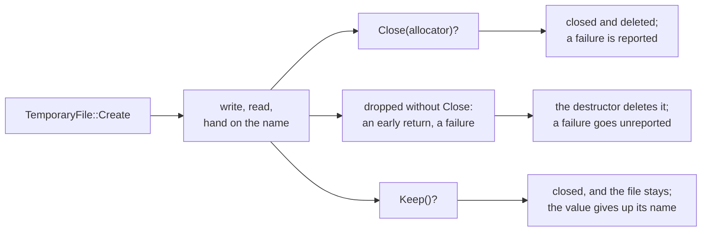

# Temporary file

::note
<!-- sync:needs:start -->

**You'll need**: [Metadata](/docs/learn/metadata), [Destructor](/docs/learn/destructor), [Move](/docs/learn/move)
<!-- sync:needs:end -->

::

A temporary file is scratch space with a name: somewhere to put data too big for memory, or a file to hand to another program. Two things make it harder than opening any file. The name must not clash with another file, and must not be guessable. And the file must not be left behind when the program is done with it — not even when the program leaves early through a failure.

## A name nobody can predict

If another program could predict the name, it could create that name first — perhaps as a link to some other file — and this program would write straight through it. So `TemporaryFile::Create` builds the name from a prefix plus 16 random hex digits, and creates the file only if nothing by that name exists yet; a collision just means the next random name is tried.

```rux
func Create(allocator, directory: Path, prefix: char8[..]) -> TemporaryFile ! IoError
```

```rux
var scratch = TemporaryFile::Create(allocator, directory, "draft-")?;
WriteAll(scratch.file, "work in progress")?;
PrintLine("created            {}", scratch.AsPath().FileName() ?? OsStringView());
```

The name comes out as `draft-` and sixteen hex digits, different on every run. `scratch.file` is an ordinary open `File`, opened for both reading and writing, and `AsPath` lends the full path.

The directory is up to you. `FileSystem::TemporaryDirectory` returns the system's own folder for such files; this program uses the package's `Bin/` folder instead, so you can watch what happens there.

## Three ways to finish

A `TemporaryFile` owns both the open file and its name, so it decides what happens to them:



| Ending              | The file afterwards | A failed delete is…       |
| ------------------- | ------------------- | ------------------------- |
| `Close(allocator)?` | deleted             | reported, as an `IoError` |
| dropped             | deleted             | silently ignored          |
| `Keep()?`           | kept                | — nothing is deleted      |

`Exists` checks the outcome. It asks for the file's [metadata](/docs/learn/metadata) and turns the fallible into a `bool` with `Core::Succeeded` — true for any success — met in [Generic outcome](/docs/learn/generic-outcome):

```rux
func Exists(allocator: Allocator, path: Path) -> bool {
    return Succeeded(MetadataOf(allocator, path, true));
}
```

## Closing: remember the name first

After `Close`, the value no longer has a name — its `AsPath` is empty. To check that the file is gone, the program copies the name into a `PathBuffer` of its own before closing:

```rux
var name = PathBuffer::FromPath(allocator, scratch.AsPath())?;
scratch.Close(allocator)?;
PrintLine("exists after Close {}", Exists(allocator, name.AsPath()));
```

`Close` closes the file, deletes it, and reports whether the deletion worked.

## Dropping: the destructor cleans up

`Forgotten` creates a temporary file, writes to it, and returns without closing it:

```rux
func Forgotten(allocator: Allocator, directory: Path) -> PathBuffer ! IoError | TextError {
    var scratch = TemporaryFile::Create(allocator, directory, "draft-")?;
    WriteAll(scratch.file, "never finished")?;
    var name = PathBuffer::FromPath(allocator, scratch.AsPath())?;
    return <-name;
}
```

When `Forgotten` returns, `scratch` goes out of scope and its [destructor](/docs/learn/destructor) deletes the file. The same happens if any `?` in the function passes a failure on, which is the point: no path out of the function leaves the file behind. The name comes back as a `PathBuffer` moved out with `<-`, as in [Move](/docs/learn/move), and `Main` confirms the file no longer exists.

The safety net has the same limit as the one in [Buffered I/O](/docs/learn/buffered-io): a destructor cannot report a failure, so a delete that fails there goes unnoticed. Call `Close` when you want to know.

## The program

The whole lesson is one package in the [Examples repository](https://github.com/rux-lang/Examples/tree/main/Files/TemporaryFile). Its comments explain every step.

<!-- sync:program:start -->

```rux [Src/Main.rux]
// A temporary file is scratch space with a name: somewhere to put data that is too big for
// memory, or a name to hand to another program. Two things make that harder than it sounds.
//
// The name must not clash, and must not be guessable. If another program could predict it, it
// could create that name first, perhaps as a link to some other file, and this program would
// write through it. `TemporaryFile::Create` builds the name from a prefix plus 16 random hex
// digits, and creates the file only if nothing by that name exists yet.
//
//     func Create(allocator, directory: Path, prefix: char8[..]) -> TemporaryFile ! IoError
//
// And the file must not be left behind. A `TemporaryFile` owns both the open file and its name.
// `Close` closes and deletes it, and reports whether the deletion worked. If the value is
// dropped without `Close`, its destructor deletes the file anyway, on early returns and failure
// paths too, but a destructor cannot report a failure, so it stays quiet about one. `Keep`
// closes the file and gives up the name, for a file that should outlive the value.
//
// `FileSystem::TemporaryDirectory` returns the system's folder for such files. This program
// uses this package's own `Bin/` folder instead. The name is random, so it differs on every run.
import Allocator::{ Allocator, SystemAllocator };
import Core::Succeeded;
import FileSystem::{ MetadataOf, TemporaryFile };
import Io::{ IoError, PrintLine, WriteAll };
import Path::{ OsString, OsStringView, Path, PathBuffer };
import Text::TextError;

func Exists(allocator: Allocator, path: Path) -> bool {
    return Succeeded(MetadataOf(allocator, path, true));
}

// Creates a temporary file, writes to it, and returns without closing it.
func Forgotten(allocator: Allocator, directory: Path) -> PathBuffer ! IoError | TextError {
    var scratch = TemporaryFile::Create(allocator, directory, "draft-")?;
    WriteAll(scratch.file, "never finished")?;
    var name = PathBuffer::FromPath(allocator, scratch.AsPath())?;
    return <-name;
}

func Main() -> ! IoError | TextError {
    var system = SystemAllocator();
    let allocator: Allocator = system;
    var holder = OsString::FromText(allocator, "Bin")?;
    let directory = Path::FromView(holder.View());

    var scratch = TemporaryFile::Create(allocator, directory, "draft-")?;
    // `file` is an ordinary open `File`, opened for reading and writing.
    WriteAll(scratch.file, "work in progress")?;
    PrintLine("created            {}", scratch.AsPath().FileName() ?? OsStringView());
    PrintLine("exists while held  {}", Exists(allocator, scratch.AsPath()));

    // Remember the name, because after `Close` the value no longer has one.
    var name = PathBuffer::FromPath(allocator, scratch.AsPath())?;
    scratch.Close(allocator)?;
    PrintLine("exists after Close {}", Exists(allocator, name.AsPath()));

    let forgotten = Forgotten(allocator, directory)?;
    PrintLine("exists after drop  {}", Exists(allocator, forgotten.AsPath()));
}
```

Besides `Io`, its `Rux.toml` lists `Allocator`, `Core`, `FileSystem`, `Path` and `Text` under `[Dependencies]`.
<!-- sync:program:end -->

## Run it

```sh
cd Examples/Files/TemporaryFile
rux run
```

<!-- sync:output:start -->

```
created            draft-08bf264c6b30a0cc
exists while held  true
exists after Close false
exists after drop  false
```

<!-- sync:output:end -->

## Common mistakes

::warning
**Returning the borrowed path.**\
If `Forgotten` returned `scratch.AsPath()` as a `Path`, it would compile — and crash when `Main` used it. A `Path` only borrows its units, and these belong to `scratch`, which is destroyed as the function returns. Copy the name into a `PathBuffer` that owns its units, as the lesson does.
::

::warning
**Returning a buffer without `<-`.**\
`return name;` fails with `error: move-only value 'name' requires an explicit '<-' in return`, and a note that `'PathBuffer' prohibits copying`. Write `return <-name;`.
::

::warning
**Asking for the name after `Close`.**\
Once closed, the value has given its name up: `scratch.AsPath()` is an empty path. Copy the name first if you still need it.
::

::warning
**Declaring it with `let`.**\
`let scratch = TemporaryFile::Create(…)?;` makes writing fail with `error: argument 1 to 'WriteAll' cannot borrow a part of immutable 'scratch' as '&var Writer'`, and `Close` with `cannot call 'Close' on immutable 'scratch'`.
::

## Try it yourself

1. Replace `scratch.Close(allocator)?` with `scratch.Keep()?`. Does the file survive the program? Look in `Bin/`, and delete it by hand afterwards.
2. Create the file in the system's folder instead: `var temporary = TemporaryDirectory(allocator)?;` gives a `PathBuffer`, and `temporary.AsPath()` is the directory.
3. Make `Forgotten` fail on purpose after writing — for example with `fail IoError::Of(IoErrorKind::Other);` — so that the program ends with status 1. Is a `draft-` file left in `Bin/` afterwards?
4. Create two temporary files with the same prefix and print both names.

## Learn more

- [Destructor](/docs/learn/destructor) — what runs when `scratch` goes out of scope
- [Move](/docs/learn/move) — returning the `PathBuffer` with `<-`
- [Metadata](/docs/learn/metadata) — how `Exists` asks whether a file is there
- [Atomic file](/docs/learn/atomic-file) — a temporary file put to work: replacing another file whole
