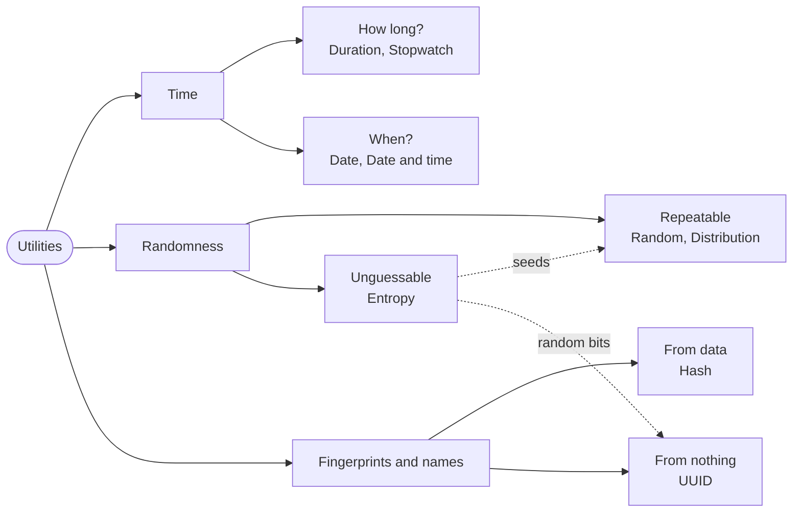

# Part 20: Utilities

Four small standard packages that almost every real program reaches for sooner or later: `Time` for spans, clocks and calendar dates, `Random` and `Entropy` for numbers you cannot predict — or deliberately can — `Hash` for fingerprints, and `Uuid` for names nobody else will pick. Each lesson is short and stands on its own, and together they show how the standard library speaks about failure: a step that may not fit returns an optional, and a request the system may refuse returns a fallible.

## What you will learn

- Spans of time with `Duration`, where every step that could overflow says so in its type.
- Measuring elapsed time with `Instant`, the clock that never goes backwards.
- Calendar dates and the leap-year rule, and reading dates with errors that point at the faulty byte.
- Moments in time: a `DateTime` with a `UtcOffset`, RFC 3339 text, and comparing moments through `Timestamp`.
- Seeded generators that replay the same numbers, and distributions that shape them into dice, shuffles and bell curves.
- Unpredictable bytes from the operating system, and why a failure there must never be papered over.
- Fast, non-cryptographic hashes and checksums, all at once or piece by piece.
- Creating, printing and strictly parsing UUIDs.

## The part at a glance



## Lessons

## Lessons

<!-- sync:lessons:start -->

|      | Lesson                                   | What you will learn                                          |
| ---- | ---------------------------------------- | ------------------------------------------------------------ |
| 20.1 | [Duration](/docs/learn/duration)         | lengths of time, and arithmetic on them                      |
| 20.2 | [Stopwatch](/docs/learn/stopwatch)       | measure how long something takes                             |
| 20.3 | [Date](/docs/learn/date)                 | calendar dates, parsing them, and leap years                 |
| 20.4 | [Date and time](/docs/learn/date-time)   | a date with a time and an offset, in RFC 3339                |
| 20.5 | [Random](/docs/learn/random)             | a reproducible random number generator                       |
| 20.6 | [Distribution](/docs/learn/distribution) | draw from a range, shuffle, and sample a normal distribution |
| 20.7 | [Entropy](/docs/learn/entropy)           | unpredictable bytes from the operating system                |
| 20.8 | [Hash](/docs/learn/hash)                 | fast non-cryptographic hashes and checksums                  |
| 20.9 | [UUID](/docs/learn/uuid)                 | create, print and parse UUIDs                                |

<!-- sync:lessons:end -->

## Before you start

This part leans on the native outcomes: [Part 8: Optionals](/docs/learn/optionals) for every `Duration?` and `Date?`, and [Part 9: Errors](/docs/learn/errors) for parsing and for requests the system may refuse. The randomness lessons pass generators as [mutable references](/docs/learn/mutable-reference) and call [generic](/docs/learn/generic) functions, and Entropy and Hash hand bytes over through [pointers](/docs/learn/pointer) from [Part 15: Memory](/docs/learn/memory). Each lesson's package is in the Examples repository's `Utilities/` folder:

```sh
cd Examples/Utilities/Duration
rux run
```

A few lessons print something different on every run — a random key, a die roll, a fresh UUID. Their pages say which lines to expect to change.

## After this part

[Part 21: Data formats](/docs/learn/data-formats) reads and writes JSON and TOML, the formats programs use to exchange and configure data.

Before moving on, try the checkpoint projects. [Guess](/docs/learn/guess) is a number-guessing game whose secret comes from a generator seeded with entropy; [Age](/docs/learn/age) works out an age in years, months and days from two dates; [Password](/docs/learn/password) draws a password straight from the system's entropy without favouring any character; and [Launch](/docs/learn/launch) counts down to a rocket launch with `SleepFor`.

For the language rules this part relies on, see [Structs](/docs/lang/structs/overview), [Enums](/docs/lang/enums/overview) and [Pointers](/docs/lang/pointers/overview) in the Rux Reference.
