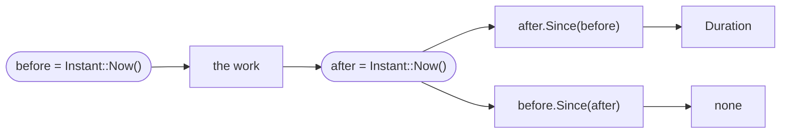

# Stopwatch

::note
<!-- sync:needs:start -->

**You'll need**: [Duration](/docs/learn/duration), [Catch](/docs/learn/catch)
<!-- sync:needs:end -->

::

To find out how long something takes, read a clock before it, read it again after, and subtract. The interesting question is _which_ clock. This lesson uses `Instant`, a clock made for exactly this job, and shows the one way the subtraction can go wrong.

Timing is also the first thing in this course whose output is different on every run. The program deals with that honestly: it prints only facts that hold every time, never the measured numbers themselves.

```rux
import Time::{ Duration, Instant, SleepFor };
```

## Two kinds of clock

A computer has two clocks, and they answer different questions.

|                           | `Instant` (monotonic)                       | `Timestamp` (wall clock)                  |
| ------------------------- | ------------------------------------------- | ----------------------------------------- |
| Answers                   | how much time passed                        | what time it is                           |
| Can go backwards          | never                                       | yes — when someone or the network sets it |
| Means anything on its own | no: it counts from an origin picked at boot | yes: seconds since 1970-01-01 UTC         |
| Printable with `{}`       | no                                          | yes, as RFC 3339 text                     |

The wall clock is the wrong tool for timing: if it is set back an hour in the middle of a measurement, the measurement comes out an hour short. An `Instant` only ever moves forward, so the difference between two readings is always the time that passed. You will meet `Timestamp` properly in [Date and time](/docs/learn/date-time).

## Elapsed time

`Instant::Now()` takes a reading, and `Elapsed()` is the time from that reading until now. Here it times a 50 ms sleep:

```rux
let nap = Duration::FromMilliseconds(50);
let started = Instant::Now();
```

`SleepFor` returns `! TimeError`, because the system may refuse to wait. A bare call would be an error, so the program [catches](/docs/learn/catch) the failure and gives up — with nothing slept, there is nothing to measure:

```rux
SleepFor(nap) catch {
    else => {
        PrintLine("the system refused to sleep");
        return 1;
    }
};
let napped = started.Elapsed();
```

A sleep lasts _at least_ as long as asked, plus whatever it took the system to wake the program up again. So `napped` is a little over 50 ms, by an amount that changes every run. The program prints the fact that holds every time instead of the number:

```rux
let oversleep = napped.Minus(nap) ?? Duration::Zero();
PrintLine("asked to sleep for {}", nap);
PrintLine("slept at least that long: {}", !oversleep.IsNegative());
```

## Timing a piece of work

The usual pattern is two readings around the work:

```rux
let before = Instant::Now();
var sum: uint64 = 0;
for i in 0..1000000 {
    sum += i as uint64;
}
let after = Instant::Now();
```

`later.Since(earlier)` gives the `Duration` between them. It answers `Duration?`, and that is the safety catch: given the readings the wrong way round, it returns `none` rather than a huge or negative number.

```rux
match after.Since(before) {
    took? => PrintLine("the loop took more than no time: {}", !took.IsZero()),
    none => PrintLine("the clock went backwards")
}
match before.Since(after) {
    took? => PrintLine("reversed: {}", took),
    none => PrintLine("reversed: none, because the argument was the later reading")
}
```



`start.Elapsed()` is shorthand for `Instant::Now().Since(start)` that can never be the wrong way round, which is why it returns a plain `Duration`.

## The program

The whole lesson is one package in the [Examples repository](https://github.com/rux-lang/Examples/tree/main/Utilities/Stopwatch). Its comments explain every step.

<!-- sync:program:start -->

```rux [Src/Main.rux]
// To time something, read a clock before and after and subtract. The clock to read is `Instant`:
// a monotonic clock, which only ever moves forward. The wall clock is the wrong tool, because
// someone (or the network) can set it back an hour in the middle of the measurement.
//
// An `Instant` has no meaning on its own. It counts from an origin the system picked at boot,
// so it cannot be printed as a time of day; it is only good for comparing with another reading
// from the same run. `later.Since(earlier)` gives the `Duration` between two readings, and
// `start.Elapsed()` is shorthand for "since start, until now".
//
// How long anything takes depends on the machine and on what else it is doing, so a measured
// number changes from run to run. This program prints only what is true on every run: that a
// sleep of 50 ms took at least 50 ms, and that readings never go backwards.
import Io::PrintLine;
import Time::{ Duration, Instant, SleepFor };

func Main() -> int {
    let nap = Duration::FromMilliseconds(50);
    let started = Instant::Now();

    // Sleeping can fail if the system refuses to wait. Then there is nothing to measure.
    SleepFor(nap) catch {
        else => {
            PrintLine("the system refused to sleep");
            return 1;
        }
    };
    let napped = started.Elapsed();

    // `napped` is a little over 50 ms, by an amount that differs every run, so compare it rather
    // than print it. Subtracting the request leaves the oversleep, which is never negative.
    let oversleep = napped.Minus(nap) ?? Duration::Zero();
    PrintLine("asked to sleep for {}", nap);
    PrintLine("slept at least that long: {}", !oversleep.IsNegative());

    // Timing some work: take a reading, do the work, take another.
    let before = Instant::Now();
    var sum: uint64 = 0;
    for i in 0..1000000 {
        sum += i as uint64;
    }
    let after = Instant::Now();
    PrintLine("sum of 0..1000000 = {}", sum);

    // `Since` wants the earlier reading as its argument. Asked the wrong way round it gives
    // `none` instead of a huge or negative duration, so a swapped pair cannot go unnoticed.
    match after.Since(before) {
        took? => PrintLine("the loop took more than no time: {}", !took.IsZero()),
        none => PrintLine("the clock went backwards")
    }
    match before.Since(after) {
        took? => PrintLine("reversed: {}", took),
        none => PrintLine("reversed: none, because the argument was the later reading")
    }
    return 0;
}
```

Besides `Io`, its `Rux.toml` lists `Time` under `[Dependencies]`.
<!-- sync:program:end -->

## Run it

```sh
cd Examples/Utilities/Stopwatch
rux run
```

<!-- sync:output:start -->

```
asked to sleep for 0.05s
slept at least that long: true
sum of 0..1000000 = 499999500000
the loop took more than no time: true
reversed: none, because the argument was the later reading
```

The measured times differ on every run, so the program prints only facts about them that hold
every time.
<!-- sync:output:end -->

Every line is the same on every run, because none of them prints a measured time.

## Common mistakes

::warning
**Printing an `Instant`.**\
An instant has no meaning outside the run that took it, so it cannot be printed at all. `PrintLine("started at {}", started)` fails with `error: argument 2 to 'PrintLine' has type 'Instant', but variadic parameter 'args' requires 'Display'`. Print the `Duration` between two instants instead.
::

::warning
**Ignoring a failed sleep.**\
Calling `SleepFor(nap);` on its own fails with `error: fallible result of type '! TimeError' is discarded`. Decide what a refused sleep means: `catch` it, as the program does, or pass it on with `?`.
::

::warning
**Treating `Since` as a duration.**\
`let took: Duration = after.Since(before);` fails with `error: cannot assign 'Duration?' to 'Duration'`. The `none` case is the swapped pair, and a `match` or `??` has to say what to do about it.
::

::warning
**Timing with the wall clock.**\
`Timestamp` has a `Since` method too, so timing with two wall-clock readings compiles and usually gives a sensible answer — until the clock is adjusted mid-measurement. Use `Instant` for anything that measures.
::

## Try it yourself

1. In the first `match`, print `took` with `{:.6}`. Run the program several times and watch the number change.
2. Change the loop to count to 10 000 000. Does the time grow by about ten times?
3. Print `oversleep` itself, in milliseconds, with `TotalMilliseconds`. How much does your system oversleep?
4. Import `Timestamp` and print `Timestamp::Now()` — the wall clock. Its text is in UTC; how far is it from your own clock?

## Learn more

- [Duration](/docs/learn/duration) — the type every measurement here produces
- [Catch](/docs/learn/catch) — handling the failure of `SleepFor`
- [Date and time](/docs/learn/date-time) — the wall clock, and moments that mean something on their own
- [Launch](/docs/learn/launch) — a checkpoint project that counts down with `SleepFor`
