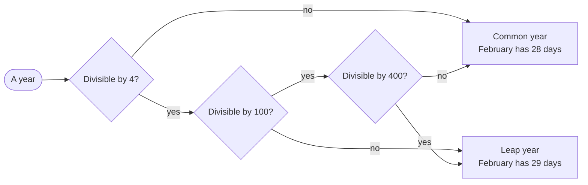

# Date

::note
<!-- sync:needs:start -->

**You'll need**: [Stopwatch](/docs/learn/stopwatch), [Outcome](/docs/learn/outcome), [Catch](/docs/learn/catch), [Variant match](/docs/learn/variant-match)
<!-- sync:needs:end -->

::

A `Date` is a day on the calendar: a year, a month and a day, with no time of day and no time zone. Unlike a duration it is not just a number, because the calendar is irregular — months have 28 to 31 days, and February has a 29th only in a leap year.

That irregularity is what makes dates interesting to read. The text `2023-02-29` is perfectly well-formed, and still wrong: 2023 had no 29 February. A program that reads dates has to tell those cases apart and say which one it found.

```rux
import Time::{ DaysInMonth, IsLeapYear, ParseDate, TimeParseError };
```

## Reading a date

`ParseDate` reads the ISO 8601 form `YYYY-MM-DD` and returns `Date ! TimeParseError`. A [`match`](/docs/learn/outcome) on the outcome handles both sides:

```rux
func Show(text: char8[..]) {
    match ParseDate(text) {
        .Success(date) => PrintLine("{}  ok, day {} of the year", date, date.DayOfYear()),
        .Failure(error) => PrintLine("{}  {}, at byte {}", text, Reason(error), error.Offset())
    }
}
```

A `Date` prints with `{}` in the same `YYYY-MM-DD` form, and `DayOfYear` counts from 1 on 1 January — so 29 February is day 60.

## What went wrong, and where

`TimeParseError` is a [variant](/docs/learn/variant-match): each case names a different mistake, and each carries the byte of the text where the parser found it. `Offset()` reads that byte whatever the case, and `Reason` turns the case into words:

```rux
func Reason(error: TimeParseError) -> char8[..] {
    return match error {
        .InvalidSyntax(_) => "not shaped like YYYY-MM-DD",
        .InvalidMonth(_) => "no such month",
        .NonexistentDay(_) => "no such day in that month",
        .InvalidTime(_) => "time out of range",
        .ExcessiveFraction(_) => "too many fraction digits",
        .InvalidOffset(_) => "offset out of range"
    };
}
```

| Text         | Case             | Byte | Points at                                  |
| ------------ | ---------------- | ---- | ------------------------------------------ |
| `2023-02-29` | `NonexistentDay` | 8    | the day, which February 2023 does not have |
| `2024-13-01` | `InvalidMonth`   | 5    | the month                                  |
| `2024/02/01` | `InvalidSyntax`  | 4    | the `/` where a `-` belongs                |
| `2024-2-1`   | `InvalidSyntax`  | 6    | the `-` where a second month digit belongs |

The last three cases never happen for a date alone. The whole `Time` package shares one error type — the next lesson reads times and offsets with it — so the `match` still covers them all.

A program that knows the byte can do better than "invalid date": it can point at the character that is wrong.

## The leap-year rule



`IsLeapYear` applies the rule, and `DaysInMonth` uses it. The program tries one year of each kind — an ordinary year, a fourth year, and the two kinds of century:

```rux
let years: int32[4] = [2023, 2024, 1900, 2000];
for year in years {
    PrintLine("{}  leap: {}, February has {} days", year, IsLeapYear(year),
        DaysInMonth(year, 2));
}
```

The array is written `int32[4]` on purpose: both functions take the year as an `int32`, and an array of plain literals would be an array of `int`.

## Calendar arithmetic

Date arithmetic follows the calendar, so the day after 28 February depends on the year:

```rux
for text in ["2023-02-28", "2024-02-28"] {
    let date = ParseDate(text) catch { else => continue };
    match date.PlusDays(1) {
        next? => PrintLine("the day after {} is {}", date, next),
        none => PrintLine("the day after {} is out of range", date)
    }
}
```

`PlusDays` returns `Date?`, because a date far enough out leaves the range the package supports: years that four digits can write, up to 9999. The `catch { else => continue }` skips any text that is not a date; here both are.

## The program

The whole lesson is one package in the [Examples repository](https://github.com/rux-lang/Examples/tree/main/Utilities/Date). Its comments explain every step.

<!-- sync:program:start -->

```rux [Src/Main.rux]
// A `Date` is a day on the calendar: a year, a month and a day, with no time and no time zone.
// Unlike a duration it is not just a number, because the calendar is irregular. Months have 28
// to 31 days, and February has a 29th only in a leap year: every fourth year, except a century
// year, except a century divisible by 400. So 2000 was a leap year and 1900 was not.
//
// That makes text such as "2023-02-29" well-formed but wrong. `ParseDate` reads the ISO 8601
// form `YYYY-MM-DD` and returns `Date ! TimeParseError`, and the error says which mistake it
// was (a bad shape, a month that does not exist, a day the month does not have) and at which
// byte of the text, so a program can point at the problem rather than just reject it.
import Io::PrintLine;
import Time::{ DaysInMonth, IsLeapYear, ParseDate, TimeParseError };

func Reason(error: TimeParseError) -> char8[..] {
    return match error {
        .InvalidSyntax(_) => "not shaped like YYYY-MM-DD",
        .InvalidMonth(_) => "no such month",
        .NonexistentDay(_) => "no such day in that month",
        .InvalidTime(_) => "time out of range",
        .ExcessiveFraction(_) => "too many fraction digits",
        .InvalidOffset(_) => "offset out of range"
    };
}

func Show(text: char8[..]) {
    match ParseDate(text) {
        .Success(date) => PrintLine("{}  ok, day {} of the year", date, date.DayOfYear()),
        .Failure(error) => PrintLine("{}  {}, at byte {}", text, Reason(error), error.Offset())
    }
}

func Main() -> int {
    Show("2024-02-29");
    Show("2023-02-29");
    Show("2024-13-01");
    Show("2024/02/01");
    Show("2024-2-1");
    PrintLine("");

    // The leap-year rule: an ordinary year, a fourth year, and the two kinds of century.
    let years: int32[4] = [2023, 2024, 1900, 2000];
    for year in years {
        PrintLine("{}  leap: {}, February has {} days", year, IsLeapYear(year),
            DaysInMonth(year, 2));
    }
    PrintLine("");

    // Date arithmetic follows the calendar, so the day after 28 February depends on the year.
    // `PlusDays` returns `Date?`, because a date far enough out leaves the supported range.
    for text in ["2023-02-28", "2024-02-28"] {
        let date = ParseDate(text) catch { else => continue };
        match date.PlusDays(1) {
            next? => PrintLine("the day after {} is {}", date, next),
            none => PrintLine("the day after {} is out of range", date)
        }
    }
    return 0;
}
```

Besides `Io`, its `Rux.toml` lists `Time` under `[Dependencies]`.
<!-- sync:program:end -->

## Run it

```sh
cd Examples/Utilities/Date
rux run
```

<!-- sync:output:start -->

```
2024-02-29  ok, day 60 of the year
2023-02-29  no such day in that month, at byte 8
2024-13-01  no such month, at byte 5
2024/02/01  not shaped like YYYY-MM-DD, at byte 4
2024-2-1  not shaped like YYYY-MM-DD, at byte 6

2023  leap: false, February has 28 days
2024  leap: true, February has 29 days
1900  leap: false, February has 28 days
2000  leap: true, February has 29 days

the day after 2023-02-28 is 2023-03-01
the day after 2024-02-28 is 2024-02-29
```

<!-- sync:output:end -->

## Common mistakes

::warning
**Leaving out an error case.**\
A `match` on `TimeParseError` must be exhaustive, even for the cases a date cannot produce. Drop the `.InvalidOffset` arm and the compiler says `error: match on 'TimeParseError' is not exhaustive; missing TimeParseError::InvalidOffset`.
::

::warning
**Using the outcome as a date.**\
`ParseDate` returns `Date ! TimeParseError`, which has no date methods. `let leap = ParseDate("2024-02-29");` followed by `leap.DayOfYear()` fails with `error: type 'Date ! TimeParseError' has no field 'DayOfYear'`. Take the date out with `match` or `catch` first.
::

::warning
**Years as plain integers.**\
`let years = [2023, 2024, 1900, 2000];` makes an array of `int`, and passing one on fails with `error: argument 1 to 'IsLeapYear' has type 'int', but parameter 'year' requires 'int32'`. Give the array its type, as the program does.
::

## Try it yourself

1. Add `Show("2100-02-29")` and `Show("2400-02-29")`. Work out the answers with the diagram before you run them.
2. Parse `2024-01-31` and call `PlusMonths(1)`. 31 February does not exist — what does the package do instead?
3. Print `DayOfWeek()` for a date you know. It counts from 0 for Sunday to 6 for Saturday.
4. Parse two dates and print how many days apart they are with `later.DaysSince(earlier)`.

## Learn more

- [Outcome](/docs/learn/outcome) and [Catch](/docs/learn/catch) — the two ways the program handles `Date ! TimeParseError`
- [Variant match](/docs/learn/variant-match) — matching the cases of a variant and their payloads
- [Date and time](/docs/learn/date-time) — adding a time of day and an offset
- [Age](/docs/learn/age) — a checkpoint project that counts years, months and days between two dates
