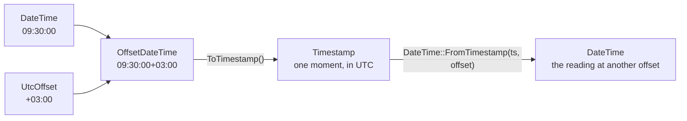

# Date and time

::note
<!-- sync:needs:start -->

**You'll need**: [Date](/docs/learn/date), [Outcome](/docs/learn/outcome), [Coalesce](/docs/learn/coalesce)
<!-- sync:needs:end -->

::

A date and a time of day together make a `DateTime`, such as 2026-10-04T09:30:00. It looks like a moment, but it is not one yet: 09:30 in Kyiv and 09:30 in New York are seven hours apart. What it lacks is an **offset** — how far the local clock was ahead of or behind UTC, the world's reference clock.

This lesson adds the offset, writes the result in RFC 3339 — the date-and-time format of logs, JSON and HTTP — and shows how to tell whether two texts name the same moment.

```rux
import Time::{ DateTime, OffsetDateTime, ParseDateTime, ParseRfc3339, UtcOffset };
```

## Four types for four questions

| Type             | Holds                          | Example                     | Is it one moment?           |
| ---------------- | ------------------------------ | --------------------------- | --------------------------- |
| `Date`           | year, month, day               | `2026-10-04`                | no — a whole day, somewhere |
| `DateTime`       | a date and a time of day       | `2026-10-04T09:30:00`       | no — 09:30 where?           |
| `OffsetDateTime` | a `DateTime` and a `UtcOffset` | `2026-10-04T09:30:00+03:00` | yes                         |
| `Timestamp`      | seconds since 1970-01-01 UTC   | `1791095400`                | yes, with one spelling      |

## A local date and time

`ParseDateTime` reads a date, a `T` and a time. Like `ParseDate` in the [previous lesson](/docs/learn/date), it returns an outcome with a `TimeParseError`, and here a [`catch`](/docs/learn/catch) ends the program if the text is not a date and time:

```rux
let meeting = ParseDateTime("2026-10-04T09:30:00") catch {
    else => {
        PrintLine("not a date and time");
        return 1;
    }
};
PrintLine("local       {}", meeting);
```

There is no offset in the text and none in the value: it prints back as `2026-10-04T09:30:00`.

## Adding an offset

`OffsetDateTime(dateTime, offset)` pairs a reading with the offset it was taken in. `UtcOffset::Of(hours, minutes)` makes the offset, and returns `UtcOffset?` because not every pair is one — no clock is 30 hours ahead of UTC:

```rux
let kyiv = OffsetDateTime(meeting, UtcOffset::Of(3, 0) ?? UtcOffset::Utc());
let newYork = OffsetDateTime(meeting, UtcOffset::Of(-4, 0) ?? UtcOffset::Utc());
```

They print as `2026-10-04T09:30:00+03:00` and `2026-10-04T09:30:00-04:00`: the same clock reading, in two places, so two different moments.

To measure between moments, turn each into a `Timestamp` with `ToTimestamp()`. A timestamp counts seconds since the start of 1970 in UTC, so it has no offset left to disagree about:

```rux
let apart = newYork.ToTimestamp().UnixSeconds() - kyiv.ToTimestamp().UnixSeconds();
PrintLine("apart by    {} s", apart);
```

New York is seven hours behind Kyiv, so its 09:30 comes 25 200 seconds later.



## RFC 3339

RFC 3339 is an `OffsetDateTime` written as text: the date, a `T`, the time, and then either `Z` for UTC or a signed `+HH:MM`. `ParseRfc3339` reads it and returns `OffsetDateTime ! TimeParseError`; printing an `OffsetDateTime` with `{}` writes it back.

This text is the Kyiv meeting again, written in UTC — different text, same moment:

```rux
match ParseRfc3339("2026-10-04T06:30:00Z") {
    .Success(utc) => {
        PrintLine("parsed      {}", utc);
        let same = utc.ToTimestamp().UnixSeconds() == kyiv.ToTimestamp().UnixSeconds();
        PrintLine("same moment as the Kyiv meeting: {}", same);

        // Converting the moment to another offset gives the local reading there.
        let tokyo = UtcOffset::Of(9, 0) ?? UtcOffset::Utc();
        let there = DateTime::FromTimestamp(utc.ToTimestamp(), tokyo);
        PrintLine("in Tokyo    {}", OffsetDateTime(there, tokyo));
    },
    .Failure(error) => PrintLine("rejected at byte {}", error.Offset())
}
```

The comparison is between timestamps, which have one spelling per moment, so `same` is `true`. Going the other way, `DateTime::FromTimestamp` takes a moment and an offset and gives the local reading there: the meeting is at 15:30 in Tokyo.

RFC 3339 requires the offset. Without it the text is only a local reading, so `ParseRfc3339("2026-10-04T09:30:00")` is refused at byte 19 — the end of the text, where the offset should start.

## The program

The whole lesson is one package in the [Examples repository](https://github.com/rux-lang/Examples/tree/main/Utilities/DateTime). Its comments explain every step.

<!-- sync:program:start -->

```rux [Src/Main.rux]
// A date and a time of day together make a `DateTime`, such as 2026-10-04T09:30:00. On its own
// that is not yet a moment: 09:30 in Kyiv and 09:30 in New York are seven hours apart. What it
// lacks is an offset, how far the clock was ahead of or behind UTC, the world's reference clock.
//
// `OffsetDateTime` is a `DateTime` plus a `UtcOffset`, and that is enough to name one moment. Its
// text form is RFC 3339, the format of logs, JSON and HTTP: the date, a `T`, the time, then `Z`
// for UTC or a signed `+HH:MM`. `ParseRfc3339` reads it and returns
// `OffsetDateTime ! TimeParseError`, and printing an `OffsetDateTime` with `{}` writes it back.
//
// Two texts can name the same moment in different offsets. To compare moments, turn each into a
// `Timestamp`, a count of seconds since 1970-01-01 in UTC, which has one spelling per moment.
import Io::PrintLine;
import Time::{ DateTime, OffsetDateTime, ParseDateTime, ParseRfc3339, UtcOffset };

func Main() -> int {
    // A local date and time. There is no offset in it, and none in its text either.
    let meeting = ParseDateTime("2026-10-04T09:30:00") catch {
        else => {
            PrintLine("not a date and time");
            return 1;
        }
    };
    PrintLine("local       {}", meeting);

    // The same reading in two places. `UtcOffset::Of` returns `UtcOffset?`, since 30 hours ahead
    // is not an offset any clock can have.
    let kyiv = OffsetDateTime(meeting, UtcOffset::Of(3, 0) ?? UtcOffset::Utc());
    let newYork = OffsetDateTime(meeting, UtcOffset::Of(-4, 0) ?? UtcOffset::Utc());
    PrintLine("in Kyiv     {}", kyiv);
    PrintLine("in New York {}", newYork);

    // Two different moments, 7 hours (25200 seconds) apart.
    let apart = newYork.ToTimestamp().UnixSeconds() - kyiv.ToTimestamp().UnixSeconds();
    PrintLine("apart by    {} s", apart);

    // RFC 3339 from text. This one is the Kyiv meeting written in UTC: other text, same moment.
    match ParseRfc3339("2026-10-04T06:30:00Z") {
        .Success(utc) => {
            PrintLine("parsed      {}", utc);
            let same = utc.ToTimestamp().UnixSeconds() == kyiv.ToTimestamp().UnixSeconds();
            PrintLine("same moment as the Kyiv meeting: {}", same);

            // Converting the moment to another offset gives the local reading there.
            let tokyo = UtcOffset::Of(9, 0) ?? UtcOffset::Utc();
            let there = DateTime::FromTimestamp(utc.ToTimestamp(), tokyo);
            PrintLine("in Tokyo    {}", OffsetDateTime(there, tokyo));
        },
        .Failure(error) => PrintLine("rejected at byte {}", error.Offset())
    }

    // RFC 3339 requires the offset. Without it, the text stops being a moment.
    match ParseRfc3339("2026-10-04T09:30:00") {
        .Success(moment) => PrintLine("parsed      {}", moment),
        .Failure(error) => PrintLine("no offset   rejected at byte {}", error.Offset())
    }
    return 0;
}
```

Besides `Io`, its `Rux.toml` lists `Time` under `[Dependencies]`.
<!-- sync:program:end -->

## Run it

```sh
cd Examples/Utilities/DateTime
rux run
```

<!-- sync:output:start -->

```
local       2026-10-04T09:30:00
in Kyiv     2026-10-04T09:30:00+03:00
in New York 2026-10-04T09:30:00-04:00
apart by    25200 s
parsed      2026-10-04T06:30:00Z
same moment as the Kyiv meeting: true
in Tokyo    2026-10-04T15:30:00+09:00
no offset   rejected at byte 19
```

<!-- sync:output:end -->

## Common mistakes

::warning
**Passing the optional offset straight in.**\
`UtcOffset::Of` returns `UtcOffset?`. Writing `OffsetDateTime(meeting, UtcOffset::Of(3, 0))` fails with `error: argument 2 to 'OffsetDateTime' has type 'UtcOffset?', but parameter 'offset' requires 'UtcOffset'`. Supply a fallback with `??`, or `match` the `none`.
::

::warning
**Comparing moments with `==`.**\
`utc == kyiv` compiles, and is `false`. It compares the two values field by field — the clock reading and the offset — and those differ even though the moment is the same. Compare their timestamps instead.
::

::warning
**Offsets with mixed signs.**\
Both parts of an offset carry its sign, so −03:30 is `UtcOffset::Of(-3, -30)`. `UtcOffset::Of(-3, 30)` is `none`, and behind a `?? UtcOffset::Utc()` fallback that quietly becomes UTC.
::

::warning
**RFC 3339 text without an offset.**\
`ParseRfc3339` refuses it. If the text really is a local reading, read it with `ParseDateTime`, and decide which offset it is in yourself.
::

## Try it yourself

1. Add a line for Mumbai, five and a half hours ahead of UTC: `UtcOffset::Of(5, 30)`.
2. Parse `2026-10-04T09:30:00.250+03:00`. Is it the same moment as `kyiv`? How does it print?
3. Import `Timestamp`, then print the current time in Kyiv: `DateTime::FromTimestamp(Timestamp::Now(), offset)` paired with that offset.
4. Change the Kyiv offset to `UtcOffset::Of(30, 0)`. What does the program print, and why is a fallback to UTC risky in a real program?

## Learn more

- [Date](/docs/learn/date) — the calendar half of a `DateTime`, and `TimeParseError`
- [Coalesce](/docs/learn/coalesce) — the `??` that supplies each offset's fallback
- [Structural equality](/docs/learn/structural-equality) — what `==` compares on a struct
- [Stopwatch](/docs/learn/stopwatch) — why measuring time uses a different clock from this one
