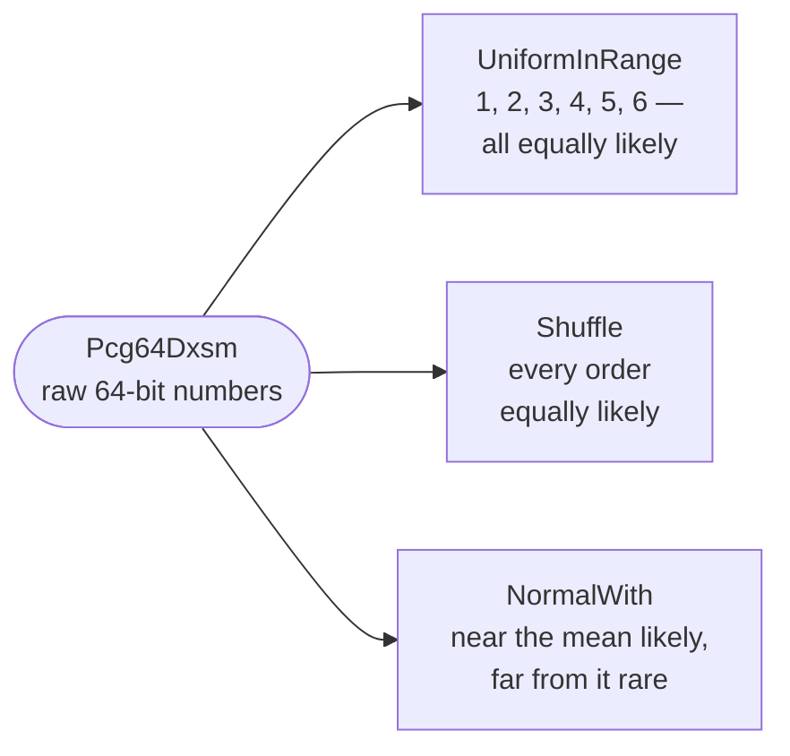

# Distribution

::note
<!-- sync:needs:start -->

**You'll need**: [Random](/docs/learn/random), [Writable slice](/docs/learn/writable-slice), [Format number](/docs/learn/format-number)
<!-- sync:needs:end -->

::

A generator hands out raw 64-bit numbers. What a program wants is almost never that: it wants a die roll from 1 to 6, a deck in a random order, or a height that is usually near the average and only rarely far from it. A **distribution** turns raw numbers into those values, and decides how likely each one is.

Each of these is easy to get subtly wrong by hand, and the mistakes do not show in a quick test. The `Random` package has exact versions, and this lesson tours three of them:

```rux
import Random::{ NormalWith, Pcg64Dxsm, Shuffle, UniformInRange };
```

The generator has a fixed seed, `Pcg64Dxsm(7)`, so — as in [Random](/docs/learn/random) — every run prints the same results.

## Uniform: every value equally likely

`UniformInRange(generator, low, high)` makes every value from `low` to `high` equally likely, **both ends included**. A die is therefore `1, 6`:

```rux
var faces: uint[6] = [0; 6];
for i in 0..6000 {
    let face = UniformInRange<Pcg64Dxsm>(generator, 1, 6);
    faces[face - 1] += 1;
}
```

Six thousand rolls land close to 1000 per face — `1013 956 939 1048 1026 1018` — and never exactly. That is what fair looks like: equally likely is not equally often.

Why not take a raw number and write `raw % 6`? Because 2⁶⁴ is not a multiple of 6. The raw numbers split into six groups that are almost, but not quite, the same size, and the low faces come up very slightly more often. `UniformInRange` corrects for that; `%` does not.

| Function                            | Draws                            | Ends             |
| ----------------------------------- | -------------------------------- | ---------------- |
| `UniformBelow(g, bound)`            | `0` to `bound - 1`               | `bound` excluded |
| `UniformInRange(g, low, high)`      | `low` to `high`                  | both included    |
| `UniformFloatInRange(g, low, high)` | a `float64` from `low` to `high` | `high` excluded  |

## Shuffle: every order equally likely

`Shuffle` puts a slice in a random order, in place, where every one of the possible arrangements is equally likely:

```rux
var cards: char8[..][8] = ["A", "2", "3", "4", "5", "6", "7", "8"];
Shuffle<Pcg64Dxsm, char8[..]>(generator, cards[..]);
```

The cards are rearranged where they are, so `Shuffle` needs a [writable slice](/docs/learn/writable-slice) of them: `cards` is a `var` array and `cards[..]` views all of it. The second type argument, `char8[..]`, is the type of one element.

The tempting home-made shuffle — swap each position with a random one anywhere in the slice — does not make every order equally likely: some arrangements come up more often than others. `Shuffle` uses Fisher and Yates' method, which swaps each position only with one at or before it, and is exactly uniform.

## Normal: the bell curve

Many measured quantities — heights, errors, reaction times — cluster around an average and thin out on either side. `NormalWith(generator, mean, deviation)` draws from that bell curve. About 68% of its values fall within one deviation of the mean:

```rux
let draws = 10000;
var total = 0.0;
var withinOne = 0;
for i in 0..draws {
    let height = NormalWith<Pcg64Dxsm>(generator, 170.0, 10.0);
    total += height;
    if height >= 160.0 && height <= 180.0 {
        withinOne += 1;
    }
}
```

The average of ten thousand draws is `170.1` — close to the mean of 170, not equal to it — and `68.3%` of them land between 160 and 180. `{:.1}` prints both to one decimal place, as in [Format number](/docs/learn/format-number).



## The program

The whole lesson is one package in the [Examples repository](https://github.com/rux-lang/Examples/tree/main/Utilities/Distribution). Its comments explain every step.

<!-- sync:program:start -->

```rux [Src/Main.rux]
// A generator hands out raw 64-bit numbers. A distribution turns them into the numbers a program
// actually wants, and decides how likely each one is.
//
// `UniformInRange(generator, low, high)` makes every value from `low` to `high` equally likely,
// both ends included, so a die is `1, 6`. `Shuffle` puts a slice in a random order in which
// every arrangement is equally likely. `NormalWith(generator, mean, deviation)` draws from the
// bell curve: values cluster around the mean, about 68% of them within one deviation of it.
//
// Each of these is easy to get subtly wrong by hand. `raw % 6` favours the low faces a little,
// and swapping random pairs a few times does not make every order equally likely. The library
// versions are exact, so use them. The generator here has a fixed seed, so every run prints
// the same results.
import Io::{ Print, PrintLine };
import Random::{ NormalWith, Pcg64Dxsm, Shuffle, UniformInRange };

func Main() -> int {
    var generator = Pcg64Dxsm(7);

    // Uniform: 6000 rolls of a die land close to 1000 per face, never exactly.
    var faces: uint[6] = [0; 6];
    for i in 0..6000 {
        let face = UniformInRange<Pcg64Dxsm>(generator, 1, 6);
        faces[face - 1] += 1;
    }
    Print("6000 die rolls ");
    for count in faces {
        Print(" {}", count);
    }
    PrintLine();

    // Shuffle: the slice is rearranged in place, so it needs a writable view.
    var cards: char8[..][8] = ["A", "2", "3", "4", "5", "6", "7", "8"];
    Shuffle<Pcg64Dxsm, char8[..]>(generator, cards[..]);
    Print("shuffled cards ");
    for card in cards {
        Print(" {}", card);
    }
    PrintLine();

    // Normal: heights with a mean of 170 cm and a deviation of 10 cm.
    let draws = 10000;
    var total = 0.0;
    var withinOne = 0;
    for i in 0..draws {
        let height = NormalWith<Pcg64Dxsm>(generator, 170.0, 10.0);
        total += height;
        if height >= 160.0 && height <= 180.0 {
            withinOne += 1;
        }
    }
    PrintLine("average height  {:.1} cm", total / (draws as float64));
    PrintLine("within 160..180 {:.1}%", (withinOne as float64) * 100.0 / (draws as float64));
    return 0;
}
```

Besides `Io`, its `Rux.toml` lists `Random` under `[Dependencies]`.
<!-- sync:program:end -->

## Run it

```sh
cd Examples/Utilities/Distribution
rux run
```

<!-- sync:output:start -->

```
6000 die rolls  1013 956 939 1048 1026 1018
shuffled cards  2 7 3 8 4 A 6 5
average height  170.1 cm
within 160..180 68.3%
```

<!-- sync:output:end -->

## Common mistakes

::warning
**Forgetting that both ends are included.**\
`UniformInRange(generator, 1, 6)` can return 6. Counting into `faces[face]` instead of `faces[face - 1]` compiles, and then stops the program with `Panic: index out of range` the first time a 6 is rolled.
::

::warning
**Shuffling something that cannot change.**\
Declare the array with `let` and the call fails with `error: argument 2 to 'Shuffle' has type 'char8[..][..]', but parameter 'items' requires 'var char8[..][..]'`. Passing the array itself rather than a slice of it fails too: `error: no matching overload for 'Shuffle'`. Shuffle `cards[..]` of a `var` array.
::

::warning
**Whole numbers for a float distribution.**\
`NormalWith` takes `float64` arguments, and an integer literal is not converted on its own: `NormalWith<Pcg64Dxsm>(generator, 170, 10)` fails with `error: argument 2 to 'NormalWith' has type 'int', but parameter 'mean' requires 'float64'`. Write `170.0` and `10.0`.
::

## Try it yourself

1. Roll two dice 6000 times and count each total from 2 to 12. Which total is most common, and why is this not a uniform distribution?
2. Import `UniformFloatInRange` and draw ten temperatures between −5.0 and 25.0.
3. Import `WeightedIndex` and make a loaded die: weights `[1.0, 1.0, 1.0, 1.0, 1.0, 5.0]` as a `float64` slice. How often does the last face come up now?
4. Change the deviation to 5.0. What share of heights land between 160 and 180 now?

## Learn more

- [Random](/docs/learn/random) — the generator these functions draw from
- [Writable slice](/docs/learn/writable-slice) — the `var T[..]` that `Shuffle` rearranges
- [Format number](/docs/learn/format-number) — the `{:.1}` used for the results
- [Guess](/docs/learn/guess) — a checkpoint project that picks its secret number with `UniformInRange`
