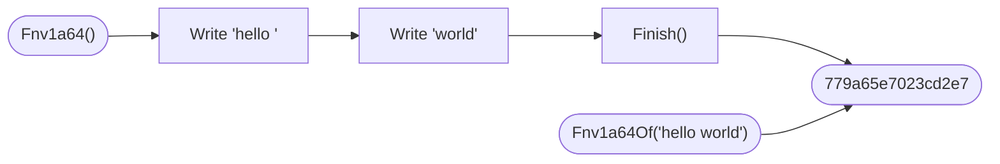

# Hash

::note
<!-- sync:needs:start -->

**You'll need**: [Pointer](/docs/learn/pointer), [String literal](/docs/learn/string-literal), [Format number](/docs/learn/format-number)
<!-- sync:needs:end -->

::

A **hash function** boils any amount of data down to one fixed-size number. The same bytes always give the same number, on every machine and every run, while bytes that differ even slightly almost always give a different one.

That makes a hash a cheap fingerprint. A [hash map](/docs/learn/hash-map) files its keys by their hashes; a download site prints a checksum next to each file so you can tell whether your copy arrived intact; a program stores a hash beside its cache to notice when the data under it has changed. This lesson tours the `Hash` package's fast, everyday hashes:

```rux
import Hash::{ Crc32Of, Fnv1a64, Fnv1a64Of, XxHash64Of };
```

## Three algorithms

Each `…Of` function takes a pointer to the bytes and their count, and returns the hash in one call:

| Function     | Algorithm | Size    | Good for                                 |
| ------------ | --------- | ------- | ---------------------------------------- |
| `Fnv1a64Of`  | FNV-1a    | 64 bits | tiny and fast; short keys in hash tables |
| `XxHash64Of` | xxHash    | 64 bits | very fast on long inputs; fingerprints   |
| `Crc32Of`    | CRC-32    | 32 bits | the checksum in ZIP, PNG and Ethernet    |

They work on **bytes**, not on text, so `Show` takes the address of the string's first character as a byte pointer:

```rux
func Show(text: char8[..]) {
    let bytes = text.data as *byte;
    PrintLine("{:<12} fnv1a64 {:016x}  xxhash64 {:016x}  crc32 {:08x}", text,
        Fnv1a64Of(bytes, text.length), XxHash64Of(bytes, text.length),
        Crc32Of(bytes, text.length));
}
```

A [string literal](/docs/learn/string-literal) is a `char8[..]`: `text.data` points at its first character and `text.length` counts its bytes. `as *byte` reads the same memory as plain bytes, which is what the hash functions take. `{:016x}` prints the hash in hexadecimal padded to 16 digits, and `{:08x}` to 8, as in [Format number](/docs/learn/format-number) — the 64-bit and 32-bit sizes written out in full.

## Same bytes, same hash; one byte changed, a different hash

```rux
Show("hello world");
Show("hello world");
Show("hello worle");
Show("");
```

The first two lines are identical, as they must be. The third changes one letter, and every hash changes with it. xxHash and CRC-32 change throughout: `45ab6734b21e6968` becomes `06a208d921a7827a`. FNV-1a is simpler, and a change in the _last_ byte leaves much of its old value standing — `779a65e7023cd2e7` against `779a64e7023cd134`. That is fine for a hash map, which only needs keys spread out, and a reason to prefer xxHash for fingerprints.

Even no bytes at all have a hash. For FNV-1a it is the algorithm's starting value, `cbf29ce484222325`, and for CRC-32 it is zero.

## Hashing in pieces

Data often arrives in pieces — read from a file a block at a time, or sent over a network. Each algorithm also has a **hasher** struct for that: make one, `Write` each piece, then `Finish`:

```rux
let first = "hello ";
let second = "world";
var hasher = Fnv1a64();
hasher.Write(first.data as *byte, first.length);
hasher.Write(second.data as *byte, second.length);
PrintLine("in two pieces fnv1a64 {:016x}", hasher.Finish());
```

The answer, `779a65e7023cd2e7`, is the same as hashing `hello world` in one call: a hasher does not care where the pieces were split.



## Not for secrets

None of these hashes is **cryptographic**. Someone who wants to can find two different inputs with the same hash on purpose. So they detect accidents — a flipped bit, a truncated download — but never tampering, and they must never be used to store or check passwords.

## The program

The whole lesson is one package in the [Examples repository](https://github.com/rux-lang/Examples/tree/main/Utilities/Hash). Its comments explain every step.

<!-- sync:program:start -->

```rux [Src/Main.rux]
// A hash function boils any amount of data down to one fixed-size number. The same bytes always
// give the same number, on every machine and every run, while bytes that differ even slightly
// almost always give a different one. That makes a hash a cheap fingerprint: a hash map files
// keys by it, and a checksum stored next to data shows whether the data changed.
//
// The Hash package has several well-known algorithms. Each `...Of` function takes a pointer to
// the bytes and their count, and returns the hash:
//
//     Fnv1a64Of   FNV-1a, 64 bits: tiny and fast, good for hash tables
//     XxHash64Of  xxHash, 64 bits: very fast on long inputs
//     Crc32Of     CRC-32, 32 bits: the checksum in ZIP, PNG and Ethernet
//
// None of these is cryptographic. Someone who wants to can find two inputs with the same hash on
// purpose, so they detect accidents, never tampering, and must not protect passwords.
import Hash::{ Crc32Of, Fnv1a64, Fnv1a64Of, XxHash64Of };
import Io::PrintLine;

func Show(text: char8[..]) {
    let bytes = text.data as *byte;
    PrintLine("{:<12} fnv1a64 {:016x}  xxhash64 {:016x}  crc32 {:08x}", text,
        Fnv1a64Of(bytes, text.length), XxHash64Of(bytes, text.length),
        Crc32Of(bytes, text.length));
}

func Main() -> int {
    // The same bytes, the same hashes.
    Show("hello world");
    Show("hello world");

    // One letter changed. xxHash and CRC-32 change throughout. FNV-1a is simpler, and a change
    // in the last byte leaves much of its old value standing: fine for a hash map, but a reason
    // to prefer xxHash for fingerprints.
    Show("hello worle");

    // Even no bytes at all have a hash.
    Show("");

    // Data that arrives in pieces can be hashed piece by piece: make a hasher, `Write` each
    // piece, then `Finish`. The answer is the same as hashing all the bytes at once.
    let first = "hello ";
    let second = "world";
    var hasher = Fnv1a64();
    hasher.Write(first.data as *byte, first.length);
    hasher.Write(second.data as *byte, second.length);
    PrintLine("in two pieces fnv1a64 {:016x}", hasher.Finish());
    return 0;
}
```

Besides `Io`, its `Rux.toml` lists `Hash` under `[Dependencies]`.
<!-- sync:program:end -->

## Run it

```sh
cd Examples/Utilities/Hash
rux run
```

<!-- sync:output:start -->

```
hello world  fnv1a64 779a65e7023cd2e7  xxhash64 45ab6734b21e6968  crc32 0d4a1185
hello world  fnv1a64 779a65e7023cd2e7  xxhash64 45ab6734b21e6968  crc32 0d4a1185
hello worle  fnv1a64 779a64e7023cd134  xxhash64 06a208d921a7827a  crc32 7a4d2113
             fnv1a64 cbf29ce484222325  xxhash64 ef46db3751d8e999  crc32 00000000
in two pieces fnv1a64 779a65e7023cd2e7
```

<!-- sync:output:end -->

## Common mistakes

::warning
**Passing the text instead of a pointer.**\
The hash functions take a pointer and a count. `Fnv1a64Of(text, text.length)` fails with `error: argument 1 to 'Fnv1a64Of' has type 'char8[..]', but parameter 'bytes' requires '*uint8'`.
::

::warning
**A character pointer where a byte pointer is wanted.**\
`text.data` on its own is a `*char8`, and passing it fails with `error: argument 1 to 'Fnv1a64Of' has type '*char8', but parameter 'bytes' requires '*uint8'`. Convert it: `text.data as *byte`.
::

::warning
**A hasher declared with `let`.**\
`Write` and `Finish` change the hasher, so with `let hasher = Fnv1a64();` the first call fails with `error: cannot call 'Write' on immutable 'hasher'`. Declare it with `var`.
::

::warning
**Protecting passwords with a fast hash.**\
FNV-1a, xxHash and CRC-32 are built to be fast, and that is exactly what helps someone trying billions of guesses. Passwords need a deliberately slow, salted password hash, which is a different tool altogether.
::

## Try it yourself

1. Hash your name with all three functions. Then change one letter in the middle rather than at the end, and compare how much of the FNV-1a value survives this time.
2. Import `Fnv1a32Of` and `Crc32cOf` and add them to `Show`. Both are 32 bits, so print them with `{:08x}`.
3. Hash `hello world` in two pieces with an `XxHash64` hasher, and check the answer against `XxHash64Of`.
4. `XxHash64SeededOf(bytes, length, seed)` mixes a seed into the hash. Hash the same text with two different seeds.

## Learn more

- [Pointer](/docs/learn/pointer) — the `*byte` every hash function takes
- [String literal](/docs/learn/string-literal) — `data` and `length`, the two halves of a string
- [Hash map](/docs/learn/hash-map) — where hashes do their everyday work
- [UUID](/docs/learn/uuid) — the next lesson: identifiers that are unique rather than derived from data
