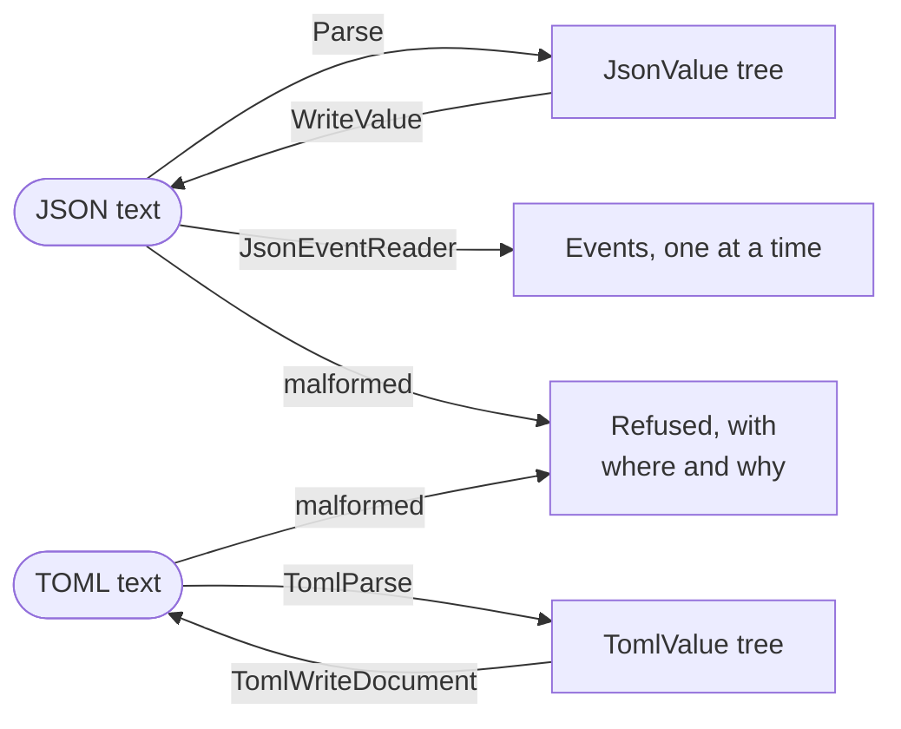

# Part 21: Data formats

Sooner or later a program has to talk to something that is not itself — a web service, a configuration file, another program written in another language. This part reads and writes the two text formats you will meet most: **JSON**, for exchanging data, and **TOML**, for configuration. Both packages work the same way: text becomes a tree of values, a program asks each value what it is before taking it apart, and a document that is wrong is refused with the place it went wrong.

## What you will learn

- Parsing JSON into a tree of six kinds of value, and reading typed values out of it through pointers and out-parameters.
- Building a JSON tree by hand, writing it compact or pretty, and checking a round trip.
- Reading JSON as a stream of events, for documents too large to hold at once.
- Reading TOML, whose values have real types: integers, floats, dates and tables.
- Changing a TOML document and writing it back — and what a round trip keeps and loses.
- Reporting a bad document by byte, or by line and column, so a person can find the mistake.

## The part at a glance



## Lessons

## Lessons

<!-- sync:lessons:start -->

|      | Lesson                                    | What you will learn                       |
| ---- | ----------------------------------------- | ----------------------------------------- |
| 21.1 | [JSON](/docs/learn/json)                  | parse JSON into a value and walk it       |
| 21.2 | [Writing JSON](/docs/learn/json-write)    | write a value out as JSON                 |
| 21.3 | [Streaming JSON](/docs/learn/json-stream) | read JSON as a stream of events           |
| 21.4 | [TOML](/docs/learn/toml)                  | parse a TOML document and read its values |
| 21.5 | [Writing TOML](/docs/learn/toml-write)    | write a TOML document                     |

<!-- sync:lessons:end -->

## Before you start

Documents are held in memory from an [allocator](/docs/learn/allocator), and values are read through [pointers](/docs/learn/pointer) and [out-parameters](/docs/learn/out-parameter), all from [Part 15: Memory](/docs/learn/memory). Text is handled with the `String`, `StringView` and `StringBuilder` of [Part 14: Text](/docs/learn/text), trees are move-only values as in [Part 11: Ownership](/docs/learn/ownership), and failures come in [error sums](/docs/learn/error-sum) from Part 9. The TOML lesson also reads a `Date` from [Part 20: Utilities](/docs/learn/utilities). Each lesson's package is in the Examples repository's `DataFormats/` folder:

```sh
cd Examples/DataFormats/Json
rux run
```

## After this part

[Part 22: Packages](/docs/learn/packages) steps back from single programs to how code is organised and shared — modules, packages, libraries and the `Rux.toml` that describes them, which you can now read as the TOML it is.

Before moving on, try the checkpoint project [Notes](/docs/learn/notes): a to-do list kept as JSON in a file, saved, loaded back, added to, and protected against a damaged or missing file. It puts this part together with [Part 19: Files](/docs/learn/files).

For the language rules this part relies on, see [Pointers](/docs/lang/pointers/overview), [null pointers](/docs/lang/pointers/overview#null) and [Interfaces](/docs/lang/interfaces/overview) in the Rux Reference, and the [manifest](/docs/packaging/manifest) for the TOML file every package has.
