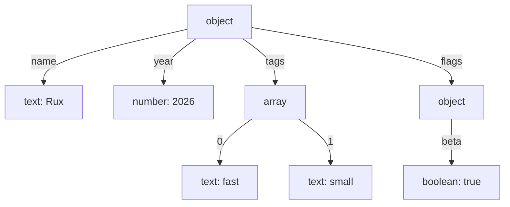

# JSON

::note
<!-- sync:needs:start -->

**You'll need**: [Allocator](/docs/learn/allocator), [Pointer](/docs/learn/pointer), [Out parameter](/docs/learn/out-parameter), [Outcome](/docs/learn/outcome), [String view](/docs/learn/string-view)
<!-- sync:needs:end -->

::

JSON is how programs that share nothing else — not a language, not a machine, not an owner — agree on what a value is. A web API answers in it, a browser stores settings in it, and a log line often is one. This lesson reads a JSON document with the `Json` package, takes typed values out of it, and shows how a broken document is refused.

```rux
import Allocator::{ Allocator, SystemAllocator };
import Json::{ JsonKind, JsonValue, Parse };
import Text::StringView;
```

## Parsing a document

`Parse` reads the whole text into a tree of values:

```
Parse(allocator, text) -> JsonValue ! JsonParseError
```

The tree needs memory — a document can be any size — so `Parse` takes an [allocator](/docs/learn/allocator) to get it from. `Main` makes the system allocator and hands out an `Allocator` view of it:

```rux
var system = SystemAllocator();
let allocator: Allocator = system;
```

The result is an [outcome](/docs/learn/outcome): either the whole document, as its root value, or the reason there is none. There is never half a document.

```rux
match Parse(allocator, document) {
    .Success(root) => Inspect(root),
    .Failure(reason) => PrintLine("refused at byte {}: {}", reason.Offset(), reason)
}
```

The document is one long string literal, with every `"` inside it escaped as `\"`:

```json
{ "name": "Rux", "year": 2026, "tags": ["fast", "small"], "flags": { "beta": true } }
```

## A tree of six kinds

Every value in the tree is one of six kinds, and `Kind()` says which. Containers hold more values, so the document above parses into this tree:



Reading the tree always means asking a value what it is before taking it apart:

| Kind      | Ask with                     | Answers                                          |
| --------- | ---------------------------- | ------------------------------------------------ |
| `Object`  | `Find(name)`, `Length()`     | a pointer to the member, null when it is missing |
| `Array`   | `At(index)`, `Length()`      | a pointer to the element, null past the end      |
| `Text`    | `AsText()`                   | a `StringView`, empty for any other kind         |
| `Number`  | `AsNumber()`, then `AsInt64` | `false` when the number is not that type         |
| `Boolean` | `AsBoolean(@flag)`           | `false` when the value is not a boolean          |
| `Null`    | `IsNull()`                   | `true` for `null`                                |

`KindName` turns a kind into a word for printing, with `else` covering the last one, `Null`.

## Finding a member

Member names are text, so `Find` takes a [`StringView`](/docs/learn/string-view). The small `Member` helper makes one from a literal:

```rux
func Member(object: &JsonValue, name: char8[..]) -> *JsonValue {
    return object.Find(StringView::FromValidated(name));
}
```

`Find` answers a [pointer](/docs/learn/pointer) that is null when there is no such member. So the program checks before reading through it:

```rux
let name = Member(root, "name");
if name != null {
    PrintLine("name      {}", (*name).AsText());
}
PrintLine("license   present: {}", Member(root, "license") != null);
```

The document has no `license`, and the program says so instead of crashing.

## Numbers keep their text

JSON has one kind of number, and it does not say how big or how precise a number may be. So a `JsonNumber` keeps the text it was written with, and converting it is a question that may be answered `false` — the text may have a fraction, or not fit the type asked for. The answer comes back through an [out-parameter](/docs/learn/out-parameter):

```rux
var year: int64 = 0;
let number = (*Member(root, "year")).AsNumber();
let fits = (*number).AsInt64(@year);
PrintLine("year      {} (text \"{}\", fits an int64: {})", year, (*number).Text(), fits);
```

`AsNumber` returns a pointer to the number — null if the value were some other kind — and `AsInt64(@year)` writes into `year` and reports whether it could.

## Arrays and nested objects

An array is walked by index, and each element is asked its kind like any other value. A nested object is just another value with members of its own:

```rux
let tags = Member(root, "tags");
for i in 0..(*tags).Length() {
    let tag = (*tags).At(i);
    PrintLine("tags[{}]   {} {}", i, KindName((*tag).Kind()), (*tag).AsText());
}

var beta = false;
let flags = Member(root, "flags");
let isBoolean = (*Member(*flags, "beta")).AsBoolean(@beta);
```

Notice that `year`, `tags` and `flags` are read without the null check that `name` got. That is safe here only because the document is a literal in the program and they are known to be there. For a document from outside, check every pointer.

## Malformed input

JSON is strict, and `Parse` refuses anything that is not exactly JSON. The failure says why, and at which byte the parser stopped:

| Document          | Refused at | Because                                   |
| ----------------- | ---------- | ----------------------------------------- |
| `[1, 2, 3,]`      | byte 10    | a trailing comma: `]` cannot follow `,`   |
| `{'name': 'Rux'}` | byte 1     | single quotes begin no token in JSON      |
| `{"open": [1, 2}` | byte 15    | `}` cannot close an array                 |
| `{"a": 1} extra`  | byte 9     | text after the end of the document        |
| _(empty)_         | byte 0     | the document ended before any value began |

A message that names the byte lets a person go straight to the mistake.

## The program

The whole lesson is one package in the [Examples repository](https://github.com/rux-lang/Examples/tree/main/DataFormats/Json). Its comments explain every step.

<!-- sync:program:start -->

```rux [Src/Main.rux]
// JSON is how programs that share nothing else agree on what a value is. The Json package reads
// a document into a tree of `JsonValue`s, and every value in the tree is one of six kinds: text,
// number, boolean, null, array or object.
//
//     Parse(allocator, text) -> JsonValue ! JsonParseError
//
// Parsing hands back a whole document or the reason there is none, never half of one. Reading the
// tree then means asking a value what it is before taking it apart: `Find` and `At` answer a
// pointer that is null when the member or element is not there, and the conversions answer
// `false`, through an out-parameter, when the value is some other kind.
import Allocator::{ Allocator, SystemAllocator };
import Io::PrintLine;
import Json::{ JsonKind, JsonValue, Parse };
import Text::StringView;

func KindName(kind: JsonKind) -> char8[..] {
    return match kind {
        JsonKind::Text => "text",
        JsonKind::Number => "number",
        JsonKind::Boolean => "boolean",
        JsonKind::Array => "array",
        JsonKind::Object => "object",
        else => "null"
    };
}

// Member names are compared as text, so `Find` takes a `StringView`.
func Member(object: &JsonValue, name: char8[..]) -> *JsonValue {
    return object.Find(StringView::FromValidated(name));
}

func Inspect(root: &JsonValue) {
    PrintLine("root      {} of {} members", KindName(root.Kind()), root.Length());

    // A member that is not there is a null pointer, so check before reading through it.
    let name = Member(root, "name");
    if name != null {
        PrintLine("name      {}", (*name).AsText());
    }
    PrintLine("license   present: {}", Member(root, "license") != null);

    // A number keeps the text it was written with, and converting it is a question that can
    // be answered `false`: the text may have a fraction, or not fit the type asked for.
    var year: int64 = 0;
    let number = (*Member(root, "year")).AsNumber();
    let fits = (*number).AsInt64(@year);
    PrintLine("year      {} (text \"{}\", fits an int64: {})", year, (*number).Text(), fits);

    // An array is walked by index, and each element is asked its kind like any other value.
    let tags = Member(root, "tags");
    for i in 0..(*tags).Length() {
        let tag = (*tags).At(i);
        PrintLine("tags[{}]   {} {}", i, KindName((*tag).Kind()), (*tag).AsText());
    }

    // A nested object is just another value with members of its own.
    var beta = false;
    let flags = Member(root, "flags");
    let isBoolean = (*Member(*flags, "beta")).AsBoolean(@beta);
    PrintLine("beta      boolean: {}, value: {}", isBoolean, beta);
}

func Check(allocator: Allocator, document: char8[..]) {
    match Parse(allocator, document) {
        .Success(root) => PrintLine("{:18} parsed as {}", document, KindName(root.Kind())),
        .Failure(reason) =>
            PrintLine("{:18} refused at byte {}: {}", document, reason.Offset(), reason)
    }
}

func Main() -> int {
    var system = SystemAllocator();
    let allocator: Allocator = system;

    let document =
        "{\"name\":\"Rux\",\"year\":2026,\"tags\":[\"fast\",\"small\"],\"flags\":{\"beta\":true}}";
    match Parse(allocator, document) {
        .Success(root) => Inspect(root),
        .Failure(reason) => PrintLine("refused at byte {}: {}", reason.Offset(), reason)
    }

    // Malformed input. The failure says why, and the byte where the parser stopped, so a message
    // to a person can point at the problem. JSON is strict: no trailing commas, no single quotes.
    PrintLine("");
    Check(allocator, "[1, 2, 3]");
    Check(allocator, "[1, 2, 3,]");
    Check(allocator, "{'name': 'Rux'}");
    Check(allocator, "{\"open\": [1, 2}");
    Check(allocator, "{\"a\": 1} extra");
    Check(allocator, "");
    return 0;
}
```

Besides `Io`, its `Rux.toml` lists `Allocator`, `Json` and `Text` under `[Dependencies]`.
<!-- sync:program:end -->

## Run it

```sh
cd Examples/DataFormats/Json
rux run
```

<!-- sync:output:start -->

```
root      object of 4 members
name      Rux
license   present: false
year      2026 (text "2026", fits an int64: true)
tags[0]   text fast
tags[1]   text small
beta      boolean: true, value: true

[1, 2, 3]          parsed as array
[1, 2, 3,]         refused at byte 10: token that cannot appear here
{'name': 'Rux'}    refused at byte 1: byte that begins no token
{"open": [1, 2}    refused at byte 15: token that cannot appear here
{"a": 1} extra     refused at byte 9: text after the end of the document
                   refused at byte 0: document ended in the middle of a value
```

<!-- sync:output:end -->

## Common mistakes

::warning
**Looking up a member with a plain literal.**\
`Find` compares names as text, and takes a `StringView`. `object.Find(name)` with a `char8[..]` fails with `error: argument 1 to 'Find' has type 'char8[..]', but parameter 'name' requires 'StringView'`. Wrap it: `StringView::FromValidated(name)`.
::

::warning
**Passing the variable instead of its address.**\
The conversions write their answer through a pointer. `(*number).AsInt64(year)` fails with `error: argument 1 to 'AsInt64' has type 'int64', but parameter 'result' requires '*var int64'`. Write `@year`.
::

::warning
**Reading through a missing member.**\
`Find` returns null for a name that is not there, and reading through null crashes the program. `(*Member(root, "license")).AsText()` compiles, and then stops the program dead. Compare the pointer with `null` first, as the program does for `name`.
::

::warning
**Forgetting the allocator.**\
`Parse(document)` fails with `error: call to 'Parse' expects 2 arguments, but 1 was provided`. The tree's memory has to come from somewhere, and the allocator says where.
::

## Try it yourself

1. Add `"license": null` to the document. Check it with `IsNull()`.
2. Add `"version": 1.5`. What do `AsInt64` and `AsFloat64` each answer for it?
3. Pass `{"a": 1, "a": 2}` to `Check`. JSON does not forbid a repeated name — but what does this parser do with one?
4. List every member of the root object with `MemberAt(i)`, printing each one's `name` and the kind of its `value`.

## Learn more

- [JSON write](/docs/learn/json-write) — building a tree and writing it back out as text
- [JSON stream](/docs/learn/json-stream) — reading a document without building the tree
- [Pointer](/docs/learn/pointer) and [Out-parameter](/docs/learn/out-parameter) — how `Find`, `At` and the conversions answer
- [Allocator](/docs/learn/allocator) — where the tree's memory comes from
- [Null pointers](/docs/lang/pointers/overview#null) in the Rux Reference
