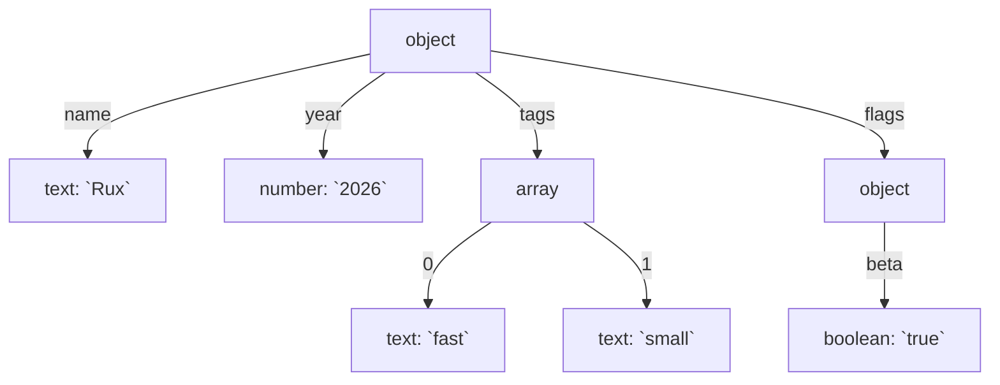

# JSON

::note
<!-- sync:needs:start -->

**You'll need**: [Allocator](/docs/learn/allocator), [Optional](/docs/learn/optional), [Catch](/docs/learn/catch), [String view](/docs/learn/string-view)
<!-- sync:needs:end -->

::

JSON is how programs that share nothing else — not a language, not a machine, not an owner — agree on what a value is. A web API answers in it, a browser stores settings in it, and a log line often is one. This lesson reads a JSON document with the `Json` package, takes typed values out of it, and shows how a broken document is refused.

```rux
import Allocator::{ Allocator, SystemAllocator };
import Io::PrintLine;
import Json::{ JsonKind, JsonParseError, JsonValue, Parse };
import Text::StringView;
```

## Parsing a document

`Parse` reads the whole text into a tree of values:

```
Parse(allocator, text) -> JsonValue ! JsonParseError
```

The tree needs memory — a document can be any size — so `Parse` takes an [allocator](/docs/learn/allocator) to get it from. `Main` makes the system allocator, which converts to an `Allocator` wherever one is wanted:

```rux
let allocator = SystemAllocator::New();
```

`Parse` either returns the whole document, as its root value, or [fails](/docs/learn/fallible) with the reason there is none. There is never half a document. `Main` [matches the outcome](/docs/learn/outcome): one arm takes the document and hands it to `Inspect`, the other takes the reason and prints it:

```rux
match Parse(allocator, document) {
    root: JsonValue => Inspect(&root),
    reason: JsonParseError => PrintLine("refused at byte {}: {}", reason.Offset(), reason)
}
```

Both arms handle the outcome, so no error is left over and `Main` keeps its plain `-> int`. `Inspect` only reads the tree, but the tree owns memory, so the loan is written: `&root`.

The document is one long string literal, with every `"` inside it escaped as `\"`:

```json
{ "name": "Rux", "year": 2026, "tags": ["fast", "small"], "flags": { "beta": true } }
```

## A tree of six kinds

Every value in the tree is one of six kinds, and `Kind()` says which. Containers hold more values, so the document above parses into this tree:


```mermaid
flowchart TD
    root["object"] -- "`name`" --> n["text: `Rux`"]
    root -- "`year`" --> y["number: `2026`"]
    root -- "`tags`" --> t["array"]
    root -- "`flags`" --> f["object"]
    t -- "`0`" --> t0["text: `fast`"]
    t -- "`1`" --> t1["text: `small`"]
    f -- "`beta`" --> b["boolean: `true`"]
```

Reading the tree always means asking a value what it is before taking it apart. Every question answers an [optional](/docs/learn/optional): `none` when the value is not what was asked for.

| Kind      | Ask with                     | Answers                                         |
| --------- | ---------------------------- | ----------------------------------------------- |
| `Object`  | `Find(name)`, `Length()`     | a reference to the member, `none` if missing    |
| `Array`   | `At(index)`, `Length()`      | a reference to the element, `none` past the end |
| `Text`    | `AsText()`                   | a `StringView`, `none` for any other kind       |
| `Number`  | `AsNumber()`, then `AsInt64` | `none` when the number is not that type         |
| `Boolean` | `AsBoolean()`                | `none` when the value is not a boolean          |
| `Null`    | `IsNull()`                   | `true` for `null`                               |

`Length()` is `none` for a value that is not a container, so the program writes `root.Length() ?? 0` to [fall back](/docs/learn/coalesce) to zero. `KindName` turns a kind into a word for printing, with the `_` arm covering the last one, `Null`.

## Finding a member

Member names are text, so `Find` takes a [`StringView`](/docs/learn/string-view). A small `Member` method makes one from a literal:

```rux
extend JsonValue {
    func Member(&self, name: char8[..]) -> &JsonValue? {
        return self.Find(StringView::FromValidated(name));
    }
}
```

`Find` answers a [reference](/docs/learn/reference) into the tree, or `none` when there is no such member. A reference that a function returns has to borrow from something, and a method's result borrows from its receiver, which is why `Member` is written in an [`extend`](/docs/learn/extension) block rather than as a free function.

Since the answer may be missing, the program unwraps it with [`if let`](/docs/learn/if-let) before reading it. `if let name? = …` binds `name` only when the member is there, and the name is in scope in the body. A binding has to come first in a condition, so checking that the member is also text takes a second `if let` inside the first:

```rux
if let name? = root.Member("name") {
    if let text? = name.AsText() {
        PrintLine("name      {}", text);
    }
}
PrintLine("license   present: {}", root.Member("license") != none);
```

```
name      Rux
license   present: false
```

The document has no `license`, and the program says so instead of crashing. Comparing with `none` asks only whether a value is there, without unwrapping it.

## Numbers keep their text

JSON has one kind of number, and it does not say how big or how precise a number may be. So a `JsonNumber` keeps the text it was written with, and converting it is a question that may be answered `none`: the text may have a fraction, or not fit the type asked for:

```rux
if let member? = root.Member("year") {
    if let number? = member.AsNumber() {
        let year = number.AsInt64();
        PrintLine("year      {} (text \"{}\", fits an int64: {})", year ?? 0, number.Text(),
            year != none);
    }
}
```

```
year      2026 (text "2026", fits an int64: true)
```

`AsNumber` answers the number, or `none` if the value were some other kind, and `AsInt64` answers the `int64`, or `none` if the text does not fit one.

## Arrays and nested objects

An array is walked by index, and each element is asked its kind like any other value. A nested object is just another value with members of its own:

```rux
if let tags? = root.Member("tags") {
    for i in 0..(tags.Length() ?? 0) {
        if let tag? = tags.At(i) {
            if let text? = tag.AsText() {
                PrintLine("tags[{}]   {} {}", i, KindName(tag.Kind()), text);
            }
        }
    }
}

if let flags? = root.Member("flags") {
    if let beta? = flags.Member("beta") {
        let value = beta.AsBoolean();
        PrintLine("beta      boolean: {}, value: {}", value != none, value ?? false);
    }
}
```

Every member is checked, even though the document is a literal in the program and they are known to be there. The types leave no other way to read them: an optional has to be unwrapped before its value can be used, so a document from outside cannot crash the program with a member it lacks.

## Malformed input

JSON is strict, and `Parse` refuses anything that is not exactly JSON. The error says why, and at which byte the parser stopped. `Check` parses each document and matches the outcome the same way `Main` does:

```rux
func Check(allocator: Allocator, document: char8[..]) {
    match Parse(allocator, document) {
        root: JsonValue => PrintLine("{:18} parsed as {}", document, KindName(root.Kind())),
        reason: JsonParseError =>
            PrintLine("{:18} refused at byte {}: {}", document, reason.Offset(), reason)
    }
}
```

| Document          | Refused at | Because                                   |
| ----------------- | ---------- | ----------------------------------------- |
| `[1, 2, 3,]`      | byte 9     | a trailing comma: `]` cannot follow `,`   |
| `{'name': 'Rux'}` | byte 1     | single quotes begin no token in JSON      |
| `{"open": [1, 2}` | byte 14    | `}` cannot close an array                 |
| `{"a": 1} extra`  | byte 9     | text after the end of the document        |
| _(empty)_         | byte 0     | the document ended before any value began |

Offsets count from zero, so byte 9 is the tenth. A message that names the byte lets a person go straight to the mistake.

## The program

The whole lesson is one package in the [Examples repository](https://github.com/rux-lang/Examples/tree/main/DataFormats/Json). Its comments explain every step.

<!-- sync:program:start -->

```rux [Src/Main.rux]
// JSON is how programs that share nothing else agree on what a value is. The Json package reads
// a document into a tree of `JsonValue`s, and every value in the tree is one of six kinds: text,
// number, boolean, null, array or object.
//
//     Parse(allocator, text) -> JsonValue ! JsonParseError
//
// Parsing hands back a whole document or fails with the reason there is none, never half of one.
// Reading the tree then means asking a value what it is before taking it apart: `Find` and `At`
// answer `none` when the member or element is not there, and the conversions answer `none` when
// the value is some other kind.
import Allocator::{ Allocator, SystemAllocator };
import Io::PrintLine;
import Json::{ JsonKind, JsonParseError, JsonValue, Parse };
import Text::StringView;

func KindName(kind: JsonKind) -> char8[..] {
    return match kind {
        JsonKind::Text => "text",
        JsonKind::Number => "number",
        JsonKind::Boolean => "boolean",
        JsonKind::Array => "array",
        JsonKind::Object => "object",
        _ => "null"
    };
}

// Member names are compared as text, so `Find` takes a `StringView`. The answer borrows from the
// value it was found in, so it is an optional reference, and the helper is a method: a reference
// result borrows from the receiver.
extend JsonValue {
    func Member(&self, name: char8[..]) -> &JsonValue? {
        return self.Find(StringView::FromValidated(name));
    }
}

func Inspect(root: &JsonValue) {
    PrintLine("root      {} of {} members", KindName(root.Kind()), root.Length() ?? 0);

    // A member that is not there is `none`, so check before reading it. `if let` binds a name
    // only where the value is present, and the name is in scope in the body.
    if let name? = root.Member("name") {
        if let text? = name.AsText() {
            PrintLine("name      {}", text);
        }
    }
    PrintLine("license   present: {}", root.Member("license") != none);

    // A number keeps the text it was written with, and converting it is a question that can
    // be answered `none`: the text may have a fraction, or not fit the type asked for.
    if let member? = root.Member("year") {
        if let number? = member.AsNumber() {
            let year = number.AsInt64();
            PrintLine("year      {} (text \"{}\", fits an int64: {})", year ?? 0, number.Text(),
                year != none);
        }
    }

    // An array is walked by index, and each element is asked its kind like any other value.
    if let tags? = root.Member("tags") {
        for i in 0..(tags.Length() ?? 0) {
            if let tag? = tags.At(i) {
                if let text? = tag.AsText() {
                    PrintLine("tags[{}]   {} {}", i, KindName(tag.Kind()), text);
                }
            }
        }
    }

    // A nested object is just another value with members of its own.
    if let flags? = root.Member("flags") {
        if let beta? = flags.Member("beta") {
            let value = beta.AsBoolean();
            PrintLine("beta      boolean: {}, value: {}", value != none, value ?? false);
        }
    }
}

// `Parse` can fail, so its outcome is matched: one arm takes the document, the other the reason.
func Check(allocator: Allocator, document: char8[..]) {
    match Parse(allocator, document) {
        root: JsonValue => PrintLine("{:18} parsed as {}", document, KindName(root.Kind())),
        reason: JsonParseError =>
            PrintLine("{:18} refused at byte {}: {}", document, reason.Offset(), reason)
    }
}

func Main() -> int {
    let allocator = SystemAllocator::New();

    let document =
        "{\"name\":\"Rux\",\"year\":2026,\"tags\":[\"fast\",\"small\"],\"flags\":{\"beta\":true}}";
    match Parse(allocator, document) {
        root: JsonValue => Inspect(&root),
        reason: JsonParseError => PrintLine("refused at byte {}: {}", reason.Offset(), reason)
    }

    // Malformed input. The failure says why, and the byte where the parser stopped, so a message
    // to a person can point at the problem. JSON is strict: no trailing commas, no single quotes.
    PrintLine("");
    Check(allocator, "[1, 2, 3]");
    Check(allocator, "[1, 2, 3,]");
    Check(allocator, "{'name': 'Rux'}");
    Check(allocator, "{\"open\": [1, 2}");
    Check(allocator, "{\"a\": 1} extra");
    Check(allocator, "");
    return 0;
}
```

Besides `Io`, its `Rux.toml` lists `Allocator`, `Json` and `Text` under `[Dependencies]`.
<!-- sync:program:end -->

## Run it

```sh
cd Examples/DataFormats/Json
rux run
```

<!-- sync:output:start -->

```
root      object of 4 members
name      Rux
license   present: false
year      2026 (text "2026", fits an int64: true)
tags[0]   text fast
tags[1]   text small
beta      boolean: true, value: true

[1, 2, 3]          parsed as array
[1, 2, 3,]         refused at byte 9: token that cannot appear here
{'name': 'Rux'}    refused at byte 1: byte that begins no token
{"open": [1, 2}    refused at byte 14: token that cannot appear here
{"a": 1} extra     refused at byte 9: text after the end of the document
                   refused at byte 0: document ended in the middle of a value
```

<!-- sync:output:end -->

## Common mistakes

::mistake
**Looking up a member with a plain literal.**\
`Find` compares names as text, and takes a `StringView`. `self.Find(name)` with a `char8[..]` fails with:

```text
error: argument 1 to 'Find' has type 'char8[..]', but parameter 'name' requires 'StringView'
```

Wrap it: `StringView::FromValidated(name)`.
::

::mistake
**Using a member before checking it is there.**\
`Member` answers `&JsonValue?`, not a value. `let name = root.Member("name");` followed by `name.AsText()` fails with:

```text
error: 'AsText' is a member of '&JsonValue', but the value is the optional '&JsonValue?'
help: take the value out first, with '?', '??' or 'if let'
```

Unwrap it first, with `if let name? = root.Member("name")`, a `match`, or `??`.
::

::mistake
**Using the outcome as the document.**\
`Parse` answers a fallible value, `JsonValue ! JsonParseError`, not a `JsonValue`. `let root = Parse(allocator, document);` followed by `Inspect(&root)` fails with:

```text
error: argument 1 to 'Inspect' has type '&(JsonValue ! JsonParseError)', but parameter 'root' requires '&JsonValue'
```

Take the outcome apart first, with a `match` whose arms are `root: JsonValue` and `reason: JsonParseError`, as `Main` and `Check` do.
::

::mistake
**Passing the error on from `Main`.**\
`let root = Parse(allocator, document)!;` in `Main` fails with:

```text
error: call to 'Parse' can fail with 'JsonParseError', but 'Main' cannot fail
```

`Main` always returns a plain `int`, so the error has to be handled there: by a `match`, by `catch`, or with `!!`.
::

::mistake
**Passing the tree without writing the loan.**\
`Inspect(root)` in the `match` arm fails with:

```text
error: 'Inspect' borrows its argument, and 'JsonValue' owns resources, so the loan must be written
help: write '&root'
```

A tree owns memory, so lending it is written out: `Inspect(&root)`.
::

::mistake
**Forgetting the allocator.**\
`Parse(document)` fails with:

```text
error: call to 'Parse' expects 2 arguments, but 1 was provided
```

The tree's memory has to come from somewhere, and the allocator says where.
::

## Try it yourself

1. Add `"license": null` to the document. Check it with `IsNull()`.
2. Add `"version": 1.5`. What do `AsInt64` and `AsFloat64` each answer for it?
3. Pass `{"a": 1, "a": 2}` to `Check`. JSON does not forbid a repeated name, but what does this parser do with one?
4. List every member of the root object with `MemberAt(i)`, printing each one's `name` and the kind of its `value`.

## Learn more

- [JSON write](/docs/learn/json-write): building a tree and writing it back out as text
- [JSON stream](/docs/learn/json-stream): reading a document without building the tree
- [If let](/docs/learn/if-let) and [Coalesce](/docs/learn/coalesce): unwrapping the optionals that `Find`, `At` and the conversions answer
- [Outcome](/docs/learn/outcome): keeping a fallible value and matching it by side
- [Allocator](/docs/learn/allocator): where the tree's memory comes from
- [if let](/docs/lang/statements/if#if-let) and [matching by side](/docs/lang/errors/fallible-values#matching-by-side) in the Rux Reference
