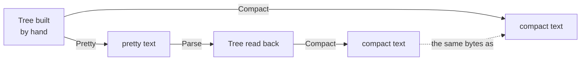

# Writing JSON

::note
<!-- sync:needs:start -->

**You'll need**: [JSON](/docs/learn/json), [String builder](/docs/learn/string-builder), [Display](/docs/learn/display), [Move](/docs/learn/move), [Error sum](/docs/learn/error-sum)
<!-- sync:needs:end -->

::

Writing JSON is the [parse lesson](/docs/learn/json) run backwards: a tree of `JsonValue`s goes in, text comes out. The tree can come from `Parse`, or — as here — be built by hand, one value at a time. This lesson builds a small document, writes it two ways, and proves the writing is faithful by reading the output back.

```rux
import Json::{ JsonStyle, JsonValue, Parse, WriteValue };
import Text::{ FormatError, String, StringBuilder, TextError, TextWriter };
```

## Building a tree by hand

Each kind has a constructor: `JsonValue::Text`, `Number`, `Boolean`, `Null`, `Array` and `Object`. Containers start empty; `Push` appends to an array and `Insert` adds a member to an object:

```rux
var tags = JsonValue::Array(allocator);
tags.Push(JsonValue::Text(allocator, "fast")?);
tags.Push(JsonValue::Number(allocator, "2.50")?);
var root = JsonValue::Object(allocator);
root.Insert(String::FromBytes(allocator, "name")?, JsonValue::Text(allocator, "Rux")?);
root.Insert(String::FromBytes(allocator, "quote")?,
            JsonValue::Text(allocator, "say \"hi\"\n")?);
root.Insert(String::FromBytes(allocator, "tags")?, <-tags);
root.Insert(String::FromBytes(allocator, "license")?, JsonValue::Null(allocator));
```

Three things to notice:

- **Text is copied into the tree.** `Text`, `Number` and `String::FromBytes` copy their bytes into memory from the allocator, and that can fail with a `TextError` — hence the `?` after each.
- **A number is given as text.** `"2.50"` stays `2.50`, exactly as written, the same way a parsed number keeps its text.
- **Values are move-only.** A `JsonValue` owns everything under it, so it cannot be copied. `Push` and `Insert` take ownership of what they are given, and handing over the finished `tags` array is an explicit [move](/docs/learn/move): `<-tags`. After that line `tags` is gone, and the array lives on inside `root`.

`Main` returns `! (TextError | FormatError)`, an [error sum](/docs/learn/error-sum), so `?` can pass on a failure of either kind from building or from writing.

## Writing it out

`WriteValue` writes a tree into any `TextWriter`:

```
WriteValue(writer, value, style) -> ! FormatError
```

`Written` points it at a [`StringBuilder`](/docs/learn/string-builder), so the text can be kept, measured and parsed again, and hands the result back as a `String` the caller owns:

```rux
func Written(allocator: Allocator, value: &JsonValue, style: JsonStyle) -> String ! FormatError {
    var builder = StringBuilder(allocator);
    let sink: &var TextWriter = builder;
    WriteValue(sink, value, style)?;
    return builder.IntoString();
}
```

`JsonStyle` chooses the layout:

| Style                  | Layout                               | Size of this document | For            |
| ---------------------- | ------------------------------------ | --------------------- | -------------- |
| `JsonStyle::Compact()` | no whitespace at all                 | 73 bytes              | a wire, a file |
| `JsonStyle::Pretty()`  | one value per line, two-space indent | 103 bytes             | a person       |

Either way the writer escapes exactly what JSON requires inside strings and nothing more: the quote's `"` and its newline come out as `\"` and `\n`.

## The round trip

A writer is only trustworthy if what it writes reads back as the same thing. The program parses the pretty text and writes it compact again:

```rux
match Parse(allocator, pretty.View().Bytes()) {
    .Success(again) => {
        let rewritten = Written(allocator, again, JsonStyle::Compact())?;
        let original = compact.View();
        PrintLine("round trip gives the same text: {}", rewritten.View().Equals(original));
    },
    .Failure(reason) => PrintLine("the written text did not parse: {}", reason)
}
```



The layout was only presentation, so the same 73 bytes come back — including `2.50`, which did not become `2.5`, because a number keeps the text it was written with.

## What JSON cannot say

JSON has no spelling for NaN or infinity. A number built from the text `"NaN"` is accepted into the tree, but writing it is refused rather than invented:

```rux
let notANumber = JsonValue::Number(allocator, "NaN")?;
match Written(allocator, notANumber, JsonStyle::Compact()) {
    .Success(text) => PrintLine("wrote {}", text),
    .Failure(error) => PrintLine("NaN refused: {}", error)
}
```

Printing the `FormatError` with `{}` gives its message, `value out of range for the form requested`.

## The program

The whole lesson is one package in the [Examples repository](https://github.com/rux-lang/Examples/tree/main/DataFormats/JsonWrite). Its comments explain every step.

<!-- sync:program:start -->

```rux [Src/Main.rux]
// Writing JSON is the parse lesson run backwards: a tree of `JsonValue`s goes in, text comes
// out. The tree can come from `Parse` or be built by hand, and `WriteValue` writes it into any
// `TextWriter` — a StringBuilder here, so the text can be kept and parsed again.
//
//     WriteValue(writer, value, style) -> ! FormatError
//
// `JsonStyle` chooses the layout. `Compact()` writes no whitespace at all, for a document going
// over a wire; `Pretty()` indents by two spaces, for a person. Either way the writer escapes
// exactly what JSON requires inside strings, and nothing more.
import Allocator::{ Allocator, SystemAllocator };
import Io::PrintLine;
import Json::{ JsonStyle, JsonValue, Parse, WriteValue };
import Text::{ FormatError, String, StringBuilder, TextError, TextWriter };

// Writes `value` in `style` and hands the text back as a String the caller owns.
func Written(allocator: Allocator, value: &JsonValue, style: JsonStyle) -> String ! FormatError {
    var builder = StringBuilder(allocator);
    let sink: &var TextWriter = builder;
    WriteValue(sink, value, style)?;
    return builder.IntoString();
}

func Main() -> ! (TextError | FormatError) {
    var system = SystemAllocator();
    let allocator: Allocator = system;

    // Building by hand. Values are move-only: `Push` and `Insert` take ownership of what they
    // are given, and a member's name is an owned String.
    var tags = JsonValue::Array(allocator);
    tags.Push(JsonValue::Text(allocator, "fast")?);
    tags.Push(JsonValue::Number(allocator, "2.50")?);
    var root = JsonValue::Object(allocator);
    root.Insert(String::FromBytes(allocator, "name")?, JsonValue::Text(allocator, "Rux")?);
    root.Insert(String::FromBytes(allocator, "quote")?,
                JsonValue::Text(allocator, "say \"hi\"\n")?);
    root.Insert(String::FromBytes(allocator, "tags")?, <-tags);
    root.Insert(String::FromBytes(allocator, "license")?, JsonValue::Null(allocator));

    let compact = Written(allocator, root, JsonStyle::Compact())?;
    let pretty = Written(allocator, root, JsonStyle::Pretty())?;
    PrintLine("compact, {} bytes:\n{}", compact.Length(), compact);
    PrintLine("pretty, {} bytes:\n{}", pretty.Length(), pretty);

    // The round trip: parse the pretty text and write it compact again. The layout was only
    // presentation, so the same bytes come back. A number keeps the text it was written with,
    // which is why `2.50` did not become `2.5`.
    match Parse(allocator, pretty.View().Bytes()) {
        .Success(again) => {
            let rewritten = Written(allocator, again, JsonStyle::Compact())?;
            let original = compact.View();
            PrintLine("round trip gives the same text: {}", rewritten.View().Equals(original));
        },
        .Failure(reason) => PrintLine("the written text did not parse: {}", reason)
    }

    // JSON cannot spell NaN or infinity, so writing one is refused, not invented.
    let notANumber = JsonValue::Number(allocator, "NaN")?;
    match Written(allocator, notANumber, JsonStyle::Compact()) {
        .Success(text) => PrintLine("wrote {}", text),
        .Failure(error) => PrintLine("NaN refused: {}", error)
    }
}
```

Besides `Io`, its `Rux.toml` lists `Allocator`, `Json` and `Text` under `[Dependencies]`.
<!-- sync:program:end -->

## Run it

```sh
cd Examples/DataFormats/JsonWrite
rux run
```

<!-- sync:output:start -->

```
compact, 73 bytes:
{"name":"Rux","quote":"say \"hi\"\n","tags":["fast",2.50],"license":null}
pretty, 103 bytes:
{
  "name": "Rux",
  "quote": "say \"hi\"\n",
  "tags": [
    "fast",
    2.50
  ],
  "license": null
}
round trip gives the same text: true
NaN refused: value out of range for the form requested
```

<!-- sync:output:end -->

## Common mistakes

::warning
**Using a value after handing it over.**\
After `root.Insert(…, <-tags)`, the array belongs to `root`. A later `tags.Push(…)` fails with `error: value 'tags' is used after it was moved`. Finish filling a container before you insert it.
::

::warning
**Inserting without `<-`.**\
`root.Insert(String::FromBytes(allocator, "tags")?, tags)` fails with `error: move-only value 'tags' requires an explicit '<-' in argument`, and a note explains that `'JsonValue' prohibits copying`. The `<-` makes the hand-over visible where it happens.
::

::warning
**A literal as a member name.**\
`Insert` takes an owned `String`. `root.Insert("name", …)` fails with `error: argument 1 to 'Insert' has type 'char8[..]', but parameter 'name' requires 'String'`. Make one with `String::FromBytes(allocator, "name")?`.
::

::warning
**Expecting `Insert` to replace.**\
`Insert` always appends, even when the object already has a member of that name — it returns `true` and the writer writes the name twice. Parsing that text back fails with `object with the same name twice`. Check with `Find` before inserting.
::

## Try it yourself

1. Add a boolean member, `"beta": true`, with `JsonValue::Boolean(allocator, true)`. How many bytes is the compact text now?
2. Build a nested object — say `"author": {"name": "Ada"}` — and look at how `Pretty()` indents it.
3. Try `"Infinity"` instead of `"NaN"`. Is it refused too?
4. Parse the document from the [JSON lesson](/docs/learn/json) and write it out with `Pretty()`.

## Learn more

- [JSON](/docs/learn/json) — reading a document into the tree this lesson writes
- [Move](/docs/learn/move) — what `<-` does, and why a `JsonValue` cannot be copied
- [String builder](/docs/learn/string-builder) — the `TextWriter` that collects the text
- [Error sum](/docs/learn/error-sum) — one fallible `Main` for two kinds of error
- [Notes](/docs/learn/notes) — a checkpoint project that saves a to-do list as JSON and loads it back
