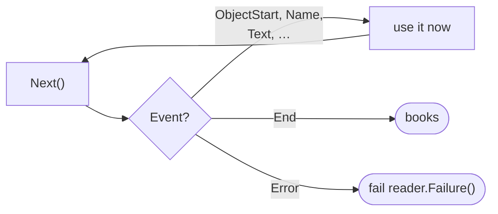

# Streaming JSON

::note
<!-- sync:needs:start -->

**You'll need**: [JSON](/docs/learn/json), [Interface value](/docs/learn/interface-value), [Destructor](/docs/learn/destructor), [Error sum](/docs/learn/error-sum), [Typed pattern](/docs/learn/typed-pattern), [Coalesce](/docs/learn/coalesce)
<!-- sync:needs:end -->

::

`Parse` builds the whole tree before your program sees any of it. For a settings file that is ideal. For a log of a million records it is not: the tree costs several times the document's size in memory, and a program that only wants one field from each record pays for all of them.

`JsonEventReader` reads the same text as a **stream of events** instead — an object opened, a name, a text value, an array closed — pulling bytes from a source as it needs them and keeping only the token it is on. The program keeps whatever it wants and lets the rest go by. This lesson prints the title of every book in a catalogue without ever building a tree.

```rux
import Io::{ IoError, IoErrorKind, PrintLine, Reader };
import Json::{ JsonEvent, JsonEventReader, JsonLimits, JsonParseError };
```

## A source of bytes

The event reader reads from any `Reader` — the interface that files and network connections implement. The lesson stands one in with `TextSource`, which serves a string at most 8 bytes per read, so tokens arrive split across reads just as they would from a real stream:

```rux
struct TextSource {
    text: char8[..];
    offset: uint;
}
```

Its `Read` method copies up to 8 bytes into the buffer it is given and reports how many, or fails with `EndOfStream` when nothing is left. Inside `Titles`, the source is handed over as an [interface value](/docs/learn/interface-value) and the reader is built on it:

```rux
let source: Reader = TextSource { text: document, offset: 0 };
var reader = JsonEventReader::New(allocator, source, JsonLimits::Default())?;
```

`New` allocates the reader's buffer, and fails with an `IoError` if it cannot. `JsonLimits::Default()` sets the limits a document must stay within — its size, the length of one string, how deeply it nests — generous for ordinary documents and well short of what would exhaust the machine.

## Events

Each call to `Next()` returns the next `JsonEvent`, and `Depth()` says how many arrays and objects are open. The first book of the catalogue produces:

| Token     | Event         | `Depth()` | `Text()` |
| --------- | ------------- | --------- | -------- |
| `[`       | `ArrayStart`  | 1         |          |
| `{`       | `ObjectStart` | 2         |          |
| `"title"` | `Name`        | 2         | `title`  |
| `"Dune"`  | `Text`        | 2         | `Dune`   |
| `"year"`  | `Name`        | 2         | `year`   |
| `1965`    | `Number`      | 2         | `1965`   |
| `}`       | `ObjectEnd`   | 1         |          |

…and at the very end, `ArrayEnd` and then `End`. Commas and colons produce no events; `True`, `False` and `Null` complete the set, and `Error` means the document went wrong.

## The loop

`Titles` asks for events until `End`, counts each object one level inside the top-level array as a book, and prints the text that follows a `title` name:

```rux
var books: uint = 0;
var wantTitle = false;
var event = reader.Next();
while event != JsonEvent::End {
    if event == JsonEvent::Error {
        // After an `Error` event `Failure()` always holds the reason; the fallback is
        // only there because the type allows `none`.
        fail reader.Failure() ?? JsonParseError::Unexpected(0);
    }
    // Each book is an object one level inside the top-level array.
    if event == JsonEvent::ObjectStart && reader.Depth() == 2 {
        books += 1;
    }
    // Print the title now: its text is gone once `Next()` is called again.
    if event == JsonEvent::Text && wantTitle {
        PrintLine("  title: {}", reader.Text());
    }
    wantTitle = event == JsonEvent::Name && IsTitle(reader.Text());
    event = reader.Next();
}
return books;
```

Order inside a book does not matter: Emma's `year` comes before its `title`, and the title is still found, because the program reacts to whatever name it meets.

## Two jobs that move onto the program

Streaming saves memory by keeping almost nothing, and that hands two jobs to the program.

**Lifetimes.** `Text()` borrows the reader's buffer, and the next `Next()` reuses it. So the text of an event must be used — or copied — before asking for another. That is why the title is printed the moment it arrives, and why `wantTitle` remembers only a `bool`, not the name's text. The buffer itself belongs to the reader, and the reader's [destructor](/docs/learn/destructor) gives it back however `Titles` ends: at the `return`, or at an early `fail`.

**Errors arrive late.** A stream cannot know that the end of a document is wrong until it gets there. When it does, `Next()` returns `Error`, and `Failure()` says why and at which byte of the whole document — however it was split into reads. By then the earlier events have already been delivered:



In the output, both broken catalogues print their titles _before_ being refused. A program that streams must be ready to discover, late, that its input was bad — and must not have committed anything it cannot take back.

## Two kinds of failure

`Titles` returns `uint ! (IoError | JsonParseError)`: the reader could not start, or the document was wrong. `Report` takes them apart with [typed patterns](/docs/learn/typed-pattern):

```rux
match Titles(allocator, document) {
    .Success(books) => PrintLine("  {} books", books),
    .Failure(error) => match error {
        reason: JsonParseError =>
            PrintLine("  refused at byte {}: {}", reason.Offset(), reason),
        _: IoError => PrintLine("  could not start reading")
    }
}
```

A source that fails partway through is reported as `JsonParseError::Source`, with the source's own `IoError` kept on the reader by `SourceError()`.

## The program

The whole lesson is one package in the [Examples repository](https://github.com/rux-lang/Examples/tree/main/DataFormats/JsonStream). Its comments explain every step.

<!-- sync:program:start -->

```rux [Src/Main.rux]
// `Parse` builds the whole tree before a program sees any of it, so a large document costs its
// size several times over in memory. `JsonEventReader` reads the same text as a stream of
// events instead — an object opened, a name, a text value, an array closed — pulling bytes from
// a `Reader` as it needs them and keeping only the token it is on. The program keeps whatever it
// wants and lets the rest go by.
//
// Streaming moves two jobs onto the program:
//
//   - Lifetimes. `Text()` borrows the reader's buffer, which the next `Next()` reuses, so the text
//     of an event must be used or copied before asking for another. The reader owns that buffer,
//     and its destructor gives it back however the function holding it ends.
//   - Errors. `Next()` answers `JsonEvent::Error` when the document goes wrong, and `Failure()`
//     then says why and at which byte of the whole document, however it was split into reads.
//     A source that fails is reported as `JsonParseError::Source`, its own `IoError` kept by
//     `SourceError()`. Events before the mistake were already delivered, so a program must be
//     ready to find out late that its input was bad.
import Allocator::{ Allocator, SystemAllocator };
import Io::{ IoError, IoErrorKind, PrintLine, Reader };
import Json::{ JsonEvent, JsonEventReader, JsonLimits, JsonParseError };
import Text::StringView;

// Stands in for a file or a socket: serves its text at most 8 bytes per read, so tokens arrive
// split across reads, as they would from a real stream.
struct TextSource {
    text: char8[..];
    offset: uint;
}

extend TextSource : Reader {
    func Read(self: &var TextSource, into: var char8[..]) -> uint ! IoError {
        let remaining = self.text.length - self.offset;
        if remaining == 0 {
            fail IoError::Of(IoErrorKind::EndOfStream);
        }
        var count: uint = 8;
        if remaining < count { count = remaining; }
        if into.length < count { count = into.length; }
        for i in 0..count {
            into[i] = self.text[self.offset + i];
        }
        self.offset += count;
        return count;
    }
}

func IsTitle(text: char8[..]) -> bool {
    let title = StringView::FromValidated("title");
    return StringView::FromValidated(text).Equals(title);
}

// Prints the title of every book and counts the books, without ever building a tree.
func Titles(allocator: Allocator, document: char8[..]) -> uint ! (IoError | JsonParseError) {
    let source: Reader = TextSource { text: document, offset: 0 };
    // The reader's buffer lives as long as `reader` does. Whether this function ends at the
    // `return` or at an early `fail`, the destructor frees it on the way out.
    var reader = JsonEventReader::New(allocator, source, JsonLimits::Default())?;
    var books: uint = 0;
    var wantTitle = false;
    var event = reader.Next();
    while event != JsonEvent::End {
        if event == JsonEvent::Error {
            // After an `Error` event `Failure()` always holds the reason; the fallback is
            // only there because the type allows `none`.
            fail reader.Failure() ?? JsonParseError::Unexpected(0);
        }
        // Each book is an object one level inside the top-level array.
        if event == JsonEvent::ObjectStart && reader.Depth() == 2 {
            books += 1;
        }
        // Print the title now: its text is gone once `Next()` is called again.
        if event == JsonEvent::Text && wantTitle {
            PrintLine("  title: {}", reader.Text());
        }
        wantTitle = event == JsonEvent::Name && IsTitle(reader.Text());
        event = reader.Next();
    }
    return books;
}

func Report(allocator: Allocator, document: char8[..]) {
    PrintLine("{}", document);
    match Titles(allocator, document) {
        .Success(books) => PrintLine("  {} books", books),
        .Failure(error) => match error {
            reason: JsonParseError =>
                PrintLine("  refused at byte {}: {}", reason.Offset(), reason),
            _: IoError => PrintLine("  could not start reading")
        }
    }
}

func Main() -> int {
    var system = SystemAllocator();
    let allocator: Allocator = system;
    let catalog = "[{\"title\": \"Dune\", \"year\": 1965}, {\"year\": 1815, \"title\": \"Emma\"}]";
    Report(allocator, catalog);

    // Two broken documents. In both, titles were printed before the mistake was found: a
    // stream cannot know the end is wrong until it gets there.
    Report(allocator, "[{\"title\": \"Dune\"}, {\"title\": \"Emma\"]");
    Report(allocator, "[{\"title\": \"Dune\"}, {\"title\":");
    return 0;
}
```

Besides `Io`, its `Rux.toml` lists `Allocator`, `Json` and `Text` under `[Dependencies]`.
<!-- sync:program:end -->

## Run it

```sh
cd Examples/DataFormats/JsonStream
rux run
```

<!-- sync:output:start -->

```
[{"title": "Dune", "year": 1965}, {"year": 1815, "title": "Emma"}]
  title: Dune
  title: Emma
  2 books
[{"title": "Dune"}, {"title": "Emma"]
  title: Dune
  title: Emma
  refused at byte 36: token that cannot appear here
[{"title": "Dune"}, {"title":
  title: Dune
  refused at byte 29: document ended in the middle of a value
```

<!-- sync:output:end -->

## Common mistakes

::warning
**Not checking for `Error`.**\
Once a document has gone wrong, `Next()` returns `Error` on every call, and never `End`. Leave out the `if event == JsonEvent::Error` check and the loop for the first broken catalogue prints its titles and then runs forever.
::

::warning
**Keeping an event's text.**\
The `char8[..]` from `Text()` points into the reader's buffer, which the next `Next()` overwrites. Use it straight away, or copy it into a `String` you own.
::

::warning
**A reader declared with `let`.**\
Reading advances the reader, so `Next()` needs it mutable. With `let reader = …` the call fails with `error: cannot call 'Next' on immutable 'reader'`, and the help says `declare 'reader' with 'var' to make it mutable`.
::

::warning
**Handling only the error you expect.**\
The failure is a sum of two types, and the `match` must cover both. Without the `IoError` arm it fails with `error: match on 'IoError | JsonParseError' is not exhaustive; missing _: IoError`.
::

## Try it yourself

1. Print each book's year as well: react to a `Number` event that follows a `year` name.
2. Change `TextSource` to serve one byte per read. Does any line of the output change — including the byte offsets?
3. Add a third book that has no title. Does the count still include it?
4. Count how many events the first catalogue produces in all, `End` excluded.

## Learn more

- [JSON](/docs/learn/json) — the tree parser, for documents small enough to hold at once
- [Interface value](/docs/learn/interface-value) — how `TextSource` becomes a `Reader`
- [Destructor](/docs/learn/destructor) — how the reader's buffer is returned on every path
- [Error sum](/docs/learn/error-sum) and [Typed pattern](/docs/learn/typed-pattern) — the two-kind failure and how `Report` splits it
- [Buffered I/O](/docs/learn/buffered-io) — reading a real file a block at a time
