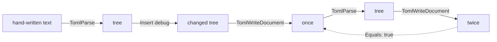

# Writing TOML

::note
<!-- sync:needs:start -->

**You'll need**: [TOML](/docs/learn/toml), [Writing JSON](/docs/learn/json-write), [Error sum](/docs/learn/error-sum)
<!-- sync:needs:end -->

::

Reading a configuration file is half the job; a program that changes its own settings has to write the file back. `TomlWriteDocument` turns a `TomlValue` table into TOML text, the way `WriteValue` did for JSON in [JSON write](/docs/learn/json-write):

```
TomlWriteDocument(writer, table) -> ! FormatError
```

This lesson reads a document a person wrote, adds a key, writes it back, and looks closely at what the trip through the tree keeps and what it loses.

```rux
import Text::{ FormatError, String, StringBuilder, StringView, TextError, TextWriter };
import Toml::{ TomlParse, TomlParseFailure, TomlValue, TomlWriteDocument };
```

## A document as a person writes it

```rux
let lines: char8[..][6] = [
    "# Settings for the demo server",
    "name = 'Rux'      # a literal string",
    "mask = 0xFF",
    "server = { host = \"localhost\", port = 8080 }",
    "",
    "tags = [\"web\", \"api\"]"
];
let text = Lines(allocator, lines)?;
PrintLine("read:\n{}", text);
var root = TomlParse(allocator, text.View().Bytes())?;
```

It has everything a hand-written file collects: a comment on a line of its own and another after a value, a `'literal string'` in single quotes, a number in hexadecimal, an _inline table_ in braces, and a blank line.

`Main` returns `! (TextError | FormatError | TomlParseFailure)` — an [error sum](/docs/learn/error-sum) of the three things that can go wrong: building text, writing it, and parsing it. So every step here can use `?`, including the parse.

## Changing the tree

To change a table, borrow it for changing. `FindMutable` is `Find`'s writable twin: it answers a `*var TomlValue`, and `Insert` adds a key and value to the table it points at, taking ownership of both:

```rux
let server = root.FindMutable(StringView::FromValidated("server"));
(*server).Insert(String::FromBytes(allocator, "debug")?, TomlValue::Boolean(allocator, true));
```

`root` itself is declared `var`, because borrowing part of it for changing changes it.

## Writing it back

`Written` is the same shape as in JSON write: a `StringBuilder` collects the text, and the caller gets it as a `String`:

```rux
func Written(allocator: Allocator, table: &TomlValue) -> String ! FormatError {
    var builder = StringBuilder(allocator);
    let sink: &var TextWriter = builder;
    TomlWriteDocument(sink, table)?;
    return builder.IntoString();
}
```

## What survives the trip

The parser keeps **values, not spelling**. So writing a parsed document back gives an equivalent document, not the same file:

| Read                                           | Written                                          |
| ---------------------------------------------- | ------------------------------------------------ |
| `# Settings for the demo server`               | gone — comments are not values                   |
| `name = 'Rux'      # a literal string`         | `name = "Rux"` — an ordinary string, no comment  |
| `mask = 0xFF`                                  | `mask = 255` — the number, in decimal            |
| `server = { host = "localhost", port = 8080 }` | a `[server]` section, written last               |
| the blank line                                 | gone; one blank line now comes before `[server]` |
| `tags = ["web", "api"]`                        | unchanged, but now before `[server]`             |

The inline table moved because TOML requires it: once a `[header]` opens a section, every following `key = value` belongs to that section, so the plain keys of a table must be written before any of its sections. What does survive is every key, every value, and their order within each table — `debug` appears after `host` and `port`, where it was inserted.

## Writing is stable

The writer is **deterministic**: the same tree always writes the same bytes. So write, read the output back, write again — and the second text is the first one exactly:

```rux
let again = TomlParse(allocator, once.View().Bytes())?;
let twice = Written(allocator, again)?;
let first = once.View();
PrintLine("written twice, same text: {}", twice.View().Equals(first));
```



The first trip normalises the file; after that nothing moves. That matters for a program that saves its settings every time it runs: the file changes when a setting does, and not otherwise.

## The program

The whole lesson is one package in the [Examples repository](https://github.com/rux-lang/Examples/tree/main/DataFormats/TomlWrite). Its comments explain every step.

<!-- sync:program:start -->

```rux [Src/Main.rux]
// `TomlWriteDocument` turns a `TomlValue` table back into TOML text, written into any
// `TextWriter`:
//
//     TomlWriteDocument(writer, table) -> ! FormatError
//
// The parser keeps values, not spelling, so writing a parsed document back gives an equivalent
// document rather than the same file. Comments and blank lines are gone, `0xFF` becomes `255`,
// a literal string becomes an ordinary one and an inline table becomes a `[header]` section,
// written after the plain keys because TOML requires it. What does survive is every key, every
// value, and their order within each table. And the writer is deterministic: the same tree
// always writes the same bytes, so write, read and write again, and the second text is the
// first one exactly.
import Allocator::{ Allocator, SystemAllocator };
import Io::PrintLine;
import Text::{ FormatError, String, StringBuilder, StringView, TextError, TextWriter };
import Toml::{ TomlParse, TomlParseFailure, TomlValue, TomlWriteDocument };

func Lines(allocator: Allocator, lines: char8[..][..]) -> String ! TextError {
    var builder = StringBuilder(allocator);
    for i in 0..lines.length {
        builder.Append(lines[i])?;
        builder.Append("\n")?;
    }
    return builder.IntoString();
}

// Writes `table` as TOML and hands the text back as a String the caller owns.
func Written(allocator: Allocator, table: &TomlValue) -> String ! FormatError {
    var builder = StringBuilder(allocator);
    let sink: &var TextWriter = builder;
    TomlWriteDocument(sink, table)?;
    return builder.IntoString();
}

func Main() -> ! (TextError | FormatError | TomlParseFailure) {
    var system = SystemAllocator();
    let allocator: Allocator = system;

    // A document as a person might write it.
    let lines: char8[..][6] = [
        "# Settings for the demo server",
        "name = 'Rux'      # a literal string",
        "mask = 0xFF",
        "server = { host = \"localhost\", port = 8080 }",
        "",
        "tags = [\"web\", \"api\"]"
    ];
    let text = Lines(allocator, lines)?;
    PrintLine("read:\n{}", text);
    var root = TomlParse(allocator, text.View().Bytes())?;

    // Change the tree before writing it. `FindMutable` lends a table for changing, and
    // `Insert` takes ownership of a new key and value.
    let server = root.FindMutable(StringView::FromValidated("server"));
    (*server).Insert(String::FromBytes(allocator, "debug")?, TomlValue::Boolean(allocator, true));

    let once = Written(allocator, root)?;
    PrintLine("written:\n{}", once);

    // Read the output back and write it again: nothing moves the second time.
    let again = TomlParse(allocator, once.View().Bytes())?;
    let twice = Written(allocator, again)?;
    let first = once.View();
    PrintLine("written twice, same text: {}", twice.View().Equals(first));
}
```

Besides `Io`, its `Rux.toml` lists `Allocator`, `Text` and `Toml` under `[Dependencies]`.
<!-- sync:program:end -->

## Run it

```sh
cd Examples/DataFormats/TomlWrite
rux run
```

<!-- sync:output:start -->

```
read:
# Settings for the demo server
name = 'Rux'      # a literal string
mask = 0xFF
server = { host = "localhost", port = 8080 }

tags = ["web", "api"]

written:
name = "Rux"
mask = 255
tags = ["web", "api"]

[server]
host = "localhost"
port = 8080
debug = true

written twice, same text: true
```

<!-- sync:output:end -->

## Common mistakes

::warning
**Looking up a table with `Find` to change it.**\
`Find` lends the table read-only. `root.Find(…)` followed by `(*server).Insert(…)` fails with `error: cannot call 'Insert' on an immutable receiver`. Use `FindMutable`.
::

::warning
**A parsed document declared with `let`.**\
`let root = TomlParse(…)?;` and then `root.FindMutable(…)` fails with `error: cannot call 'FindMutable' on immutable 'root'`. A tree you mean to change must be a `var`.
::

::warning
**Expecting `Insert` to replace a value.**\
`Insert` always appends, even when the table already has that key. Insert a second `port` and the writer writes `port` twice; reading that text back is refused, because a repeated key is an error in TOML — so this program's `?` ends `Main` with status 1. Check with `Find` before inserting.
::

::warning
**Rewriting a file a person maintains.**\
Comments, blank lines and the spelling of values do not survive. That is fine for a file only the program writes, and a nasty surprise in one a person has annotated. Write such settings to a separate file, or leave the person's file alone.
::

## Try it yourself

1. Insert a top-level key, `version = 2`, with `TomlValue::Integer(allocator, 2)`. Where in the output does it land, and why there?
2. Write the mask in binary instead: `mask = 0b1111_1111`. What does the written text say?
3. Add a comment after `tags`. Is any trace of it left in the output?
4. In the tree `again`, find `server` and read `debug` back with `AsBoolean`. Did the value survive the trip as a boolean?

## Learn more

- [TOML](/docs/learn/toml) — reading values out of the tree this lesson writes
- [JSON write](/docs/learn/json-write) — the same writer pattern for JSON
- [Error sum](/docs/learn/error-sum) — `Main` failing with one of three error types
- [Atomic file](/docs/learn/atomic-file) — saving the written text so a crash cannot leave half a file
