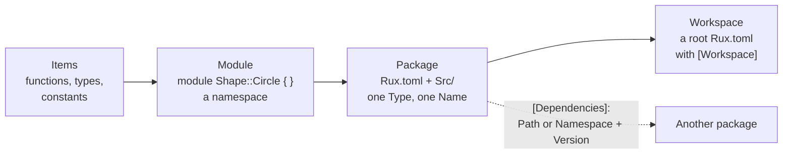

# Part 22: Packages

Every program so far has been one package with one source file. Real projects are bigger: many files, libraries of your own, packages from the registry, sometimes a whole tree of packages worked on together. This part shows how Rux organises all of that — from a module inside one file up to a workspace of several packages — and the `rux` commands that keep such a project tidy. By the end you can split a program into a library and an executable, decide what the library shows to the world, and test and document it.

## What you will learn

- Splitting one package across several files, and grouping names into modules with `module A::B { }`.
- Choosing what a package shows to other packages with `pub`, and what it keeps private.
- Reading a `Rux.toml` manifest, and the four package types it can declare.
- Depending on registry packages and on packages in a folder beside your own.
- Keeping a program and its libraries in one workspace.
- What source, static and shared libraries are, and what each one produces.
- Documenting a public API with `///` comments and generating pages with `rux doc`.
- Formatting, linting and testing a package with `rux fmt`, `rux lint` and `rux test`.

## From module to workspace

Each level groups the one before it:



| Level     | Declared by                   | Groups            | `pub` matters?                        |
| --------- | ----------------------------- | ----------------- | ------------------------------------- |
| Module    | `module Name { }` in a file   | items             | no — a package sees all its modules   |
| Package   | `Rux.toml` with `[Package]`   | files and modules | yes — at the border to other packages |
| Workspace | `Rux.toml` with `[Workspace]` | packages          | no — membership is not a dependency   |

## Lessons

<!-- sync:lessons:start -->

|       | Lesson                                       | What you will learn                                 |
| ----- | -------------------------------------------- | --------------------------------------------------- |
| 22.1  | [Module](/docs/learn/module)                 | split a package across source files and modules     |
| 22.2  | [Visibility](/docs/learn/visibility)         | choose what a package shows to others with `pub`    |
| 22.3  | [Package](/docs/learn/package)               | what a manifest says about a package                |
| 22.4  | [Dependency](/docs/learn/dependency)         | depend on another package                           |
| 22.5  | [Workspace](/docs/learn/workspace)           | build several packages together                     |
| 22.6  | [Source library](/docs/learn/source-library) | write a library and use it from an executable       |
| 22.7  | [Static library](/docs/learn/static-library) | build a static library                              |
| 22.8  | [Shared library](/docs/learn/shared-library) | build a shared library                              |
| 22.9  | [Documentation](/docs/learn/documentation)   | document your code with `///` comments              |
| 22.10 | [Tooling](/docs/learn/tooling)               | format, lint, test and document with the `rux` tool |

<!-- sync:lessons:end -->

## Before you start

This part leans on [Part 4: Functions](/docs/learn/functions) and [Part 6: Types](/docs/learn/types) — the libraries here export functions, structs, constructors and methods — and Source library uses a [generic](/docs/learn/generic) function over a [slice](/docs/learn/slice). Each lesson's package is in the Examples repository's `Packages/` folder:

```sh
cd Examples/Packages/Module
rux run
```

Several lessons hold more than one package: the library sits in a folder beside `Src/` with its own `Rux.toml`, and the lesson page shows every file. Workspace is run from its `App/` member, and the two native library lessons are built with `rux build` rather than run.

## After this part

[Part 23: Compile time](/docs/learn/compile-time) is about code chosen while compiling — `when`, the target and build mode you met as `#build` in [Package](/docs/learn/package), and your own defines. [Part 24: Platform](/docs/learn/platform) then calls native code with `extern`, which is how a separately built program uses a [shared library](/docs/learn/shared-library). This part has no checkpoint project of its own; the next one, [Melody](/docs/learn/melody), follows Part 24.

For the full rules, see [Modules](/docs/lang/modules/overview) in the Rux Reference, and the packaging guides: [Package manifest](/docs/packaging/manifest), [Package types](/docs/packaging/types) and [Dependencies](/docs/packaging/dependencies). Every command used here is described in the [CLI reference](/docs/cli).
