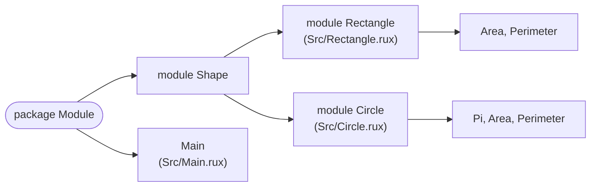

# Module

::note
<!-- sync:needs:start -->

**You'll need**: [Function](/docs/learn/function), [Const](/docs/learn/const)
<!-- sync:needs:end -->

::

Until now every program has fitted in one file, `Src/Main.rux`. Real programs outgrow that quickly, and Rux gives you two separate tools for organising them. **Files** are how you store the source: a package may have as many as you like. **Modules** are how you organise the _names_ in it: a module is a named namespace, so two functions can both be called `Area` as long as they live in different modules. This lesson uses both, in one package.

## Many files, one package

Every `.rux` file under `Src/` belongs to the package, and the compiler reads them all together as one unit. This lesson has three: `Main.rux`, `Rectangle.rux` and `Circle.rux`. You do not list them anywhere — putting a file in `Src/` is enough.

The file's own name means nothing to the compiler. What decides where its functions live is the `module` declaration wrapped around them, in `Src/Rectangle.rux`:

```rux
module Shape::Rectangle {
    func Area(width: int, height: int) -> int {
        return width * height;
    }

    func Perimeter(width: int, height: int) -> int {
        return 2 * (width + height);
    }
}
```

You could rename the file to `Boxes.rux` and nothing would change. Keeping file and module names in step is still a good habit, because it tells a reader where to look.

## A module is a namespace

`Src/Circle.rux` declares `Area` and `Perimeter` again. That is not a clash, because a module is a namespace: the full name of each function includes the module it is in.

```rux
module Shape::Circle {
    const Pi: float64 = 3.14159;

    func Area(radius: float64) -> float64 {
        return Pi * radius * radius;
    }
```

`A::B` nests one module inside another, so both modules sit under a shared parent called `Shape`. Writing `module Shape { module Circle { … } }` would mean exactly the same thing; the `::` form just saves a level of indentation. Seen from outside, every path starts with the package name, which is `Module` — the `Name` in this lesson's `Rux.toml`:



| Function           | Declared in         | Full path                         |
| ------------------ | ------------------- | --------------------------------- |
| Rectangle's `Area` | `Src/Rectangle.rux` | `Module::Shape::Rectangle::Area`  |
| Circle's `Area`    | `Src/Circle.rux`    | `Module::Shape::Circle::Area`     |
| `Main`             | `Src/Main.rux`      | at the package root, in no module |

## Importing an item or a whole module

`Main.rux` reaches the other two files with imports, and they show the two things an import can name:

```rux
import Io::PrintLine;
import Module::Shape::Circle;
import Module::Shape::Rectangle::{ Area, Perimeter };
```

The last line imports two **items**, the rectangle's functions. Imported items are used by their bare names, as if they were declared in `Main.rux`:

```rux
PrintLine("rectangle 3 x 4 area      {}", Area(3, 4));
PrintLine("rectangle 3 x 4 perimeter {}", Perimeter(3, 4));
```

The second line imports a whole **module**. Its items are then reached through the module's name, which is what keeps both `Area`s usable side by side:

```rux
PrintLine("circle radius 4 area      {}", Circle::Area(4.0));
PrintLine("circle radius 4 perimeter {}", Circle::Perimeter(4.0));
```

Importing a module rather than its items is the better choice whenever a name on its own would be unclear. `Circle::Area(4.0)` says which area you mean; a bare `Area(4.0)` makes the reader go and look.

## No `pub` inside a package

Nothing in `Rectangle.rux` or `Circle.rux` is marked `pub`, and `Main.rux` uses them anyway. Every file of a package sees everything the package declares. `pub` is about what _other packages_ may see — which is the next lesson, [Visibility](/docs/learn/visibility).

## The program

The whole lesson is one package in the [Examples repository](https://github.com/rux-lang/Examples/tree/main/Packages/Module). Its comments explain every step.

<!-- sync:program:start -->

::code-tree{defaultValue="Src/Main.rux"}

```toml [Rux.toml]
[Manifest]
Version = 1
MinRux = "0.4.0"

[Package]
Name = "Module"
Version = "0.1.0"
Type = "Executable"
Description = "Source files, modules and imports inside one package"
Authors = ["Rux Contributors <info@rux-lang.dev>"]

[Dependencies]
Io = { Namespace = "Rux", Version = "*" }
```

```rux [Src/Circle.rux]
// A second file, adding a second module beside the first one under the same `Shape` parent.
//
// It declares `Area` and `Perimeter` again. That is not a clash: a module is a namespace, so
// `Shape::Circle::Area` and `Shape::Rectangle::Area` are two different names.
module Shape::Circle {
    const Pi: float64 = 3.14159;

    func Area(radius: float64) -> float64 {
        return Pi * radius * radius;
    }

    func Perimeter(radius: float64) -> float64 {
        return 2.0 * Pi * radius;
    }
}
```

```rux [Src/Main.rux]
// Until now every package has been a single `Main.rux`. A package may hold as many source files
// as it likes under `Src/`, and the compiler reads them all as one package.
//
// Each of the other two files wraps its contents in `module Shape::Rectangle { }` or
// `module Shape::Circle { }`. A module is a named namespace inside the package, and `A::B` nests
// one module inside another, so both of these live under a shared parent called `Shape`.
//
// An import can bring in two kinds of thing:
//
// - an item, such as a function, which is then used by its bare name, or
// - a whole module, whose items are then reached through it: `Circle::Area(4.0)`.
//
// Nothing in the other files is marked `pub`. Every file of a package sees everything the package
// declares; `pub` is about what other packages may see, which is the next lesson.
import Io::PrintLine;
import Module::Shape::Circle;
import Module::Shape::Rectangle::{ Area, Perimeter };

func Main() -> int {
    // Imported items read like functions declared in this file.
    PrintLine("rectangle 3 x 4 area      {}", Area(3, 4));
    PrintLine("rectangle 3 x 4 perimeter {}", Perimeter(3, 4));

    // The circle's functions have the same names, so they are reached through their module.
    // That keeps both `Area`s usable side by side.
    PrintLine("circle radius 4 area      {}", Circle::Area(4.0));
    PrintLine("circle radius 4 perimeter {}", Circle::Perimeter(4.0));
    return 0;
}
```

```rux [Src/Rectangle.rux]
// This file adds a module called `Shape::Rectangle` to the package. The file's own name means
// nothing to the compiler; the `module` declaration is what decides where these functions live.
//
// The path is written relative to the package. Seen from an import, the full name starts with the
// package name, as every import does: `Module::Shape::Rectangle`.
module Shape::Rectangle {
    func Area(width: int, height: int) -> int {
        return width * height;
    }

    func Perimeter(width: int, height: int) -> int {
        return 2 * (width + height);
    }
}
```

::
<!-- sync:program:end -->

## Run it

```sh
cd Examples/Packages/Module
rux run
```

<!-- sync:output:start -->

```
rectangle 3 x 4 area      12
rectangle 3 x 4 perimeter 14
circle radius 4 area      50.26544
circle radius 4 perimeter 25.13272
```

<!-- sync:output:end -->

## Common mistakes

::warning
**Leaving the package name out of the import.**\
An import always starts with a package. Write `import Shape::Circle;` and the compiler looks for a package called `Shape`: `error: package 'Shape' is not listed in [Dependencies]`, with the help line "add the package under [Dependencies] or correct the import path". Your own modules start with your own package's name, `Module::Shape::Circle`.
::

::warning
**Using a module without importing it.**\
Without `import Module::Shape::Circle;`, the call `Circle::Area(4.0)` fails with `error: name 'Circle' is not defined in this scope`. Spelling out the whole path does not help either — `Module::Shape::Circle::Area(4.0)` fails the same way, naming `'Module'`. The first segment of a path has to be brought in by an import.
::

::warning
**Importing a package as if it were a module.**\
`import Io;` fails with `error: import 'Io' does not name a module`, and the help suggests `import Io::Name`. Import the items you need from a package, or one of its modules.
::

::warning
**Two imported functions nobody can tell apart.**\
Here both `Area`s could even be imported by name together, because one takes two `int`s and the other a `float64`, so every call picks one. If they took the same parameters, `Area(2, 3)` would fail with `error: call to 'Area' is ambiguous: 2 overloads accept argument types (int, int)`. Import the module and qualify the call instead.
::

## Try it yourself

1. Add a fourth file, `Src/Square.rux`, with a module `Shape::Square` and a function `Area(side: int) -> int`. Import the module and print the area of a 5 × 5 square.
2. Replace `import Module::Shape::Circle;` with `import Module::Shape;` and change the calls to `Shape::Circle::Area(4.0)`. Does it still run?
3. Change `Name` in `Rux.toml` to `Shapes`. Which lines does the compiler reject, and what do you have to change? Look at the name of the program in `Bin/` afterwards.

## Learn more

- [Module declaration](/docs/lang/modules/overview#module-declarations) and [Import](/docs/lang/modules/imports) in the Rux Reference
- [Visibility](/docs/learn/visibility) — what `pub` means between packages
- [Directory layout](/docs/packaging/layout) — where the files of a package go
