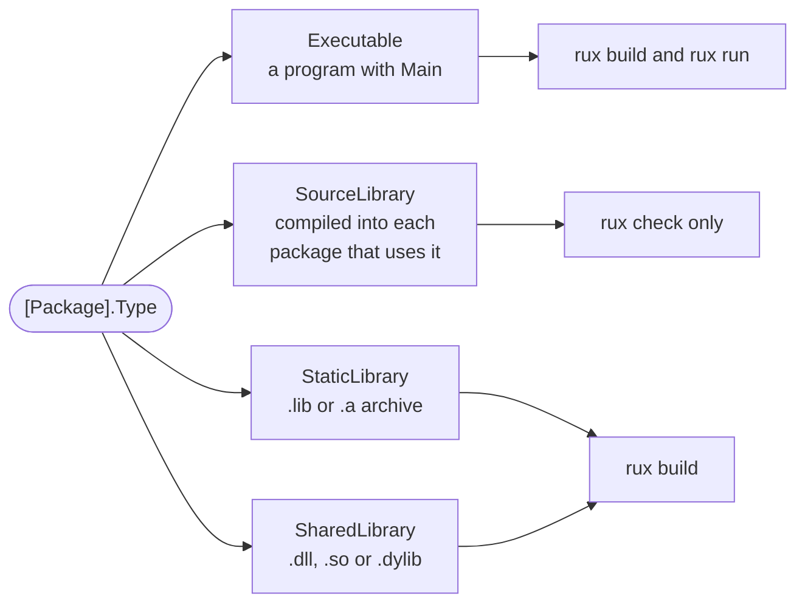

# Package

::note
<!-- sync:needs:start -->

**You'll need**: [Module](/docs/learn/module), [Enum](/docs/learn/enum), [Match expression](/docs/learn/match-expression)
<!-- sync:needs:end -->

::

Every lesson so far has had a `Rux.toml` beside its `Src/` folder, and you have mostly ignored it. That file is the **package manifest**: it tells `rux` what the package is called, what it builds and what it needs. This lesson reads one section by section, and its program asks the compiler to report back on its own manifest.

## The manifest, section by section

Here is this lesson's `Rux.toml` in full:

```toml [Rux.toml]
[Manifest]
Version = 1
MinRux = "0.4.0"

[Package]
Name = "Package"
Version = "0.1.0"
Type = "Executable"
Description = "The parts of a Rux.toml manifest and the four package types"
Authors = ["Rux Contributors <info@rux-lang.dev>"]

[Dependencies]
Core = { Namespace = "Rux", Version = "*" }
Io = { Namespace = "Rux", Version = "*" }
```

It has three sections, each about something different:

| Section          | Describes                     | Fields used here                                                     |
| ---------------- | ----------------------------- | -------------------------------------------------------------------- |
| `[Manifest]`     | the file itself               | `Version`, the schema; `MinRux`, the oldest compiler                 |
| `[Package]`      | the package                   | `Name`, `Version`, `Type`, `Description`, `Authors`                  |
| `[Dependencies]` | the packages this one imports | one line per import name — the [next lesson](/docs/learn/dependency) |

The manifest is strict. Field names are case-sensitive, and an unknown field is an error rather than something quietly ignored, so a typo fails the build instead of silently changing it.

## Two versions that have nothing to do with each other

The file has two `Version` lines, and they answer different questions. `[Manifest].Version = 1` is the **schema** version: which set of rules the file is written in. It is always written out, never inferred, and 1 is the only one so far. `[Package].Version = "0.1.0"` is the package's own **release number**, a semantic version that you raise as the package changes.

`MinRux` sits next to the schema version because it is also about reading the file: a compiler older than `MinRux` refuses the package before compiling anything.

## `Name` reaches further than it looks

`Name` is more than a label. It is the first segment of every import path into the package — you used that in [Module](/docs/learn/module), where every path began with `Module::` — and it is the name of what the build produces. `rux run` here builds `Bin/Debug/<OS>/<Arch>/Package.exe` on Windows.

## Four package types

`Type` is required, and it decides what `rux build` makes:



Every lesson so far has been an `Executable`. The other three are the subject of [Source library](/docs/learn/source-library), [Static library](/docs/learn/static-library) and [Shared library](/docs/learn/shared-library).

## The program reads its own manifest

`#build` and `#compiler` are values the compiler fills in while it compiles, imported from `Core` like any other item. [Part 23: Compile time](/docs/learn/compile-time) covers them properly; here they let the program see its manifest from the inside. `#build.outputKind` is `[Package].Type`:

```rux
let kind = match #build.outputKind {
    .Executable => "Executable",
    .SourceLibrary => "SourceLibrary",
    .StaticLibrary => "StaticLibrary",
    .SharedLibrary => "SharedLibrary"
};
```

`#compiler.version` is the version of the compiler doing the build, so the program can compare it with the `MinRux` it declares:

```rux
let minimum = SemanticVersion(0, 4, 0);
PrintLine("MinRux   0.4.0 met: {}", #compiler.version.Compare(minimum) >= 0);
```

A program that runs at all always prints `true` here — a compiler that did not meet `MinRux` would have refused to build it. And `#build.profile` is `Debug` for a plain `rux run`, or `Release` with `rux run --release`.

## Starting a new package

You rarely write a manifest from nothing. `rux new Name` creates a folder with a minimal `Rux.toml`, a `Src/Main.rux` and a `.gitignore`; `--source`, `--static` and `--shared` pick the other three types. The manifest it writes has only the required fields — no `MinRux`, which is optional until you publish — so you add the rest, and the `[Dependencies]` you need, by hand.

## The program

The whole lesson is one package in the [Examples repository](https://github.com/rux-lang/Examples/tree/main/Packages/Package). Its comments explain every step.

<!-- sync:program:start -->

```rux [Src/Main.rux]
// Every lesson so far has had a `Rux.toml` beside its `Src/` directory. That file is the package
// manifest, and this lesson reads it section by section.
//
// - `[Manifest]` describes the file itself. `Version = 1` is the manifest schema, and `MinRux` is
//   the oldest compiler allowed to build the package.
// - `[Package]` describes the package. `Name` is also the first segment of every import path into
//   it. `Version` is the package's own version, unrelated to the schema version above. `Type`
//   decides what `rux build` produces.
// - `[Dependencies]` lists the packages this one imports, one line per import name.
//
// `Type` is required, and it is one of four:
//
//     Executable      a program with a `Main`; `rux run` builds it and starts it
//     SourceLibrary   source compiled into every package that depends on it
//     StaticLibrary   a native archive: `.lib` on Windows, `.a` elsewhere
//     SharedLibrary   a native library loaded at run time: `.dll`, `.so` or `.dylib`
//
// The program asks the compiler what it is building. `#build` and `#compiler` are values the
// compiler fills in while it compiles, imported from `Core` like any other item. The Compile time
// part covers them properly; here they let the program report on its own manifest.
import Core::{ #build, #compiler, OutputKind, SemanticVersion };
import Io::PrintLine;

func Main() -> int {
    // `outputKind` is `[Package].Type`, seen from inside the program.
    let kind = match #build.outputKind {
        .Executable => "Executable",
        .SourceLibrary => "SourceLibrary",
        .StaticLibrary => "StaticLibrary",
        .SharedLibrary => "SharedLibrary"
    };
    PrintLine("Type     {}", kind);

    // A compiler older than `MinRux` refuses the package before compiling anything, so a program
    // that runs at all always finds this true.
    let minimum = SemanticVersion(0, 4, 0);
    PrintLine("MinRux   0.4.0 met: {}", #compiler.version.Compare(minimum) >= 0);

    // `rux run` builds the Debug profile, into `Bin/Debug/<OS>/<Arch>/Package.exe` on Windows.
    // The file name comes from `[Package].Name`.
    PrintLine("Profile  {}", #build.profile);
    return 0;
}
```

Besides `Io`, its `Rux.toml` lists `Core` under `[Dependencies]`.
<!-- sync:program:end -->

## Run it

```sh
cd Examples/Packages/Package
rux run
```

<!-- sync:output:start -->

```
Type     Executable
MinRux   0.4.0 met: true
Profile  Debug
```

This package's own `Rux.toml`, line by line:

| Line                                          | Meaning                                                                    |
| --------------------------------------------- | -------------------------------------------------------------------------- |
| `[Manifest]`                                  | Facts about the file itself                                                |
| `Version = 1`                                 | The manifest schema; 1 is the only one, and it is never inferred           |
| `MinRux = "0.4.0"`                            | The oldest compiler that may build the package                             |
| `[Package]`                                   | Facts about the package                                                    |
| `Name = "Package"`                            | Its name, the first segment of its import paths and of its artifact's name |
| `Version = "0.1.0"`                           | The package's own semantic version                                         |
| `Type = "Executable"`                         | What it builds: one of the four package types in `Src/Main.rux`            |
| `Authors = [...]`                             | Who wrote it                                                               |
| `Description = "..."`                         | One line about it                                                          |
| `[Dependencies]`                              | The packages it imports, one per import name                               |
| `Core = { Namespace = "Rux", Version = "*" }` | `Core` from the registry, any version installed                            |

`rux new Name` writes a manifest like this one; `--source`, `--static` and `--shared` select the other three types.
<!-- sync:output:end -->

## Common mistakes

::warning
**Leaving out `Type`.**\
There is no default package type. Without the line, `rux` stops at `error: [Package] must declare 'Type'`, and the help line lists the four choices.
::

::warning
**An old or invented type name.**\
`Type = "Program"` fails with `error: [Package].Type must be 'Executable', 'SharedLibrary', 'StaticLibrary' or 'SourceLibrary', found 'Program'`. The older spellings `Program`, `Library` and `Source` are gone, with no aliases.
::

::warning
**A misspelt field.**\
The manifest is strict: `Descripton = "…"` fails with `error: unknown field 'Descripton' in [Package]`. That is a feature — a typo cannot quietly drop a setting.
::

::warning
**Raising the wrong `Version`.**\
`[Manifest].Version` is not your release number. Set it to 2 and the build stops with `error: unsupported manifest version 2 in [Manifest].Version; this compiler accepts version 1`. Release numbers go in `[Package].Version`.
::

::warning
**A `MinRux` newer than your compiler.**\
With `MinRux = "9.0.0"`, nothing is compiled: `error: package 'Package' requires Rux '9.0.0' or newer, but this is Rux '0.4.0'`. Install a newer `rux`, or lower `MinRux` if the package really builds with an older one.
::

## Try it yourself

1. Run `rux run --release` and compare the `Profile` line with a plain `rux run`.
2. Change `Type` to `StaticLibrary` and try `rux run`. Then try `rux build` and find the file it writes under `Bin/`.
3. Run `rux info` in this folder. Which manifest fields does it show?
4. Outside the Examples repository, run `rux new Sketch --source` and compare its `Rux.toml` and `Src/` with this lesson's.

## Learn more

- [Package manifest](/docs/packaging/manifest) — every section and field, with the validation rules
- [Package types](/docs/packaging/types) — what each `Type` builds on each platform
- [`rux new`](/docs/cli/new) and [`rux info`](/docs/cli/info) in the CLI reference
- [Match expression](/docs/learn/match-expression) — the `match` that turns `outputKind` into text
