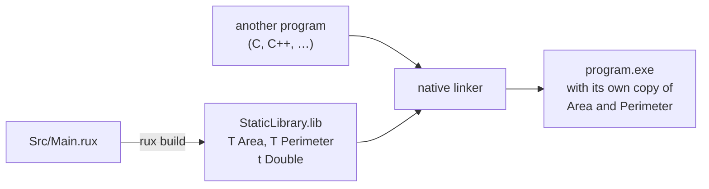

# Static library

::note
<!-- sync:needs:start -->

**You'll need**: [Package](/docs/learn/package), [Source library](/docs/learn/source-library)
<!-- sync:needs:end -->

::

A [source library](/docs/learn/source-library) waits to be compiled into whatever uses it. A **static library** is the opposite: the package is compiled ahead of time, straight to machine code, and packed into a native archive. Archives are what native toolchains — C and C++ linkers, for instance — know how to use, so this is how Rux code is handed to them. This package has no `Main` and nothing to run; the lesson is about what the build produces.

## Asking for an archive

One line of the manifest changes:

```toml
Type = "StaticLibrary"
```

`rux build` then writes an archive whose name follows each platform's convention:

| Platform              | File written by `rux build`                                |
| --------------------- | ---------------------------------------------------------- |
| Windows               | `Bin/Debug/Windows/x86-64/StaticLibrary.lib`               |
| Linux, macOS, FreeBSD | `libStaticLibrary.a`, in the matching `Bin/Debug/…` folder |

`rux build --release` writes the optimised version under `Bin/Release/` instead.

A native linker treats an archive as a box of parts: when it builds a program, it copies in the functions that program calls, and leaves the rest. The finished program carries its own copy of everything it took, so nothing extra has to ship beside it.

## One symbol per function

Inside the archive, each function is a **symbol** — a name a linker can bind a call to. The source decides which names are offered to the outside:

```rux
pub func Area(width: int, height: int) -> int {
    return width * height;
}

pub func Perimeter(width: int, height: int) -> int {
    return Double(width + height);
}

func Double(value: int) -> int {
    return 2 * value;
}
```

`Area` and `Perimeter` are `pub`, so they become **global** symbols that other code can link against. `Double` is package-private, so it becomes a **local** symbol: it is in the archive, because `Perimeter` needs it, but nothing outside can bind to it. A symbol lister shows the difference. With LLVM installed, `llvm-nm` on the Windows archive prints:

```
Main.obj:
00000000 T Area
00000137 t Double
0000008e T Perimeter
```

Capital `T` means a global function, lower-case `t` a local one. The numbers are positions within the compiled code and change as the code does. `Main.obj` is named after the source file, `Src/Main.rux`.



## What a static library is not

It is **not a program**. There is no `Main`, so `rux run` refuses to start it.

It is also **not what Rux packages consume**. If another Rux package lists this one under `[Dependencies]`, it compiles this package's _source_, exactly as it would a source library, and `pub` works as it always does: `Area` can be imported, `Double` cannot. In Rux 0.4.0 every dependency is taken as source. The archive is for native toolchains, not for other Rux packages.

## The program

The whole lesson is one package in the [Examples repository](https://github.com/rux-lang/Examples/tree/main/Packages/StaticLibrary). Its comments explain every step.

<!-- sync:program:start -->

```rux [Src/Main.rux]
// `Type = "StaticLibrary"` asks `rux build` for a native archive: the package compiled ahead of
// time to machine code and packed into `StaticLibrary.lib` on Windows, or `libStaticLibrary.a` on
// Linux, macOS and FreeBSD. A native linker copies what it needs from an archive into the program
// it is building, so nothing extra has to ship beside that program.
//
// The archive holds one symbol per function. `Area` and `Perimeter` are `pub`, so they become
// global symbols that other code can link against. `Double` is package-private, so it becomes a
// local symbol: it is in the archive, because `Perimeter` calls it, but nothing outside can bind
// to it.
//
// Two things a static library is not:
//
// - It is not a program. There is no `Main`, and `rux run` refuses with "package 'StaticLibrary'
//   produces a static library and cannot be run".
// - It is not what Rux packages consume. A package that lists this one under `[Dependencies]`
//   compiles its source, exactly as it would a source library; in Rux 0.4.0 dependencies are
//   always taken as source. The archive is for native toolchains.
pub func Area(width: int, height: int) -> int {
    return width * height;
}

pub func Perimeter(width: int, height: int) -> int {
    return Double(width + height);
}

func Double(value: int) -> int {
    return 2 * value;
}
```

<!-- sync:program:end -->

## Run it

```sh
cd Examples/Packages/StaticLibrary
rux build
```

<!-- sync:output:start -->

```
Compiling StaticLibrary v0.1.0 (Debug, Windows x86-64)
Built StaticLibrary (Debug, Windows x86-64) in 1 ms
  Output: Bin\Debug\Windows\x86-64\StaticLibrary.lib
  1 file | 28 LOC | 61 tokens | 18.6K LOC/s | StaticLibrary.lib 1 KB
```

Any symbol lister shows what the archive holds; with LLVM installed, `llvm-nm Bin/Debug/Windows/x86-64/StaticLibrary.lib` prints `T` for the global `Area` and `Perimeter` and `t` for the local `Double`.
<!-- sync:output:end -->

## Common mistakes

::warning
**Running a library.**\
`rux run` fails with `error: package 'StaticLibrary' produces a static library and cannot be run`, noting that "only executable packages have an entry point". Use `rux build`.
::

::warning
**Expecting a private function to be linkable.**\
`Double` is in the archive, but only as a local symbol, so a native linker cannot resolve a call to it from outside. Add `pub` to anything other code should be able to call.
::

::warning
**Expecting a Rux dependency to use the archive.**\
A Rux package that depends on this one compiles its source instead. Building the archive first changes nothing for it, and `import StaticLibrary::{ Area, Double };` still fails with `error: function 'Double' is private to package 'StaticLibrary'`.
::

## Try it yourself

1. Add a `pub` function `Volume(width: int, height: int, depth: int) -> int`, rebuild, and list the symbols again. Which letter does `Volume` get?
2. Make `Double` public and list the symbols. What changed?
3. Run `rux build --release`. Where does the archive go, and does `llvm-nm` show the same three symbols in it?
4. Write a small executable package beside this one that depends on it with `Path` and prints `Area(3, 4)`. Does its build use `StaticLibrary.lib`?

## Learn more

- [Package types](/docs/packaging/types) — the archive names on each platform
- [`rux build`](/docs/cli/build) in the CLI reference
- [Shared library](/docs/learn/shared-library) — the other native library type, loaded at run time
- [Visibility](/docs/learn/visibility) — the same `pub` that decides global and local symbols here
