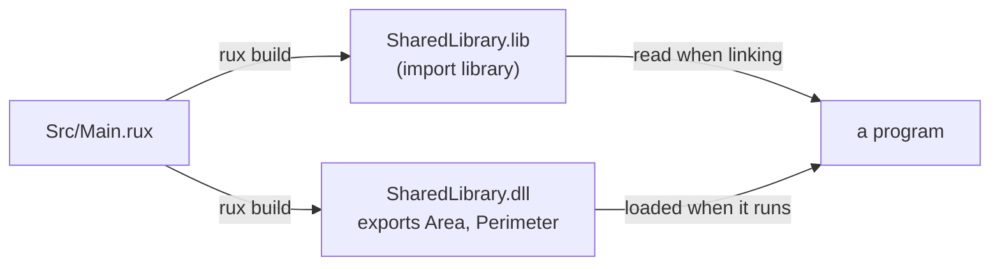

# Shared library

::note
<!-- sync:needs:start -->

**You'll need**: [Static library](/docs/learn/static-library)
<!-- sync:needs:end -->

::

A [static library](/docs/learn/static-library) is copied into each program that links it. A **shared library** is not copied anywhere: it ships as a file of its own, and programs load it while they run. Every program that uses it shares the one copy on disk, and the library can be replaced without rebuilding them. The source of this lesson is identical to the static library's; only `Type` differs, and with it what the build produces.

## Asking for a shared library

```toml
Type = "SharedLibrary"
```

Each platform has its own name and extension for the file:

| Platform       | File written by `rux build`                                      |
| -------------- | ---------------------------------------------------------------- |
| Windows        | `SharedLibrary.dll`, plus the import library `SharedLibrary.lib` |
| Linux, FreeBSD | `libSharedLibrary.so`                                            |
| macOS          | `libSharedLibrary.dylib`                                         |

On Windows the build writes two files into `Bin/Debug/Windows/x86-64/`. The `.dll` is the library itself. The small `.lib` beside it is an **import library**: a native linker reads it when it builds a program, to learn which functions that program will find in the `.dll` when it starts.

## The export table: what `pub` lets out

What other programs can call is the library's **export table**, and `pub` decides what goes in it:

```rux
pub func Area(width: int, height: int) -> int {
    return width * height;
}

pub func Perimeter(width: int, height: int) -> int {
    return Double(width + height);
}

func Double(value: int) -> int {
    return 2 * value;
}
```

`Area` and `Perimeter` are exported under exactly those names. `Double` is compiled into the library, because `Perimeter` calls it, but it is never exported, so no program can look it up. On Windows, `llvm-readobj --coff-exports` (with LLVM installed) or `dumpbin /exports` (from a Visual Studio prompt) lists the table; for this library it names `Area` and `Perimeter`, and nothing else.

The same rule covers dependencies. A shared library built on `Io` contains the parts of `Io` it uses, but exports only its own `pub` functions, not `Io`'s.

## Static or shared?

|                        | Static library             | Shared library                             |
| ---------------------- | -------------------------- | ------------------------------------------ |
| File on Windows        | `.lib`                     | `.dll` and an import `.lib`                |
| Joined to the program  | when the program is linked | when the program starts                    |
| Ships with the program | no — already copied inside | yes — the program needs the file beside it |
| Updating the library   | rebuild every program      | replace one file                           |
| What `pub` controls    | global or local symbols    | the export table                           |



## Calling it

Like a static library, a shared library has no `Main`, so `rux run` refuses it. And a Rux package that depends on it compiles its source instead, as for every dependency in Rux 0.4.0. To call the exports from a separately built program, you declare them with `extern` and name the library with `#Link` — the subject of [Extern](/docs/learn/extern) in Part 24.

## The program

The whole lesson is one package in the [Examples repository](https://github.com/rux-lang/Examples/tree/main/Packages/SharedLibrary). Its comments explain every step.

<!-- sync:program:start -->

```rux [Src/Main.rux]
// `Type = "SharedLibrary"` asks `rux build` for a library that programs load while they run:
// `SharedLibrary.dll` on Windows, `libSharedLibrary.so` on Linux and FreeBSD, and
// `libSharedLibrary.dylib` on macOS. Unlike an archive, it is not copied into the program. It
// ships as its own file, and every program that loads it shares the one copy.
//
// What other programs can call is the library's export table, and `pub` decides what goes in it.
// `Area` and `Perimeter` are exported under exactly those names. `Double` is package-private, so
// it is compiled into the library but never exported: no program can look it up. The same holds
// for dependencies: a library built on `Io` contains the code it uses, but exports only its own
// `pub` functions, not `Io`'s.
//
// On Windows, the build also writes `SharedLibrary.lib` beside the `.dll`. That small file is an
// import library, which a native linker reads to know which exports the program will find in the
// `.dll` at run time.
//
// Like a static library, a shared library has no `Main`, so `rux run` refuses it; and a Rux
// package that depends on it compiles its source instead, as for every dependency in Rux 0.4.0.
// Calling an export from a separately built program is done with `extern` and `#Link`, which the
// Platform part covers.
pub func Area(width: int, height: int) -> int {
    return width * height;
}

pub func Perimeter(width: int, height: int) -> int {
    return Double(width + height);
}

func Double(value: int) -> int {
    return 2 * value;
}
```

<!-- sync:program:end -->

## Run it

```sh
cd Examples/Packages/SharedLibrary
rux build
```

<!-- sync:output:start -->

```
Compiling SharedLibrary v0.1.0 (Debug, Windows x86-64)
Built SharedLibrary (Debug, Windows x86-64) in 1 ms
  Output: Bin\Debug\Windows\x86-64\SharedLibrary.dll
  1 file | 30 LOC | 61 tokens | 24.6K LOC/s | SharedLibrary.dll 2 KB
```

`SharedLibrary.lib`, the import library, is written beside the `.dll`. To see the export table, run `dumpbin /exports` from a Visual Studio prompt, or `llvm-readobj --coff-exports` with LLVM installed, on `Bin/Debug/Windows/x86-64/SharedLibrary.dll`. Both list `Area` and `Perimeter`, and not `Double`.
<!-- sync:output:end -->

## Common mistakes

::warning
**Running a library.**\
`rux run` fails with `error: package 'SharedLibrary' produces a shared library and cannot be run`, and the help line says "build it with 'rux build'".
::

::warning
**Forgetting `pub` on a function you mean to export.**\
Nothing warns you: the library builds, and the function is simply missing from the export table. The failure comes later, when a program that expects it is linked or loaded. List the exports after any change to the public surface.
::

::warning
**Shipping the program without the library.**\
A program that loads `SharedLibrary.dll` needs that file at run time, where the system can find it — usually beside the program. The import `.lib` is only for linking and does not need to ship.
::

## Try it yourself

1. Add a `pub` function `Volume(width: int, height: int, depth: int) -> int`, rebuild, and list the exports. Is `Volume` there?
2. Remove `pub` from `Perimeter`, rebuild and list the exports again. What happens to `Double`, which only `Perimeter` called?
3. Compare the folders that `rux build` fills in this lesson and in [Static library](/docs/learn/static-library). Which file appears in both, and does it mean the same thing?

## Learn more

- [Package types](/docs/packaging/types) — shared library names on each platform
- [Extern](/docs/learn/extern) and [C interop](/docs/learn/c-interop) — calling native libraries from Rux
- [Link](/docs/lang/attributes/link) in the Rux Reference — the `#Link` attribute
- [`rux build`](/docs/cli/build) in the CLI reference
