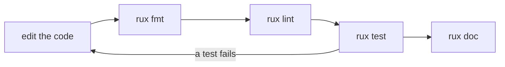

# Tooling

::note
<!-- sync:needs:start -->

**You'll need**: [Source library](/docs/learn/source-library), [Documentation](/docs/learn/documentation), [Range](/docs/learn/range)
<!-- sync:needs:end -->

::

So far you have used three `rux` commands: `run`, `check` and `build`. A few more keep a package tidy once it is more than a single file — they format it, lint it, test it and document it. None of them changes what the program does; together they catch the mistakes the compiler lets through. This lesson has a small `Calendar` library, a program that uses it, and a test for it, so that every command has something to work on.

## The pieces of this lesson

```
Tooling/
├── Rux.toml              the program; depends on Calendar
├── Src/Main.rux
├── Calendar/             the code under test, a source library
│   ├── Rux.toml
│   └── Src/Calendar.rux
└── Tests/
    └── LeapYear/         one test, an executable package
        ├── Rux.toml
        └── Src/Main.rux
```

`Calendar` lives in its own library so that both the program and the test can depend on it. The program prints the length of February for five years:

```rux
for year in 1900..=1904 {
    PrintLine("February {} has {} days", year, DaysInMonth(year, 2));
}
```

## The commands

All of them run from the package folder, `Tooling/`:

| Command           | What it does                                                        |
| ----------------- | ------------------------------------------------------------------- |
| `rux fmt`         | rewrites the sources and `Rux.toml` in the standard layout          |
| `rux fmt --check` | changes nothing; lists the files `rux fmt` would rewrite, and fails |
| `rux lint`        | warns about what compiles but is still wrong, such as missing docs  |
| `rux test`        | builds and runs every executable package below `Tests/`             |
| `rux doc`         | writes reference pages for the `pub` items to `Bin/Docs/`           |



## Formatting

`rux fmt` puts every file in the one standard layout, so a diff shows real changes and not someone's spacing habits. For `Rux.toml` that means the canonical order and spelling — sections in a fixed order, `Description` before `Authors`, spaces around every `=`. For source files in Rux 0.4.0 it is line-level clean-up: trailing spaces go and line endings are made consistent, while indentation is left as you wrote it.

`--check` turns formatting into a pass-or-fail question. It touches nothing, names each file that `rux fmt` would rewrite, and exits with status 1 if there is one. That is the form to use in a script or in continuous integration, where nobody wants the build to rewrite their files.

## Testing

A test in Rux is an ordinary executable package below `Tests/`. `rux test` builds and runs each one, and a test **passes when its `Main` returns 0**. This lesson's test checks the leap-year rules with `Assert` from `Core`:

```rux
Assert(IsLeapYear(2024), "2024 is a leap year");
Assert(!IsLeapYear(2023), "2023 is not a leap year");

// A century is not a leap year, unless it divides by 400.
Assert(!IsLeapYear(1900), "1900 is not a leap year");
Assert(IsLeapYear(2000), "2000 is a leap year");
```

When an `Assert` condition is false, it prints its message and ends the program with a failing status, so a failed test says which check it was. Because a test is a package, it has its own `Rux.toml`, which depends on the code under test by path and on `Core` from the registry:

```toml
[Dependencies]
Calendar = { Path = "../../Calendar" }
Core = { Namespace = "Rux", Version = "*" }
```

Add more folders under `Tests/` and `rux test` finds them by itself; there is no list to keep. If you break the rules in `Calendar`, the report shows which test failed and why — here, after an assertion that claims 2100 is a leap year (the timings and the exit code vary by machine):

```
Testing Tooling v0.1.0 (Debug, Windows x86-64)
Running 1 test
Failed LeapYear in 692 ms
  note: test 'LeapYear' exited with code -1073741795
  Output:
    Assertion failed: 2100 is a leap year
      at Main (Src/Main.rux:16:5)
Failed 1 test in 692 ms (0 passed, 1 failed)
```

## Linting and documenting

`rux lint` and `rux doc` work as in [Documentation](/docs/learn/documentation). `Calendar`'s functions are documented with `@param` and `@returns`, so its pages have something to show.

## What this course never runs

`rux pack` and `rux publish` also exist, for sharing a source library through the package registry. They need an account and change something public, so this course stops short of them. The [publishing guide](/docs/packaging/publishing) covers them when you are ready.

## The program

The whole lesson is one package in the [Examples repository](https://github.com/rux-lang/Examples/tree/main/Packages/Tooling). Its comments explain every step.

<!-- sync:program:start -->

::code-tree{defaultValue="Src/Main.rux"}

```toml [Rux.toml]
[Manifest]
Version = 1
MinRux = "0.4.0"

[Package]
Name = "Tooling"
Version = "0.1.0"
Type = "Executable"
Description = "Formatting, linting, testing and documenting a package with the rux tools"
Authors = ["Rux Contributors <info@rux-lang.dev>"]

[Dependencies]
Calendar = { Path = "Calendar" }
Io = { Namespace = "Rux", Version = "*" }
```

```toml [Calendar/Rux.toml]
[Manifest]
Version = 1
MinRux = "0.4.0"

[Package]
Name = "Calendar"
Version = "0.1.0"
Type = "SourceLibrary"
Description = "Leap years and month lengths, the code under test in the Tooling lesson"
Authors = ["Rux Contributors <info@rux-lang.dev>"]
```

```rux [Src/Main.rux]
// `rux run` and `rux check` are not the only commands. A few more keep a package tidy, and all of
// them are run from the package directory:
//
//     rux fmt           rewrite every source file and the manifest in the standard layout
//     rux fmt --check   change nothing; list the files that `rux fmt` would rewrite, and fail
//     rux lint          warn about what compiles but is still wrong, such as a `pub` item with no
//                       documentation or a misspelled documentation tag
//     rux test          build and run every executable package below `Tests/`
//     rux doc           generate reference pages for the `pub` items, in `Bin/Docs/`
//
// `--check` exists for scripts and continuous integration: it makes formatting a pass-or-fail
// question without touching anyone's files.
//
// This lesson has one test, in `Tests/LeapYear/`, for the small `Calendar` library beside `Src/`.
// The program below uses the same library, so a passing test says something about the program.
//
// `rux pack` and `rux publish` also exist, for sharing a source library through the registry. They
// need an account and change something public, so this course never runs them.
import Calendar::DaysInMonth;
import Io::PrintLine;

func Main() -> int {
    for year in 1900..=1904 {
        PrintLine("February {} has {} days", year, DaysInMonth(year, 2));
    }
    return 0;
}
```

```toml [Tests/LeapYear/Rux.toml]
[Manifest]
Version = 1
MinRux = "0.4.0"

[Package]
Name = "LeapYear"
Version = "0.1.0"
Type = "Executable"
Description = "Tests for the leap year rules in Calendar"
Authors = ["Rux Contributors <info@rux-lang.dev>"]

[Dependencies]
Calendar = { Path = "../../Calendar" }
Core = { Namespace = "Rux", Version = "*" }
```

```rux [Calendar/Src/Calendar.rux]
// The code under test. It lives in its own small library so that both the program and the test
// package can depend on it.

/// Whether `year` has a 29 February in the Gregorian calendar.
/// @param year the year, counted in the usual way
/// @returns true for every fourth year, except centuries not divisible by 400
pub func IsLeapYear(year: int) -> bool {
    return year % 4 == 0 && (year % 100 != 0 || year % 400 == 0);
}

/// How many days `month` has in `year`.
/// @param year the year, which matters only for February
/// @param month the month, from 1 for January to 12 for December
/// @returns the number of days, from 28 to 31
pub func DaysInMonth(year: int, month: int) -> int {
    if month == 2 {
        return IsLeapYear(year) ? 29 : 28;
    }
    if month == 4 || month == 6 || month == 9 || month == 11 {
        return 30;
    }
    return 31;
}
```

```rux [Tests/LeapYear/Src/Main.rux]
// A test is an executable package below `Tests/`. `rux test` builds and runs each one, and a test
// passes when its `Main` returns 0.
//
// `Assert` from `Core` does the checking. When its condition is false it prints its message and
// ends the program with a failing status, so a failed test says which check it was. A test is an
// ordinary package, so it depends on the code under test by path and on `Core` from the registry.
import Calendar::{ DaysInMonth, IsLeapYear };
import Core::Assert;

func Main() -> int {
    Assert(IsLeapYear(2024), "2024 is a leap year");
    Assert(!IsLeapYear(2023), "2023 is not a leap year");

    // A century is not a leap year, unless it divides by 400.
    Assert(!IsLeapYear(1900), "1900 is not a leap year");
    Assert(IsLeapYear(2000), "2000 is a leap year");

    Assert(DaysInMonth(2024, 2) == 29, "February 2024 has 29 days");
    Assert(DaysInMonth(2023, 2) == 28, "February 2023 has 28 days");
    Assert(DaysInMonth(2023, 4) == 30, "April has 30 days");
    return 0;
}
```

::
<!-- sync:program:end -->

## Run it

```sh
cd Examples/Packages/Tooling
rux run
```

<!-- sync:output:start -->

```
February 1900 has 28 days
February 1901 has 28 days
February 1902 has 28 days
February 1903 has 28 days
February 1904 has 29 days
```

The other commands, all run from this directory:

| Command           | What it does                                                       |
| ----------------- | ------------------------------------------------------------------ |
| `rux fmt`         | Rewrites the sources and `Rux.toml` in the standard layout         |
| `rux fmt --check` | Changes nothing; fails if `rux fmt` would rewrite a file           |
| `rux lint`        | Warns about what compiles but is still wrong, such as missing docs |
| `rux test`        | Builds and runs each package below `Tests/`; status 0 passes       |
| `rux doc`         | Writes reference pages for the `pub` items to `Bin/Docs/`          |

`rux test` prints one line per test; the timings vary:

```text
Testing Tooling v0.1.0 (Debug, Windows x86-64)
Running 1 test
Passed LeapYear in 427 ms
Passed 1 test in 427 ms (1 passed, 0 failed)
```

<!-- sync:output:end -->

## Common mistakes

::warning
**A test that cannot fail.**\
A test passes when `Main` returns 0, and nothing else is looked at. A test that prints "wrong!" and still returns 0 passes. Check with `Assert`, which ends the program with a failing status.
::

::warning
**A test without its dependencies.**\
A test is a package like any other. Remove the `Core` line from `Tests/LeapYear/Rux.toml` and `rux test` reports `Failed LeapYear`, with the note "the test package did not compile" and the familiar `package 'Core' is not listed in [Dependencies]`.
::

::warning
**Expecting `rux fmt --check` to fix anything.**\
It only reports, for example `error: source file '…\Src\Main.rux' is not formatted`, and exits with status 1. Run `rux fmt` to rewrite the files.
::

## Try it yourself

1. Break `IsLeapYear` in `Calendar/Src/Calendar.rux` by removing the `year % 400 == 0` part, and run `rux test`. Which assertion fails? Then run `rux run` — does the program's output show the bug?
2. Add a second test, `Tests/MonthLength/`, that checks `DaysInMonth` for January, April and December. Run `rux test` and count the tests.
3. Add a few spaces to the end of a line in `Src/Main.rux`. Run `rux fmt --check`, then `echo $?`, then `rux fmt`, then `rux fmt --check` again.
4. Run `rux doc --open` in `Calendar/`. Does a source library get pages even though it cannot be built?

## Learn more

- [`rux fmt`](/docs/cli/fmt), [`rux lint`](/docs/cli/lint), [`rux test`](/docs/cli/test) and [`rux doc`](/docs/cli/doc) in the CLI reference
- [Assert](/docs/learn/assert) — the check every test is made of
- [Publishing](/docs/packaging/publishing) — `rux pack` and `rux publish`, for when you share a package
- [Source library](/docs/learn/source-library) — the kind of package `Calendar` is
