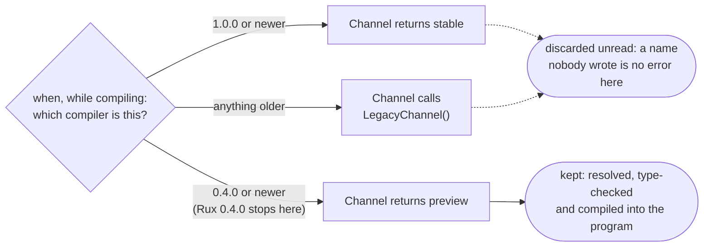

# When

::note
<!-- sync:needs:start -->

**You'll need**: [Const](/docs/learn/const), [If](/docs/learn/if), [Function](/docs/learn/function)
<!-- sync:needs:end -->

::

Every `if` you have written so far decides while the program runs. Both of its branches are compiled, because until the program runs nobody knows which one will be needed. Some questions, though, are answered before the program even exists: which compiler is building it, which operating system it is for, whether this is a debug or a release build. For those, Rux has `when`, the compile-time `if`. Its condition must be something the compiler already knows, and only the branch it picks becomes part of the program.

That one difference has a big consequence. The branches `when` skips are never resolved or type-checked, so they may name functions that do not exist. That is exactly what code for a newer compiler, or for another platform, looks like from where you are building — and it is what makes one source file able to serve them all.

## `if` and `when` side by side

|                     | `if`                                   | `when`                                  |
| ------------------- | -------------------------------------- | --------------------------------------- |
| Decided             | while the program runs                 | while the program is compiled           |
| Condition           | any `bool`                             | a value the compiler knows              |
| Untaken branch      | compiled and type-checked all the same | dropped before it is resolved           |
| Next test in chain  | `else if`                              | `else when`                             |
| Scope of a branch   | its own: bindings end with the branch  | none: bindings stay after it            |
| Where it can appear | inside a function body                 | inside a body, and between declarations |

The values a `when` can read come from the `Core` package. This lesson uses `#compiler.version`, the version of the compiler doing the build; [Target](/docs/learn/target), [Build mode](/docs/learn/build-mode) and [Define](/docs/learn/define) add the operating system, the build mode and values of your own.

## Constants the compiler can compare

`#compiler.version` is a `SemanticVersion`: three numbers, `major`, `minor` and `patch`, that compare the way version numbers should. To compare it against a version of your own, declare that version as a constant:

```rux
const Rux040 = SemanticVersion { major: 0, minor: 4, patch: 0 };
const Rux100 = SemanticVersion { major: 1, minor: 0, patch: 0 };
```

Notice the struct literal. `SemanticVersion(1, 0, 0)` is a call to a constructor, and a call only runs when the program does — far too late for a `when`, which has to be decided before there is a program to run. The compiler refuses it, and its help line says what a constant may be built from: literals, operators, casts and other constants.

## Choosing declarations

Between declarations, `when` decides which declarations exist at all. Each branch here declares a function called `Channel`, so the rest of the program calls `Channel()` without knowing — or caring — which one it got:

```rux
when #compiler.version >= Rux100 {
    func Channel() -> char8[..] { return "stable"; }
} else when #compiler.version >= Rux040 {
    func Channel() -> char8[..] { return "preview"; }
} else {
    // Never resolved by this compiler, so naming a function nobody wrote is not an error.
    func Channel() -> char8[..] { return LegacyChannel(); }
}
```

A chain keeps the keyword it opened with: after `when` comes `else when`, never `else if`. That keeps it obvious which tests the compiler answers and which the running program answers. The compiler walks the chain top to bottom, keeps the first branch whose condition holds, and throws the others away unread:



`LegacyChannel` is never written anywhere. With Rux 0.4.0 the last branch is discarded, so nothing ever goes looking for it.

## Choosing statements

Inside a function body, `when` decides which statements exist. It opens no scope of its own, so a binding made in the taken branch is still there after it:

```rux
when #compiler.version.minor >= 4 {
    let greeting = "when picked this branch while compiling";
} else {
    let greeting = NotWrittenYet();
}
PrintLine("{}", greeting);
```

After compiling, it is as if the `when` and the `else` branch had never been written and the first `let` stood on its own. The same code with `if` fails twice over: `NotWrittenYet` does not exist, and `greeting` would end with the branch that made it.

The version itself is printed with ordinary field reads. They cost nothing at run time — the compiler folds them into the program as plain numbers.

## The program

The whole lesson is one package in the [Examples repository](https://github.com/rux-lang/Examples/tree/main/CompileTime/When). Its comments explain every step.

<!-- sync:program:start -->

```rux [Src/Main.rux]
// `if` chooses while the program runs, so both of its branches have to compile. `when` chooses
// while the program is being compiled: its condition must be something the compiler already
// knows, and only the branch it picks becomes part of the program.
//
// The branches `when` skips are never resolved or type-checked. They may call functions that do
// not exist, which is exactly what code for a newer compiler, or for another platform, looks like
// from where you are building. Written with `if`, the same code would not compile.
//
// A chain keeps the keyword it opened with: after `when`, the next test is `else when`, and
// writing `else if` there is an error.
import Core::{ #compiler, SemanticVersion };
import Io::PrintLine;

// A constant is written as a struct literal: a call such as `SemanticVersion(1, 0, 0)` would only
// run when the program does, and is "not a compile-time value".
const Rux040 = SemanticVersion { major: 0, minor: 4, patch: 0 };
const Rux100 = SemanticVersion { major: 1, minor: 0, patch: 0 };

// Between declarations, `when` decides which declarations exist. Each branch declares the same
// function, so the rest of the program calls `Channel` without knowing which one it got.
when #compiler.version >= Rux100 {
    func Channel() -> char8[..] { return "stable"; }
} else when #compiler.version >= Rux040 {
    func Channel() -> char8[..] { return "preview"; }
} else {
    // Never resolved by this compiler, so naming a function nobody wrote is not an error.
    func Channel() -> char8[..] { return LegacyChannel(); }
}

func Main() -> int {
    // The version is a compile-time constant, folded into the binary as plain numbers.
    PrintLine("Compiled with Rux {}.{}.{}",
        #compiler.version.major,
        #compiler.version.minor,
        #compiler.version.patch);
    PrintLine("Release channel: {}", Channel());

    // Inside a body, `when` decides which statements exist. It opens no scope of its own, so a
    // binding made in the taken branch is still there after it.
    when #compiler.version.minor >= 4 {
        let greeting = "when picked this branch while compiling";
    } else {
        let greeting = NotWrittenYet();
    }
    PrintLine("{}", greeting);
    return 0;
}
```

Besides `Io`, its `Rux.toml` lists `Core` under `[Dependencies]`.
<!-- sync:program:end -->

## Run it

```sh
cd Examples/CompileTime/When
rux run
```

<!-- sync:output:start -->

```
Compiled with Rux 0.4.0
Release channel: preview
when picked this branch while compiling
```

The version numbers are those of the compiler that built the program.
<!-- sync:output:end -->

## Common mistakes

::warning
**Writing `else if` after `when`.**\
A chain cannot switch from compile time to run time halfway through. `} else if …` after a `when` fails with `error: expected 'when' after 'else' in a compile-time 'when' chain; 'if' is the run-time conditional`.
::

::warning
**A condition only the running program knows.**\
`let minor = 4;` followed by `when minor >= 4` fails with `error: 'minor' is not a compile-time constant`. A `let` gets its value when the program runs; a `when` has to be settled before that. Use a `const`, or a value from `Core` such as `#compiler`.
::

::warning
**Building a constant with a call.**\
`const Rux100 = SemanticVersion(1, 0, 0);` fails with `error: call to 'SemanticVersion' is not a compile-time value`. Write the struct literal instead, as the lesson does.
::

::warning
**Using `if` where only one branch can compile.**\
An `if` compiles both branches, so a branch that names something missing breaks the build: `error: name 'NotWrittenYet' is not defined in this scope`. When a branch only makes sense for some builds, it needs `when`.
::

## Try it yourself

1. Change `Rux040` to version 0.5.0 and predict what happens before you build. (The `else` branch is now the one that is kept, so `LegacyChannel` finally has to exist.)
2. After the `PrintLine` of `greeting`, add a `when` that prints "a patch release" when `#compiler.version.patch` is above zero, and "the first release of 0.4" otherwise, with the numbers read from `#compiler.version`.
3. Change the statement-level `when` to `if`, keep the `else` as it is, and read both errors.

## Learn more

- [Conditional compilation](/docs/lang/comptime/conditional) and [Build context](/docs/lang/comptime/context) in the Rux Reference
- [Compile-time programming](/docs/lang/comptime/overview) — how `when`, the build context and intrinsics fit together
- [`#compiler`](/docs/api/core/compiler) in the Core API reference
- [If](/docs/learn/if) — the run-time conditional `when` mirrors
- [Target](/docs/learn/target) — the next lesson, which branches on the machine being built for
