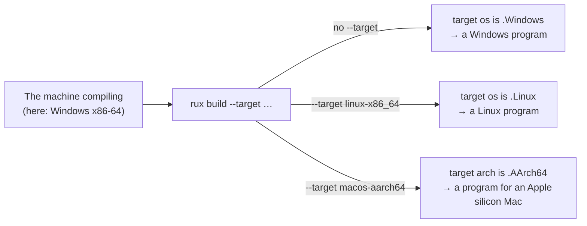

# Target

::note
<!-- sync:needs:start -->

**You'll need**: [When](/docs/learn/when), [Enum](/docs/learn/enum), [Match](/docs/learn/match)
<!-- sync:needs:end -->

::

Every build is for one machine: an operating system and a processor architecture. A path is written `Users\Ada` on Windows and `/home/ada` on Linux; a function from `Kernel32.dll` exists on one system and not the others; assembly for an Intel processor means nothing to an ARM one. Code that has to be different from machine to machine needs a way to ask which machine it is being built for.

`#target` answers that. It describes the machine as ordinary values — an enum for the system, another for the processor, a few numbers and a name — and the compiler fills them in. Because they are known while compiling, [`when`](/docs/learn/when) can branch on them and keep only the code that fits.

## What `#target` holds

`#target` comes from `Core`, like `#compiler` did. The fields you will reach for most:

| Field         | Type              | On this Windows PC | Other values                   |
| ------------- | ----------------- | ------------------ | ------------------------------ |
| `os`          | `OperatingSystem` | `.Windows`         | `.Linux`, `.macOS`, `.FreeBSD` |
| `arch`        | `Architecture`    | `.X86_64`          | `.AArch64`                     |
| `pointerBits` | `uint`            | `64`               | `64` on every supported target |
| `triple`      | `char8[..]`       | `"windows-x86_64"` | `"linux-aarch64"`, …           |
| `dataModel`   | `DataModel`       | `.LLP64`           | `.LP64` on every Unix          |

There are also `abi`, `endian` and `objectFormat`, which matter once you start talking to code written in other languages in [Part 24](/docs/learn/platform). Both enums have an `.Unknown` variant too, which no supported build produces.

## The match form

To pick one of several values, `when` has a match form. It looks at one value and keeps the arm whose variant matches:

```rux
when #target.os {
    .Windows => const SystemName: char8[..] = "Windows";
    .Linux => const SystemName: char8[..] = "Linux";
    .macOS => const SystemName: char8[..] = "macOS";
    .FreeBSD => const SystemName: char8[..] = "FreeBSD";
    else => const SystemName: char8[..] = "an unknown system";
}
```

This sits between declarations, so it decides which declaration exists. Each arm declares the same constant, `SystemName`, and the rest of the program uses it without caring which arm produced it. It reads like a [`match`](/docs/learn/match), and the enum shorthand `.Windows` works the same way — but only the kept arm is ever compiled.

The `else` arm is worth keeping even though the four arms cover every system Rux builds for today. Without it, a build for a system no arm names stops with `no arm of this 'when' matches …`, which is a fine outcome for code that really cannot run there, and a poor one for code that simply forgot.

## The ordinary form

For a yes-or-no question about the target, the ordinary form reads better:

```rux
when #target.os == OperatingSystem::Windows {
    const PathSeparator: char8[..] = "\\";
} else {
    const PathSeparator: char8[..] = "/";
}
```

Enum-valued fields such as `os` and `arch` compare only for equality. "Is the system less than Windows?" has no meaning, and the compiler rejects it.

## The target is not the machine you are on

The target is the machine the program will **run** on, not the one compiling it. Ask for another with `--target`, using the same names `#target.triple` prints:

```sh
rux build --target linux-x86_64
```

The compiler is still running on Windows, yet every branch above is chosen again for Linux: `SystemName` becomes `"Linux"` and `PathSeparator` becomes `"/"`. The result lands in `Bin/Debug/Linux/x86-64/` — a Linux program, which you copy to a Linux machine to run. This is why platform code branches on `#target` and never on anything it could only discover by looking around at run time: by then, it is too late to change what was compiled.



## The program

The whole lesson is one package in the [Examples repository](https://github.com/rux-lang/Examples/tree/main/CompileTime/Target). Its comments explain every step.

<!-- sync:program:start -->

```rux [Src/Main.rux]
// Every build is for one machine: an operating system and a processor architecture. `#target`
// describes that machine as ordinary values, filled in by the compiler, so `when` can branch on
// them and keep only the code that fits.
//
// The target is the machine the program will run on, not the one compiling it. Ask for another
// with `rux build --target linux-x86_64`, and every branch below is chosen again for Linux, even
// though the compiler is still running on Windows. That is why platform code branches on
// `#target` and never on anything it could discover at run time.
import Core::{ #target, OperatingSystem };
import Io::PrintLine;

// The match form of `when` picks one arm by value. Each arm declares the same constant, so the
// rest of the program uses `SystemName` without caring which arm produced it.
when #target.os {
    .Windows => const SystemName: char8[..] = "Windows";
    .Linux => const SystemName: char8[..] = "Linux";
    .macOS => const SystemName: char8[..] = "macOS";
    .FreeBSD => const SystemName: char8[..] = "FreeBSD";
    else => const SystemName: char8[..] = "an unknown system";
}

when #target.arch {
    .X86_64 => const ProcessorName: char8[..] = "x86-64";
    .AArch64 => const ProcessorName: char8[..] = "AArch64";
    else => const ProcessorName: char8[..] = "an unknown processor";
}

// The ordinary form works too, for a yes-or-no question about the target.
when #target.os == OperatingSystem::Windows {
    const PathSeparator: char8[..] = "\\";
} else {
    const PathSeparator: char8[..] = "/";
}

func Main() -> int {
    PrintLine("Built for {} on {}", SystemName, ProcessorName);
    PrintLine("Target name: {}", #target.triple);
    PrintLine("A path here looks like Users{}Ada{}Notes.txt", PathSeparator, PathSeparator);
    return 0;
}
```

Besides `Io`, its `Rux.toml` lists `Core` under `[Dependencies]`.
<!-- sync:program:end -->

## Run it

```sh
cd Examples/CompileTime/Target
rux run
```

<!-- sync:output:start -->

```
Built for Windows on x86-64
Target name: windows-x86_64
A path here looks like Users\Ada\Notes.txt
```

This is the output of a Windows x86-64 build; other targets print their own names and separator.
<!-- sync:output:end -->

## Common mistakes

::warning
**Leaving out the `else` arm.**\
A match-form `when` with no arm for the system being built stops the build. Remove the `.FreeBSD` and `else` arms, run `rux check --target freebsd-x86_64`, and it fails with `error: no arm of this 'when' matches .FreeBSD`.
::

::warning
**Spelling a variant the old way.**\
The variant is `.macOS`, with a lower-case m. `.MacOS` fails with `error: '.MacOS' is not a variant of 'OperatingSystem'` — and the message goes on to list the variants that do exist.
::

::warning
**Ordering an enum.**\
`when #target.os < .Windows` fails with `error: 'when' condition is not a valid compile-time expression`. Systems and architectures compare only with `==` and `!=`.
::

## Try it yourself

1. Run `rux build --target linux-x86_64`, then `rux build --target macos-aarch64`, and look at the folders that appear under `Bin/Debug/`.
2. Remove the `.FreeBSD` and `else` arms from the first `when`. Check the program for each of `windows-x86_64`, `linux-x86_64`, `macos-aarch64` and `freebsd-x86_64` with `rux check --target …`. Which ones still build?
3. Add a `when #target.dataModel == .LLP64` that prints "C's long is 32 bits here", with an `else` that prints "64 bits". What do you expect for Windows, and for Linux?
4. Print `#target.pointerBits` on its own line.

## Learn more

- [Build context](/docs/lang/comptime/context) in the Rux Reference — every field of `#target`
- [`#target`](/docs/api/core/target) in the Core API reference
- [`rux build`](/docs/cli/build) — `--target` and the other build options
- [Enum](/docs/learn/enum) and [Match](/docs/learn/match) — the run-time forms of what this lesson does at compile time
- [Extern](/docs/learn/extern) — calling a library that only one system has
