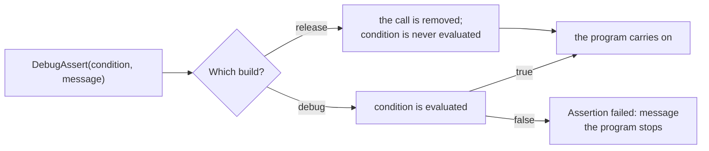

# Build mode

::note
<!-- sync:needs:start -->

**You'll need**: [When](/docs/learn/when), [Assert](/docs/learn/assert)
<!-- sync:needs:end -->

::

The same source can be built two ways. While you are writing a program you want it to compile quickly and to catch every mistake as early as possible. When you hand it to someone, you want it small and fast. Rux calls these two a **debug build** and a **release build**, and `#build` lets the program ask which one it is part of.

The [Assert](/docs/learn/assert) lesson already met the difference from the outside: `DebugAssert` is checked in one and gone from the other. This lesson looks at it from the inside.

## Debug and release

`rux run` and `rux build` make a debug build unless you say otherwise. Add `--release` for the other kind:

```sh
rux run             # debug
rux run --release   # release
```

|                   | Debug                            | Release                    |
| ----------------- | -------------------------------- | -------------------------- |
| Optimized         | no — the code follows the source | yes                        |
| Debug information | emitted                          | left out                   |
| `DebugAssert`     | checked                          | removed                    |
| Output folder     | `Bin/Debug/<OS>/<Arch>/`         | `Bin/Release/<OS>/<Arch>/` |
| Good for          | writing and testing              | shipping                   |

## Asking which build this is

`#build` comes from `Core`, like `#target`, and is just as free to read: every field is fixed before compiling starts and folds into the program as a constant.

```rux
PrintLine("Profile: {}", #build.profile);
when #build.mode == BuildMode::Debug {
    PrintLine("Debug build: unoptimized, with every check switched on");
} else {
    PrintLine("Release build: optimized, with the debug checks compiled out");
}
```

`profile` is a name — `Debug` or `Release` here, but a project may name its own profiles, so the name is not the thing to branch on. `mode` is the part every profile has: always `BuildMode::Debug` or `BuildMode::Release`. Because `mode` is known while compiling, the `when` keeps only one of the two `PrintLine` calls; the release program does not contain the debug message at all.

`#build` has a few more fields worth knowing:

| Field             | Type        | Holds                                                  |
| ----------------- | ----------- | ------------------------------------------------------ |
| `profile`         | `char8[..]` | the profile's name                                     |
| `mode`            | `BuildMode` | `.Debug` or `.Release`                                 |
| `debugAssertions` | `bool`      | whether `DebugAssert` checks are kept                  |
| `debugInfo`       | `bool`      | whether debug information is emitted                   |
| `isTest`          | `bool`      | whether this is a `rux test` build                     |
| `date`, `time`    | `char8[..]` | when the build started, as `YYYY-MM-DD` and `HH:MM:SS` |

The program prints `#build.debugAssertions` because it answers the narrower question the rest of the program cares about: will the next line be checked?

## A check that costs nothing once you ship

`DebugAssert` takes a condition and a message, just like `Assert`. In a debug build it behaves exactly like `Assert`. In a release build it is removed entirely — and its arguments are **not even evaluated**:

```rux
// Stands in for a slow consistency check. The line it prints shows whether it ran at all.
func ScoresAreSorted() -> bool {
    PrintLine("  ...checking that the scores are sorted");
    return true;
}
```

```rux
DebugAssert(ScoresAreSorted(), "the scores must be sorted");
```

Compare the two outputs below: the line `...checking that the scores are sorted` appears only in the debug run. In the release program `ScoresAreSorted` is never called, so an expensive check costs exactly nothing.



That is also the catch. Anything a `DebugAssert` argument does — print, count, save — happens in a debug build and silently does not happen in a release one. Keep the condition a pure question, and use [`Assert`](/docs/learn/assert) for checks that must still run in the program you ship.

## The program

The whole lesson is one package in the [Examples repository](https://github.com/rux-lang/Examples/tree/main/CompileTime/BuildMode). Its comments explain every step.

<!-- sync:program:start -->

```rux [Src/Main.rux]
// `rux run` makes a debug build: unoptimized, quick to compile, full of checks. `rux run --release`
// makes a release build: optimized, with the debug-only checks taken out. `#build` describes the
// build in progress, and `#build.mode` says which of the two it is.
//
// `DebugAssert` is the check that comes and goes. In a debug build it behaves like `Assert`. In a
// release build it is removed entirely, and its arguments are not even evaluated, so an expensive
// check costs nothing once you ship. The other side of that bargain: never put work the program
// needs inside one, or a release build will quietly skip it.
import Core::{ #build, BuildMode, DebugAssert };
import Io::PrintLine;

// Stands in for a slow consistency check. The line it prints shows whether it ran at all.
func ScoresAreSorted() -> bool {
    PrintLine("  ...checking that the scores are sorted");
    return true;
}

func Main() -> int {
    // A project may name its own profiles; the mode is the part every profile has.
    PrintLine("Profile: {}", #build.profile);
    when #build.mode == BuildMode::Debug {
        PrintLine("Debug build: unoptimized, with every check switched on");
    } else {
        PrintLine("Release build: optimized, with the debug checks compiled out");
    }

    // `#build.debugAssertions` answers the narrower question of whether those checks are kept.
    PrintLine("Debug assertions kept: {}", #build.debugAssertions);

    DebugAssert(ScoresAreSorted(), "the scores must be sorted");
    PrintLine("Done");
    return 0;
}
```

Besides `Io`, its `Rux.toml` lists `Core` under `[Dependencies]`.
<!-- sync:program:end -->

## Run it

```sh
cd Examples/CompileTime/BuildMode
rux run
```

<!-- sync:output:start -->

```
Profile: Debug
Debug build: unoptimized, with every check switched on
Debug assertions kept: true
  ...checking that the scores are sorted
Done
```

```sh
rux run --release
```

```text
Profile: Release
Release build: optimized, with the debug checks compiled out
Debug assertions kept: false
Done
```

<!-- sync:output:end -->

## Common mistakes

::warning
**Putting needed work inside `DebugAssert`.**\
`DebugAssert(SaveScores(), "the scores were saved")` saves the scores in a debug build and never calls `SaveScores` in a release one. Do the work first, keep the result in a variable, and assert on the variable.
::

::warning
**Using `DebugAssert` for a promise the shipped program relies on.**\
A release build removes it, so a broken assumption sails straight past. If the check must hold for your users too, write `Assert`.
::

::warning
**Branching on the profile's name.**\
A project can name its own profiles, so comparing `#build.profile` against `"Release"` misses every release profile with another name. Branch on `#build.mode`.
::

## Try it yourself

1. Make `ScoresAreSorted` return `false`. Run the program with and without `--release`. The debug build stops with `Assertion failed: the scores must be sorted`; what does the release build print?
2. Print `#build.date` and `#build.time`, then build twice and compare.
3. Print `#build.debugInfo` in both builds.

## Learn more

- [Build context](/docs/lang/comptime/context) in the Rux Reference — every field of `#build`
- [`#build`](/docs/api/core/build) and [`Assert`](/docs/api/core/assert) in the Core API reference
- [`rux run`](/docs/cli/run) and [`rux build`](/docs/cli/build) — the `--release` option
- [Assert](/docs/learn/assert) — `Assert` and `DebugAssert` from the run-time side
- [Define](/docs/learn/define) — build switches of your own
