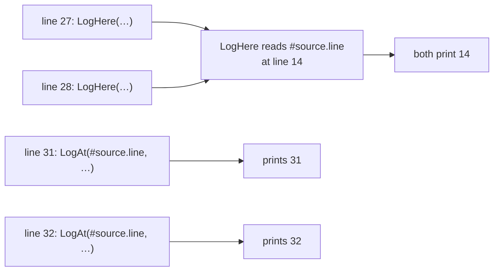

# Source location

::note
<!-- sync:needs:start -->

**You'll need**: [Function](/docs/learn/function), [Target](/docs/learn/target)
<!-- sync:needs:end -->

::

When something goes wrong, the first question is usually "where?". A log line that says `Main.rux:31` saves a search through the whole program, and that is why every compiler error you have read so far starts with a file, a line and a column. `#source` gives your own program the same knowledge: the file, the line and column, and the function an expression is written in.

Like [`#target`](/docs/learn/target), `#source` is filled in by the compiler while it compiles. A read costs nothing at run time — by then it is just a constant number or a piece of text.

## Reading `#source`

`#source` comes from `Core`. Read its fields with a dot:

```rux
PrintLine("This read is at line {}, column {} of {}, in {}",
    #source.line, #source.column, #source.fileName, #source.function);
```

This prints `line 24, column 23 of Main.rux, in Main`. Look closely at the column: 23 is not where the `PrintLine` starts, nor where `#source.line` starts. It is exactly where `#source.column` is written. Every read describes **itself** — the expression that does the reading — and nothing else.

| Field      | Type        | In this program  |
| ---------- | ----------- | ---------------- |
| `line`     | `uint`      | `24`             |
| `column`   | `uint`      | `23`             |
| `fileName` | `char8[..]` | `"Main.rux"`     |
| `filePath` | `char8[..]` | `"Src/Main.rux"` |
| `function` | `char8[..]` | `"Main"`         |
| `module`   | `char8[..]` | `"Main"`         |

`fileName` is the file's name alone; `filePath` is its path inside the package, which tells two `Main.rux` files in different folders apart.

## Which place does it describe?

That rule — a read describes where it is written — has a consequence that surprises almost everyone. A helper that reads `#source.line` inside its own body reports its own line, every time, no matter who called it:

```rux
// Reads `#source` in its own body, so it always describes this function.
func LogHere(message: char8[..]) {
    PrintLine("  {}:{} in {}: {}", #source.fileName, #source.line, #source.function, message);
}
```

Both calls print `Main.rux:14 in LogHere`. Line 14 is the line inside `LogHere`, and `LogHere` is the function around it — true, and useless for finding the caller.

To report where a call came from, the **caller** has to read `#source.line` and pass the value in:

```rux
// Is handed the location by its caller, so it describes the call.
func LogAt(line: uint, message: char8[..]) {
    PrintLine("  line {}: {}", line, message);
}
```

```rux
LogAt(#source.line, "first call");
LogAt(#source.line, "second call");
```

Now the two calls print lines 31 and 32 — their own lines, because that is where `#source.line` is written.



## The program

The whole lesson is one package in the [Examples repository](https://github.com/rux-lang/Examples/tree/main/CompileTime/SourceLocation). Its comments explain every step.

<!-- sync:program:start -->

```rux [Src/Main.rux]
// `#source` tells a program where it is in its own source code: the file, the line and column,
// and the function around it. Like `#target`, the compiler fills it in while compiling, so a read
// costs nothing at run time — it is just a constant.
//
// The surprise is *which* place it describes. Every read of `#source` describes the expression
// that reads it, wherever that is written. A helper that reads `#source.line` inside its own body
// therefore reports its own line, every time, no matter who called it. To report where a call
// came from, the caller has to read `#source.line` itself and pass the value in.
import Core::{ #source };
import Io::PrintLine;

// Reads `#source` in its own body, so it always describes this function.
func LogHere(message: char8[..]) {
    PrintLine("  {}:{} in {}: {}", #source.fileName, #source.line, #source.function, message);
}

// Is handed the location by its caller, so it describes the call.
func LogAt(line: uint, message: char8[..]) {
    PrintLine("  line {}: {}", line, message);
}

func Main() -> int {
    PrintLine("This read is at line {}, column {} of {}, in {}",
        #source.line, #source.column, #source.fileName, #source.function);

    PrintLine("A helper that reads #source itself:");
    LogHere("first call");
    LogHere("second call");

    PrintLine("A helper that is passed #source.line:");
    LogAt(#source.line, "first call");
    LogAt(#source.line, "second call");
    return 0;
}
```

Besides `Io`, its `Rux.toml` lists `Core` under `[Dependencies]`.
<!-- sync:program:end -->

## Run it

```sh
cd Examples/CompileTime/SourceLocation
rux run
```

<!-- sync:output:start -->

```
This read is at line 24, column 23 of Main.rux, in Main
A helper that reads #source itself:
  Main.rux:14 in LogHere: first call
  Main.rux:14 in LogHere: second call
A helper that is passed #source.line:
  line 31: first call
  line 32: second call
```

<!-- sync:output:end -->

## Common mistakes

::warning
**Expecting a helper to know its caller.**\
A helper that reads `#source` in its own body describes its own body. If a log line should name the call site, read `#source.line` at the call and pass it in, as `LogAt` does.
::

::warning
**Forgetting the import.**\
`#source` is declared in `Core`, so without `import Core::{ #source };` a read fails with `error: name '#source' is not defined in this scope`.
::

## Try it yourself

1. Print `#source.filePath` and `#source.module` next to `#source.fileName`.
2. Write `func Check(condition: bool, line: uint)` that prints `check failed at line N` when the condition is false. Call it twice from `Main`, once with `2 + 2 == 5`, passing `#source.line` each time.
3. Join the first `PrintLine` call onto a single line. Predict the new line and column before you run.

## Learn more

- [Build context](/docs/lang/comptime/context) in the Rux Reference — every field of `#source`
- [`#source`](/docs/api/core/source) in the Core API reference
- [Assert](/docs/learn/assert) and [Panic](/docs/learn/panic) — they report the file, line and column of the call that failed
- [Compile error](/docs/learn/compile-error) — making the compiler itself report a location
