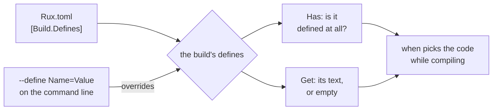

# Define

::note
<!-- sync:needs:start -->

**You'll need**: [When](/docs/learn/when), [Build mode](/docs/learn/build-mode)
<!-- sync:needs:end -->

::

`#target` and `#build` answer questions the compiler already knows: which machine, which kind of build. A **define** is a question you answer yourself — a named value handed to the build, such as a feature switch, a customer's name or the address of a test server. The program reads it while compiling with `#config`, so a `when` can branch on it and keep only the code that applies.

## Handing a value to the build

On the command line, `--define` takes a name and, optionally, a value. Repeat it for each define:

```sh
rux run --define Name=Ada --define Verbose
```

A define without a value, like `Verbose` here, holds the text `"true"`. Defines that belong to the project rather than to one build go in a `[Build.Defines]` table in `Rux.toml`:

```toml
[Build.Defines]
Name = "Grace"
```

The two combine: the manifest gives the defaults, and `--define` overrides them for one build. With the table above, `rux run` greets Grace and `rux run --define Name=Ada` greets Ada. A manifest value may be a string, a boolean or an integer, but `#config` always hands it to the program as text — `Retries = 3` reads as `"3"`.



## Has and Get

`#config` comes from `Core` and has two questions to ask:

- `#config.Has("Name")` says whether the build defines `Name` at all.
- `#config.Get("Name")` gives its text, or an empty string when it is not defined.

`Get` alone cannot tell "not defined" from "defined as empty", so the program asks `Has` first:

```rux
when #config.Has("Name") {
    let name = #config.Get("Name");
} else {
    let name = "World";
}
PrintLine("Hello, {}!", name);
```

| How the build was started   | `Has("Name")` | `Get("Name")` | Greeting        |
| --------------------------- | ------------- | ------------- | --------------- |
| `rux run`                   | `false`       | `""`          | `Hello, World!` |
| `rux run --define Name=Ada` | `true`        | `"Ada"`       | `Hello, Ada!`   |
| `rux run --define Name=`    | `true`        | `""`          | `Hello, !`      |

As in the [When](/docs/learn/when) lesson, the `when` opens no scope, so `name` is still there for the `PrintLine` after it. The last line of the program shows `Get` on a name nobody defined: its `length` is 0.

## A feature switch

The most common use of a define is to switch a feature on or off:

```rux
when #config.Has("Verbose") {
    PrintLine("Verbose is on (its value is \"{}\")", #config.Get("Verbose"));
} else {
    PrintLine("Verbose is off; rebuild with --define Verbose to turn it on");
}
```

The untaken branch is not part of the program at all — a build without `Verbose` contains no trace of the verbose code. The flip side is that a define is fixed once the program is built. Changing one means **rebuilding**: `rux run` does that for you, but an `.exe` you built earlier keeps the defines it was built with.

Because both questions are answered while compiling, the name must be written as a string literal in the source. Even a `const` holding the name is refused.

## The program

The whole lesson is one package in the [Examples repository](https://github.com/rux-lang/Examples/tree/main/CompileTime/Define). Its comments explain every step.

<!-- sync:program:start -->

```rux [Src/Main.rux]
// `#target` and `#build` answer questions the compiler already knows. A define is a question you
// answer yourself: a named value handed to the build, such as a feature switch or a customer's
// name. Pass one on the command line with `--define Name=Value`, or list it in a `[Build.Defines]`
// table in `Rux.toml`. The program reads it with `#config`:
//
// - `#config.Has("Name")` says whether the build defines `Name` at all.
// - `#config.Get("Name")` gives its text, or an empty string when it is not defined.
//
// A define without a value, such as `--define Verbose`, holds the text "true". Both questions are
// answered while compiling, so `when` can branch on them, and changing a define means rebuilding.
// For the same reason the name must be written as a string literal: passing a variable is refused
// with "the argument to 'Has' must be a string literal written in the source".
import Core::{ #config };
import Io::PrintLine;

func Main() -> int {
    // Has tells "not defined" apart from "defined as empty", which Get alone cannot.
    when #config.Has("Name") {
        let name = #config.Get("Name");
    } else {
        let name = "World";
    }
    PrintLine("Hello, {}!", name);

    // A feature switch: the untaken branch is not part of the program at all.
    when #config.Has("Verbose") {
        PrintLine("Verbose is on (its value is \"{}\")", #config.Get("Verbose"));
    } else {
        PrintLine("Verbose is off; rebuild with --define Verbose to turn it on");
    }

    PrintLine("An undefined name reads as {} characters", #config.Get("Missing").length);
    return 0;
}
```

Besides `Io`, its `Rux.toml` lists `Core` under `[Dependencies]`.
<!-- sync:program:end -->

## Run it

```sh
cd Examples/CompileTime/Define
rux run
```

<!-- sync:output:start -->

```
Hello, World!
Verbose is off; rebuild with --define Verbose to turn it on
An undefined name reads as 0 characters
```

```sh
rux run --define Name=Ada --define Verbose
```

```text
Hello, Ada!
Verbose is on (its value is "true")
An undefined name reads as 0 characters
```

<!-- sync:output:end -->

## Common mistakes

::warning
**Naming the define with a variable.**\
`#config.Has(key)` fails with `error: the argument to 'Has' must be a string literal written in the source`, and so does a constant. Inside a `when` condition the same mistake reads `error: 'key' is not a compile-time constant`. Write the name in quotes.
::

::warning
**Testing presence with `Get`.**\
An empty answer from `Get` means either "not defined" or "defined as empty". Ask `Has` when the difference matters.
::

::warning
**Expecting a built program to see a new define.**\
A define is folded in while compiling. Running an old `.exe` with a new `--define` in mind changes nothing; build again.
::

## Try it yourself

1. Run the program with `--define Name=Ada --define Verbose`, then with `--define Name=` alone. Explain the second greeting.
2. Add a `[Build.Defines]` table to `Rux.toml` with `Name = "Grace"`. Run with and without `--define Name=Ada`.
3. Add a `when #config.Get("Name") == "Ada"` that prints an extra line just for Ada.

## Learn more

- [Build context](/docs/lang/comptime/context) in the Rux Reference — `#config` and the rest of the build context
- [`#config`](/docs/api/core/config) in the Core API reference
- [Package manifest](/docs/packaging/manifest) — the `[Build.Defines]` table
- [`rux run`](/docs/cli/run) and [`rux build`](/docs/cli/build) — the `--define` option
- [Build mode](/docs/learn/build-mode) — the other switch every build has
