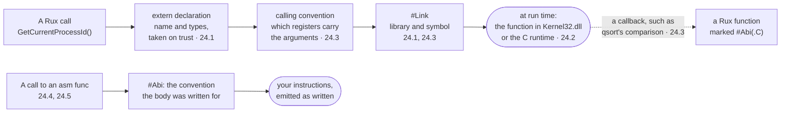

# Part 24: Platform

Under every Rux program sits an operating system, full of functions written in C long before your program existed, and a processor that runs nothing but its own instructions. The standard packages usually stand between you and both. This part removes them: you declare and call a system function yourself, use the C runtime directly with its own types and conventions, let C call a Rux function back, and finally write function bodies in assembly for two different processors. Nothing here is everyday code — but after this part you will know what every `Io::PrintLine` eventually turns into, and how to reach a library no package covers yet.

## What you will learn

- Declaring a function from a system library with `extern`, and naming the library with `#Link`.
- Why the compiler takes such a declaration on trust, and what happens when it is wrong.
- Calling the C runtime through the `C` package: C's own types, opaque pointers, C structs and variadic calls.
- Checking C's failure values — null pointers and negative counts — because nothing panics for you.
- Giving a foreign function a Rux name of its own, and choosing a calling convention with `#Abi`.
- Writing an `asm func` in x86-64 assembly, and its AArch64 version, selected with `when #target.arch`.

## The path of a foreign call

From the call site, a foreign function looks like any other. Underneath, each lesson adds one piece of the agreement between the two sides:



| Situation                                  | Tool                      | Lesson                             |
| ------------------------------------------ | ------------------------- | ---------------------------------- |
| a system function no package declares      | `extern` and `#Link`      | [Extern](/docs/learn/extern)       |
| anything in the C runtime                  | the `C` package           | [C interop](/docs/learn/c-interop) |
| a C name you would rather not spell        | `#Link`'s second argument | [ABI](/docs/learn/abi)             |
| a Rux function that C calls back           | `#Abi(.C)`                | [ABI](/docs/learn/abi)             |
| an instruction the language cannot express | `asm func`                | [Assembly](/docs/learn/asm)        |

## Lessons

<!-- sync:lessons:start -->

|      | Lesson                              | What you will learn                                                    |
| ---- | ----------------------------------- | ---------------------------------------------------------------------- |
| 24.1 | [Extern](/docs/learn/extern)        | call a platform API directly through an extern declaration and `#Link` |
| 24.2 | [C interop](/docs/learn/c-interop)  | C-compatible types, pointers and handles                               |
| 24.3 | [ABI](/docs/learn/abi)              | choose a calling convention with `#Abi`                                |
| 24.4 | [Assembly](/docs/learn/asm)         | write a function body in assembly                                      |
| 24.5 | [ARM assembly](/docs/learn/asm-arm) | the same function in AArch64 assembly, chosen with `when`              |

<!-- sync:lessons:end -->

## Before you start

Finish [Part 23: Compile time](/docs/learn/compile-time) first: every lesson here uses `when #target` to keep platform code out of builds it cannot work in, and `#Error` to explain why. The C lessons also lean on [Part 15: Memory](/docs/learn/memory) — [Pointer](/docs/learn/pointer), [Pointer slice](/docs/learn/pointer-slice) and [Layout](/docs/learn/layout) — and on [Defer](/docs/learn/defer).

Not every lesson runs everywhere. [Extern](/docs/learn/extern) calls `Kernel32.dll` and is Windows only; [Assembly](/docs/learn/asm) needs an x86-64 processor; the assembly in [ARM assembly](/docs/learn/asm-arm) runs only on AArch64, though the lesson builds anywhere. [C interop](/docs/learn/c-interop) and [ABI](/docs/learn/abi) run on Windows, Linux, macOS and FreeBSD. Each lesson's package is in the Examples repository's `Platform/` folder:

```sh
cd Examples/Platform/Extern
rux run
```

## After this part

That completes the tour of the language and its standard packages. [Part 25: Projects](/docs/learn/projects) puts it all together in complete small programs, and this part's checkpoint, [Melody](/docs/learn/melody), plays the opening of Ode to Joy through the console speaker by calling the Windows `Beep` function with `extern` — so it, too, is Windows only.

For the full rules behind this part, see [Foreign function interface](/docs/lang/ffi/overview), [Link](/docs/lang/attributes/link), [Abi](/docs/lang/attributes/abi) and [Assembler functions](/docs/lang/ffi/assembly) in the Rux Reference, and [the C package](/docs/api/c) in the API reference.
