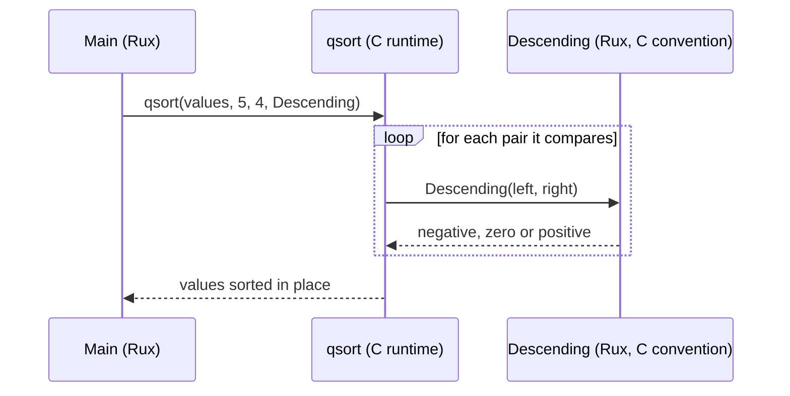

# ABI

::note
<!-- sync:needs:start -->

**You'll need**: [Extern](/docs/learn/extern), [C interop](/docs/learn/c-interop), [Target](/docs/learn/target)
<!-- sync:needs:end -->

::

::tip
**Runs on Windows, Linux, macOS and FreeBSD.**\
The program calls each system's C runtime, choosing the library's name with `when`.
::

When compiled code calls compiled code, both sides must agree on things no source file shows: what the function is called inside the library, which processor registers carry the arguments, where the result comes back. That agreement is the **ABI**, the application binary interface. Between two Rux functions the compiler handles it silently, because it compiles both sides. Across the border to C it cannot — and two parts of the agreement can be written down in Rux.

## A Rux name for a C symbol

The **symbol** is the name a library exports. It is normally the name you declare, but `#Link` takes a second argument when the two should differ, so a terse C name can be given a readable Rux one:

```rux
// Rux name first, then the symbol the library exports.
#Link(CRuntime, "abs")
extern func AbsoluteValue(n: c_int) -> c_int;

#Link(CRuntime, "strlen")
extern func CStringLength(text: *char8) -> size_t;
```

The program calls `AbsoluteValue(-7)`; the library sees a call to `abs`. The first argument is the library, and `#Link` accepts only a constant declared in the same file, so the program chooses the C runtime's name itself:

```rux
when #target.os {
    .FreeBSD => const CRuntime = "libc.so.7";
    .Linux => const CRuntime = "libc.so.6";
    .macOS => const CRuntime = "libSystem.B.dylib";
    .Windows => const CRuntime = "ucrtbase.dll";
    else => #Error("This lesson needs to know the name of this system's C runtime")
}
```

## Calling conventions

The **calling convention** decides which registers and stack slots carry the arguments and the result. x86-64 has two in common use, and AArch64 one:

| Convention | Used by                            | First integer arguments                | Result |
| ---------- | ---------------------------------- | -------------------------------------- | ------ |
| Win64      | Windows on x86-64                  | `rcx`, `rdx`, `r8`, `r9`               | `rax`  |
| System V   | Linux, macOS and FreeBSD on x86-64 | `rdi`, `rsi`, `rdx`, `rcx`, `r8`, `r9` | `rax`  |
| AAPCS64    | every system on AArch64            | `x0` to `x7`                           | `x0`   |

`#Abi` chooses one, with three names: `.Win64`, `.SysV`, and `.C`, which means "the C convention of whatever target is being built". Externs use `.C` unless told otherwise, which is why `AbsoluteValue` needed no `#Abi` — on Windows it is Win64, on Linux System V, and always what the C runtime expects.

## A Rux function that C calls

`qsort` sorts an array of anything. It does not know how to compare your values, so you hand it a function that does, and `qsort` calls that function itself, again and again:

```rux
#Abi(.C)
func Descending(left: *opaque, right: *opaque) -> c_int {
    let a = *(left as *c_int);
    let b = *(right as *c_int);
    if a > b {
        return -1;
    }
    if a < b {
        return 1;
    }
    return 0;
}
```

```rux
var values: c_int[5] = [3, 9, 1, 7, 5];
qsort(@values[0] as *var opaque, values.length, sizeof(c_int), Descending);
```



Now C is the caller, so `Descending` must receive its arguments where C puts them. Rux functions already use the C convention on every target Rux supports, so the program would work without the attribute. `#Abi(.C)` writes the promise down, so that it stays true — and so the next reader knows this function is called from outside Rux.

The comparison gets two untyped addresses, because `qsort` works on any type. The function converts them back to `*c_int` and reads the numbers, then answers the way C expects: negative when `left` should come first, positive when `right` should, zero for a tie. Returning −1 for the larger value is what makes the order descending.

## When the two sides disagree

If two Rux functions disagree about a convention, the compiler sorts it out. Code it did not compile is different. Change the attribute on `Descending` to `#Abi(.SysV)` and build on Windows: `qsort` puts the two addresses in `rcx` and `rdx`, `Descending` reads `rdi` and `rsi`, and compares whatever happened to be there. Nothing reports it. One run printed `sorted by C 1 3 5 9 7` — not descending, not ascending, just wrong.

## The program

The whole lesson is one package in the [Examples repository](https://github.com/rux-lang/Examples/tree/main/Platform/Abi). Its comments explain every step.

<!-- sync:program:start -->

```rux [Src/Main.rux]
// When compiled code calls compiled code, both sides must agree on things no source file shows.
// That agreement is the ABI, the application binary interface, and two parts of it can be
// written in Rux.
//
// The symbol: the name the library exports. It is normally the Rux name, but `#Link` takes a
// second argument when the two differ, so a terse C name can be given a readable Rux one.
//
// The calling convention: which registers and stack slots carry the arguments and the result.
// `#Abi` chooses it. `.C` is the C convention of whatever target is being built. On x86-64 it
// is `.Win64` on Windows and `.SysV` on Linux, macOS and FreeBSD, and those two can be named
// directly. Externs use `.C` unless told otherwise.
//
// If two Rux functions disagree, the compiler sorts it out, since it compiles both sides. Code
// it did not compile is different: if a declaration names the wrong convention, the arguments
// arrive in the wrong registers. Nothing reports that. The function simply reads whatever
// happened to be there.
import Core::{ #Error, #target };
import C::{ c_int, qsort, size_t };
import Io::{ Print, PrintLine };

// `#Link` needs a constant from this file, so the C runtime's library name is chosen here.
when #target.os {
    .FreeBSD => const CRuntime = "libc.so.7";
    .Linux => const CRuntime = "libc.so.6";
    .macOS => const CRuntime = "libSystem.B.dylib";
    .Windows => const CRuntime = "ucrtbase.dll";
    else => #Error("This lesson needs to know the name of this system's C runtime")
}

// Rux name first, then the symbol the library exports.
#Link(CRuntime, "abs")
extern func AbsoluteValue(n: c_int) -> c_int;

#Link(CRuntime, "strlen")
extern func CStringLength(text: *char8) -> size_t;

// C's qsort calls this function itself, so the function must use the convention C expects.
// Rux functions already use that convention on every target it supports. `#Abi(.C)` writes the
// promise down, so it stays true.
#Abi(.C)
func Descending(left: *opaque, right: *opaque) -> c_int {
    let a = *(left as *c_int);
    let b = *(right as *c_int);
    if a > b {
        return -1;
    }
    if a < b {
        return 1;
    }
    return 0;
}

func Main() -> int {
    PrintLine("AbsoluteValue(-7)    {}", AbsoluteValue(-7));
    PrintLine("CStringLength(\"abi\") {}", CStringLength("abi".data));

    var values: c_int[5] = [3, 9, 1, 7, 5];
    qsort(@values[0] as *var opaque, values.length, sizeof(c_int), Descending);
    Print("sorted by C         ");
    for value in values {
        Print(" {}", value);
    }
    PrintLine();
    return 0;
}
```

Besides `Io`, its `Rux.toml` lists `C` and `Core` under `[Dependencies]`.
<!-- sync:program:end -->

## Run it

```sh
cd Examples/Platform/Abi
rux run
```

<!-- sync:output:start -->

```
AbsoluteValue(-7)    7
CStringLength("abi") 3
sorted by C          9 7 5 3 1
```

<!-- sync:output:end -->

## Common mistakes

::warning
**Taking the library name from another package.**\
The `C` package has its own `CRuntime` constant, but `#Link` cannot use it: imported from `C`, it fails with `error: '#Link' library name 'CRuntime' is not a compile-time constant`. Declare the name in the file that uses it.
::

::warning
**Naming a convention that does not exist.**\
`#Abi(.Fast)` fails with `error: unknown ABI '.Fast'; valid ABIs are: .C, .SysV, .Win64`.
::

::warning
**The wrong convention on a callback.**\
A function that C calls must use the convention C uses. Name the wrong one and nothing complains: the arguments arrive in registers the function never reads, and it computes with garbage. Prefer `.C` for anything handed to C.
::

## Try it yourself

1. Bind the C runtime's `toupper` under the Rux name `UpperCase`, taking and returning a `c_int`, and print `UpperCase('r' as c_int) as char8`.
2. Turn `Descending` into `Ascending`, so the program prints `1 3 5 7 9`.
3. On Windows, change `#Abi(.C)` on `Descending` to `#Abi(.SysV)` and run it a few times. On Linux or macOS, try `#Abi(.Win64)` instead.

## Learn more

- [Abi](/docs/lang/attributes/abi) and [Link](/docs/lang/attributes/link) in the Rux Reference
- [`abs`](/docs/api/c/stdlib#abs) and the rest of [the C package](/docs/api/c)
- [C interop](/docs/learn/c-interop) — C's types, pointers and structs
- [Callback](/docs/learn/callback) — passing a function as a value, entirely inside Rux
- [Assembly](/docs/learn/asm) — the next lesson, where you write the convention's registers by hand
