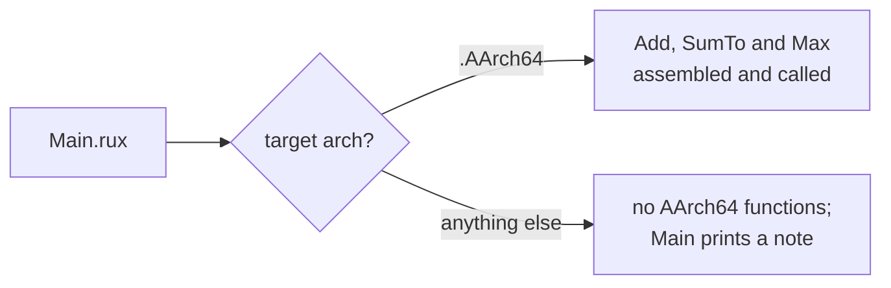

# ARM assembly

::note
<!-- sync:needs:start -->

**You'll need**: [Assembly](/docs/learn/asm), [When](/docs/learn/when), [Target](/docs/learn/target)
<!-- sync:needs:end -->

::

::tip
**The assembly runs only on AArch64.**\
That means an Apple silicon Mac, a Windows on ARM laptop or ARM Linux. The lesson still builds and runs on an x86-64 machine, but there `when` leaves the AArch64 functions out and the program prints a note instead.
::

The [Assembly](/docs/learn/asm) lesson wrote its functions in x86-64 assembly, and that code means nothing to an ARM processor. AArch64 — the 64-bit ARM architecture in Apple silicon Macs, Windows on ARM laptops and most phones — has its own instructions, its own registers and its own rules. Code that should run on both needs one body per architecture, and `when #target.arch` picks the right one while compiling.

## A different processor

|                     | x86-64                           | AArch64                                |
| ------------------- | -------------------------------- | -------------------------------------- |
| Registers           | `rax`, `rcx`, `rdx`, … 16 in all | `x0` to `x30`, plus `xzr`, always zero |
| Calling conventions | Win64 or System V, by system     | AAPCS64, on every system               |
| Integer arguments   | `rcx`, `rdx` … or `rdi`, `rsi` … | `x0`, `x1`, `x2` …                     |
| Result              | `rax`                            | `x0`                                   |
| Arithmetic          | two operands: `add rax, rdx`     | three: `add x0, x0, x1`                |
| A number            | `0`                              | `#0`                                   |

The second row is good news. With a single calling convention on every operating system, there is no `#Abi` to choose: an AArch64 body works the same on macOS, Windows and Linux. Arguments arrive in `x0`, `x1` and onwards, and the result goes back in `x0` — so the first argument and the result share a register.

## Add, in three operands

```rux
asm func Add(a: int64, b: int64) -> int64 {
    add x0, x0, x1
    ret
}
```

Most AArch64 instructions take a destination and two sources, so `add x0, x0, x1` means `x0 = x0 + x1`. The first argument is already in `x0`, where the result belongs, so one instruction does the whole job.

## The same loop

```rux
// The same loop as the x86-64 lesson. xzr is a register that always reads as zero.
asm func SumTo(n: int64) -> int64 {
    mov x1, x0
    mov x0, xzr
next:
    cmp x1, #0
    b.le done
    add x0, x0, x1
    sub x1, x1, #1
    b next
done:
    ret
}
```

Because `x0` is both `n` and the result, the loop first moves `n` aside into `x1`, then zeroes the total by copying `xzr`. After that it is the x86-64 loop word for word: `cmp` and the conditional branch `b.le` (branch if less or equal) leave when `n` runs out, `b` jumps back unconditionally. Note the `#` on numbers written into an instruction: `#0`, `#1`.

## Choosing without a jump

```rux
// csel picks one of two registers based on the comparison before it, with no jump.
asm func Max(a: int64, b: int64) -> int64 {
    cmp x0, x1
    csel x0, x0, x1, gt
    ret
}
```

`csel` — conditional select — reads "`x0` becomes `x0` if the comparison said greater than, otherwise `x1`". The x86-64 version of `Max` needs a label and a jump; here it is one instruction with no branch at all.

## Building on either machine

The three functions sit in an AArch64 arm, and every other architecture gets an empty one:

```rux
when #target.arch {
    .AArch64 => {
        // … Add, SumTo and Max …
    },
    else => {}
}
```

A branch that is not taken is never checked or assembled, so on an x86-64 machine the functions simply do not exist. `Main` must not call them there, so it asks the same question again:

```rux
when #target.arch == .AArch64 {
    PrintLine("Add(20, 22)  {}", Add(20, 22));
    PrintLine("SumTo(100)   {}", SumTo(100));
    PrintLine("Max(4, 9)    {}", Max(4, 9));
} else {
    PrintLine("This lesson's assembly is for AArch64, and this machine is not one.");
    PrintLine("The AArch64 functions were left out of this build, so none of them ran.");
}
```



Unlike the Assembly lesson, nothing here stops the build: a program can carry assembly for one architecture and still be useful on another. You do not need an ARM machine to check the AArch64 code, either — `rux build --target linux-aarch64` assembles it on any machine and reports the instructions it cannot encode. Running the result is the only step that needs real AArch64 hardware.

## The program

The whole lesson is one package in the [Examples repository](https://github.com/rux-lang/Examples/tree/main/Platform/AsmArm). Its comments explain every step.

<!-- sync:program:start -->

```rux [Src/Main.rux]
// The Asm lesson wrote its functions in x86-64 assembly, and that code means nothing to an ARM
// processor. AArch64, the 64-bit ARM architecture in Apple silicon Macs, Windows on ARM laptops
// and most phones, has its own instructions, its own registers and its own rules. Code that
// should run on both needs one body per architecture.
//
// `when #target.arch` picks the body while compiling. A branch that is not taken is never
// checked or assembled, so this file builds on an x86-64 machine too: the AArch64 functions
// below are simply left out, and `Main` says so instead of calling them.
//
// Unlike x86-64, AArch64 has a single calling convention, AAPCS64, on every operating system,
// so there is no `#Abi` to choose. Integer arguments arrive in x0, x1, x2 and so on, and the
// result goes back in x0. The instructions are different too: most take a destination and two
// sources, so `add x0, x0, x1` means x0 = x0 + x1.
import Core::{ #target };
import Io::PrintLine;

when #target.arch {
    .AArch64 => {
        asm func Add(a: int64, b: int64) -> int64 {
            add x0, x0, x1
            ret
        }

        // The same loop as the x86-64 lesson. xzr is a register that always reads as zero.
        asm func SumTo(n: int64) -> int64 {
            mov x1, x0
            mov x0, xzr
        next:
            cmp x1, #0
            b.le done
            add x0, x0, x1
            sub x1, x1, #1
            b next
        done:
            ret
        }

        // csel picks one of two registers based on the comparison before it, with no jump.
        asm func Max(a: int64, b: int64) -> int64 {
            cmp x0, x1
            csel x0, x0, x1, gt
            ret
        }
    },
    else => {}
}

func Main() -> int {
    when #target.arch == .AArch64 {
        PrintLine("Add(20, 22)  {}", Add(20, 22));
        PrintLine("SumTo(100)   {}", SumTo(100));
        PrintLine("Max(4, 9)    {}", Max(4, 9));
    } else {
        PrintLine("This lesson's assembly is for AArch64, and this machine is not one.");
        PrintLine("The AArch64 functions were left out of this build, so none of them ran.");
    }
    return 0;
}
```

Besides `Io`, its `Rux.toml` lists `Core` under `[Dependencies]`.
<!-- sync:program:end -->

## Run it

```sh
cd Examples/Platform/AsmArm
rux run
```

On an AArch64 machine it prints the first block below. That output comes from the Examples repository and needs real AArch64 hardware to reproduce; on an x86-64 machine you will see the second block.

<!-- sync:output:start -->

```
Add(20, 22)  42
SumTo(100)   5050
Max(4, 9)    9
```

On an x86-64 machine:

```text
This lesson's assembly is for AArch64, and this machine is not one.
The AArch64 functions were left out of this build, so none of them ran.
```

<!-- sync:output:end -->

## Common mistakes

::warning
**Calling an AArch64 function outside the guard.**\
On an x86-64 machine the functions were never compiled, so a call to `Add` outside `when #target.arch == .AArch64` fails with `error: name 'Add' is not defined in this scope`.
::

::warning
**x86-64 habits in an AArch64 body.**\
The register names and operand counts are different. Built for AArch64, `mov rax, rcx` fails with `error: 'mov' takes a register as operand 1, found the symbol 'rax'`, and `add rax, rdx` with `error: 'add' takes 3 operands, found 2`.
::

::warning
**Trusting an x86-64 build to check the ARM code.**\
`rux run` on an x86-64 machine never looks inside the AArch64 branch, so a mistake there stays hidden. Build with `--target linux-aarch64` to have it assembled.
::

## Try it yourself

1. Run `rux build --target linux-aarch64`, then `rux build --target macos-aarch64`, and find the two programs under `Bin/Debug/`.
2. Add `Subtract(a: int64, b: int64) -> int64` with a single `sub`, and call it from the AArch64 branch of `Main`. Build for `linux-aarch64` to check it assembles.
3. Add `Min` next to `Max`, using `csel` with the condition `lt`.
4. If you have an Apple silicon Mac, a Windows on ARM laptop or an ARM Linux board, run the program there and compare its output with the first block above.

## Learn more

- [Assembler functions](/docs/lang/functions/assembler) in the Rux Reference
- [Assembly](/docs/learn/asm) — the x86-64 version of these functions
- [Target](/docs/learn/target) — `#target.arch` and building for another machine with `--target`
- [`rux build`](/docs/cli/build) — the targets `--target` accepts
