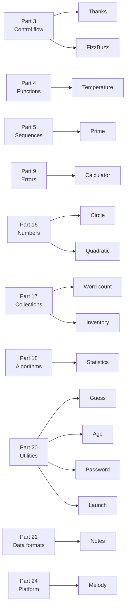

# Part 25: Projects

Every other part of the course teaches one idea per lesson. This part does the opposite: each project is a complete small program that puts many ideas to work at once — a calculator that explains its errors, a word counter, a guessing game, a to-do list kept in a file. They are not meant to be read after Part 24. Each one is a **checkpoint** for an earlier part, and uses nothing the course has not taught by then, so you can stop after that part and build something real.

## What you will learn

- How the single ideas of the lessons combine into a program with a design: small functions with one job each, data described by types, and `Main` reading like a summary.
- How to treat input as hostile: reading lines, parsing numbers, and telling the end of the input, a read error, a malformed number and an out-of-range one apart.
- How to model every way a program can fail as an error type, and when to stop, pass a failure on, or skip it and carry on.
- How to choose the right standard package for a job — collections, algorithms, time, randomness, entropy, files and JSON.
- How to run interactive programs, and which projects need a keyboard, a sound card or Windows.

## Which part unlocks which project

The arrows point from the part you need to have finished to the projects you can build after it:



| After part                                  | Project                                                                                                            | What it practises                                                       |
| ------------------------------------------- | ------------------------------------------------------------------------------------------------------------------ | ----------------------------------------------------------------------- |
| [3 Control flow](/docs/learn/control-flow)  | [Thanks](/docs/learn/thanks), [FizzBuzz](/docs/learn/fizz-buzz)                                                    | Loops, `match` expressions, the order of an `else if` chain             |
| [4 Functions](/docs/learn/functions)        | [Temperature](/docs/learn/temperature)                                                                             | Small functions, recursion, default arguments                           |
| [5 Sequences](/docs/learn/sequences)        | [Prime](/docs/learn/prime)                                                                                         | An array of flags and the sieve of Eratosthenes                         |
| [9 Errors](/docs/learn/errors)              | [Calculator](/docs/learn/calculator)                                                                               | An error variant, `fail`, `?`, `match` and `catch` in one program       |
| [16 Numbers](/docs/learn/numbers)           | [Circle](/docs/learn/circle), [Quadratic](/docs/learn/quadratic)                                                   | Reading and checking numbers, infinity, NaN and floating-point accuracy |
| [17 Collections](/docs/learn/collections)   | [Word count](/docs/learn/word-count), [Inventory](/docs/learn/inventory)                                           | Hash and tree maps, a vector of structs, two kinds of failure           |
| [18 Algorithms](/docs/learn/algorithms)     | [Statistics](/docs/learn/statistics)                                                                               | Sorting, folding and extremes, and the empty case                       |
| [20 Utilities](/docs/learn/utilities)       | [Guess](/docs/learn/guess), [Age](/docs/learn/age), [Password](/docs/learn/password), [Launch](/docs/learn/launch) | Randomness, entropy, calendar arithmetic, pauses and a game loop        |
| [21 Data formats](/docs/learn/data-formats) | [Notes](/docs/learn/notes)                                                                                         | JSON saved to a file atomically, and loaded back                        |
| [24 Platform](/docs/learn/platform)         | [Melody](/docs/learn/melody)                                                                                       | Calling a Windows function directly, chosen while compiling             |

Circle and Quadratic are really about [Part 14: Text](/docs/learn/text) — reading and parsing a line — but they also borrow `IsFinite` and the Math package from Part 16, so they unlock there.

## Lessons

<!-- sync:lessons:start -->

|       | Lesson                                 | What you will learn                                                                |
| ----- | -------------------------------------- | ---------------------------------------------------------------------------------- |
| 25.1  | [Thanks](/docs/learn/thanks)           | draw RUX as an ASCII banner and thank everyone who helps build it                  |
| 25.2  | [FizzBuzz](/docs/learn/fizz-buzz)      | the classic counting game                                                          |
| 25.3  | [Temperature](/docs/learn/temperature) | a table of Celsius and Fahrenheit temperatures                                     |
| 25.4  | [Prime](/docs/learn/prime)             | every prime below 100, found with the sieve of Eratosthenes                        |
| 25.5  | [Calculator](/docs/learn/calculator)   | evaluate expressions and report every way they can go wrong                        |
| 25.6  | [Circle](/docs/learn/circle)           | read a radius, check it, and print the circle's measurements                       |
| 25.7  | [Quadratic](/docs/learn/quadratic)     | solve a quadratic equation, including linear and degenerate cases                  |
| 25.8  | [Word count](/docs/learn/word-count)   | count how often each word appears                                                  |
| 25.9  | [Inventory](/docs/learn/inventory)     | keep a stock list of items, with updates that can fail                             |
| 25.10 | [Statistics](/docs/learn/statistics)   | count, extremes, mean, variance and median, including empty and single-value input |
| 25.11 | [Guess](/docs/learn/guess)             | a number guessing game with seven valid guesses from 1 to 100                      |
| 25.12 | [Age](/docs/learn/age)                 | an age in completed years, months and days, with month-end clamping                |
| 25.13 | [Password](/docs/learn/password)       | a 16-character password drawn from system entropy with rejection sampling          |
| 25.14 | [Launch](/docs/learn/launch)           | a mission checklist, a bounded countdown and a launch                              |
| 25.15 | [Notes](/docs/learn/notes)             | keep notes in a JSON file                                                          |
| 25.16 | [Melody](/docs/learn/melody)           | play a tune through the Windows console speaker (Windows only)                     |

<!-- sync:lessons:end -->

## Before you start

Pick the project for the part you have just finished, rather than reading this part in order. Each project page lists exactly which lessons it leans on, links them where they are used, and ends with exercises that extend the program — those are the real work.

Each project is a package in the Examples repository's `Projects/` folder:

```sh
cd Examples/Projects/FizzBuzz
rux run
```

Most projects print the same output on every run. A few are different:

| Project                                                                                                                    | What to expect                                                                     |
| -------------------------------------------------------------------------------------------------------------------------- | ---------------------------------------------------------------------------------- |
| [Circle](/docs/learn/circle), [Quadratic](/docs/learn/quadratic), [Guess](/docs/learn/guess), [Launch](/docs/learn/launch) | They wait for you to type. Answer the prompt and press Enter, or pipe the input in |
| [Guess](/docs/learn/guess), [Password](/docs/learn/password)                                                               | A different number or password on every run                                        |
| [Notes](/docs/learn/notes)                                                                                                 | Writes a file in the package's `Bin/` folder, and deletes it again                 |
| [Melody](/docs/learn/melody)                                                                                               | Windows only, and plays sound through the console speaker                          |

## After this part

This is the end of the course. From here, the best next step is a program of your own — take the project closest to what you want to build and change it until it is yours. The [Rux Reference](/docs/lang/introduction) has the full rules behind every lesson, the [API reference](/docs/api/introduction) covers the standard packages, and the [cheat sheet](/docs/learn/cheatsheet) keeps the syntax on one page. When you want to share what you made, [Part 22: Packages](/docs/learn/packages) shows how to turn it into a package others can depend on.
