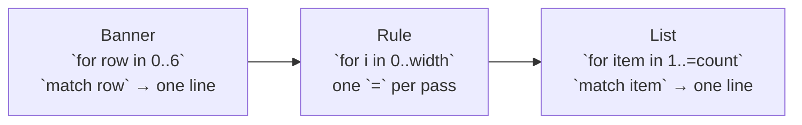

# Thanks

::note
<!-- sync:needs:start -->

**You'll need**: Parts 1–3 — this project is the checkpoint for Control flow, and leans on [Console](/docs/learn/console), [For](/docs/learn/for) and [Match expression](/docs/learn/match-expression).
<!-- sync:needs:end -->

::

This is the first checkpoint project of the course. It prints the word RUX in large letters, draws a rule under it, and lists everything that goes into building a language — a thank-you card written in code.

Nothing here is new. The program uses only what Parts 1–3 taught: `Print` and `PrintLine`, `for` over a range, and `match` used as an expression. The point of the project is to see those few tools add up to something that looks designed. If you can read every line of it, you have Control flow under your belt.

## How it is put together

`Main` does three jobs, one after another, and each is a loop:



| Piece           | What it does                                     | Lessons it uses                                                                                      |
| --------------- | ------------------------------------------------ | ---------------------------------------------------------------------------------------------------- |
| Banner          | Picks the text of each row of the big letters    | [For](/docs/learn/for), [Range](/docs/learn/range), [Match expression](/docs/learn/match-expression) |
| Rule            | Repeats one character `width` times              | [For](/docs/learn/for), [Console](/docs/learn/console), [Variable](/docs/learn/variable)             |
| Thank-you list  | Picks the text of each numbered item             | [Match expression](/docs/learn/match-expression), [Range](/docs/learn/range)                         |
| Closing message | Plain `PrintLine` calls, with empty ones as gaps | [Hello, World](/docs/learn/hello), [Console](/docs/learn/console)                                    |

There are no arrays yet — they arrive in [Part 5](/docs/learn/sequences) — so a list of lines cannot be stored and walked. Instead a loop counts the rows, and a `match` says what belongs on each one.

## Big letters are rows of characters

A large letter is only a few rows of `#` and spaces printed one under another. Each row here runs across all three letters at once:

```rux
for row in 0..6 {
    let line = match row {
        0 => "  ####    ##  ##   ##   ##  ",
        1 => "  ##  ##  ##  ##    ## ##   ",
        2 => "  ##  ##  ##  ##     ###    ",
        3 => "  #####   ##  ##     ###    ",
        4 => "  ## ##   ##  ##    ## ##   ",
        else => "  ##  ##   ####    ##   ##  "
    };
    PrintLine("{}", line);
}
```

Read the arms from top to bottom rather than one at a time, and the shapes of R, U and X appear. Three details are worth noticing:

- `0..6` is a half-open range: it gives 0, 1, 2, 3, 4 and 5 — six rows — and stops before 6.
- The `match` is an **expression**. Each arm produces a piece of text, and the whole `match` hands that text to `let line`.
- The last row is the `else` arm. A match over an `int` must have an answer for _every_ integer, not only the six the loop will ever ask about, so the final row doubles as the default.

## A rule drawn by repetition

The `=` line under the banner is not typed out. A loop prints one character `width` times, and `Print` (not `PrintLine`) keeps them all on one line:

```rux
let width = 44;
for i in 0..width {
    Print("=");
}
PrintLine();
```

The loop variable `i` is never read — the loop exists only to run its body 44 times. Naming the width once means the rule above and below the title can never disagree, and changing one number resizes both.

## A numbered list without an array

The thank-you list uses the same trick as the banner, counted from 1 this time:

```rux
for item in 1..=count {
    let contribution = match item {
        1 => "the ideas, and the patience to explain them twice",
        2 => "the long discussions, and the short sharp ones",
        3 => "the code, the tests, and the unglamorous fixes",
        4 => "the critique that was right, and the kind that stung",
        5 => "the bug reports written carefully by strangers",
        6 => "the documentation nobody is thanked for",
        7 => "the funding that bought time to think",
        8 => "turning up, reading along, and asking good questions",
        else => "the posts, the shares, the subscribes, the word of mouth"
    };
    PrintLine("  - {}", contribution);
}
```

`count` is 9, and `1..=count` is the inclusive range: it includes `count` itself, so the loop runs for items 1 to 9. As in the banner, the ninth item lives in the `else` arm, which keeps the match complete.

## The program

The whole lesson is one package in the [Examples repository](https://github.com/rux-lang/Examples/tree/main/Projects/Thanks). Its comments explain every step.

<!-- sync:program:start -->

```rux [Src/Main.rux]
// A banner drawn as text, and a thank-you to the people who make Rux.
//
// Everything here comes from the first three parts of the course: printing, a `for` loop over a
// range, and `match` used as an expression. There are no arrays yet, so each list is a loop that
// counts rows and a `match` that says what belongs on each one. Large letters are only rows of
// characters printed one after another.
import Io::{ Print, PrintLine };

func Main() -> int {
    // Each row runs across all three letters. Read the arms from top to bottom rather than one
    // at a time, and the shapes of R, U and X appear.
    PrintLine();
    for row in 0..6 {
        let line = match row {
            0 => "  ####    ##  ##   ##   ##  ",
            1 => "  ##  ##  ##  ##    ## ##   ",
            2 => "  ##  ##  ##  ##     ###    ",
            3 => "  #####   ##  ##     ###    ",
            4 => "  ## ##   ##  ##    ## ##   ",
            else => "  ##  ##   ####    ##   ##  "
        };
        PrintLine("{}", line);
    }
    PrintLine();

    // A rule drawn by repeating one character, rather than by typing it out.
    let width = 44;
    for i in 0..width {
        Print("=");
    }
    PrintLine();
    PrintLine("            Thank you, everyone");
    for i in 0..width {
        Print("=");
    }
    PrintLine();
    PrintLine();

    // Every kind of help that goes into a language, in no particular order, because none of them
    // is the one that matters least. The `else` arm is the last item, so a match over numbers
    // still has an answer for every row.
    let count = 9;
    PrintLine("Rux exists because of:");
    PrintLine();
    for item in 1..=count {
        let contribution = match item {
            1 => "the ideas, and the patience to explain them twice",
            2 => "the long discussions, and the short sharp ones",
            3 => "the code, the tests, and the unglamorous fixes",
            4 => "the critique that was right, and the kind that stung",
            5 => "the bug reports written carefully by strangers",
            6 => "the documentation nobody is thanked for",
            7 => "the funding that bought time to think",
            8 => "turning up, reading along, and asking good questions",
            else => "the posts, the shares, the subscribes, the word of mouth"
        };
        PrintLine("  - {}", contribution);
    }

    PrintLine();
    PrintLine("A language is a community that happens to have a compiler.");
    PrintLine("Thank you for being part of this one.");
    PrintLine();
    PrintLine("    -- Ivan Muzyka, creator of Rux");
    PrintLine();
    return 0;
}
```

<!-- sync:program:end -->

## Run it

```sh
cd Examples/Projects/Thanks
rux run
```

<!-- sync:output:start -->

```

  ####    ##  ##   ##   ##
  ##  ##  ##  ##    ## ##
  ##  ##  ##  ##     ###
  #####   ##  ##     ###
  ## ##   ##  ##    ## ##
  ##  ##   ####    ##   ##

============================================
            Thank you, everyone
============================================

Rux exists because of:

  - the ideas, and the patience to explain them twice
  - the long discussions, and the short sharp ones
  - the code, the tests, and the unglamorous fixes
  - the critique that was right, and the kind that stung
  - the bug reports written carefully by strangers
  - the documentation nobody is thanked for
  - the funding that bought time to think
  - turning up, reading along, and asking good questions
  - the posts, the shares, the subscribes, the word of mouth

A language is a community that happens to have a compiler.
Thank you for being part of this one.

    -- Ivan Muzyka, creator of Rux
```

<!-- sync:output:end -->

## Common mistakes

::mistake
**A match over numbers with no `else` arm.**\
Changing the banner's `else` arm to `5 =>` looks harmless, since the loop never asks for anything else. The compiler disagrees:

```text
error: match on 'int' is not exhaustive; its arms do not cover every value
```

The compiler adds the hint `add an 'else' arm`. It checks the `match` on its own, not the loop around it. See [Exhaustive](/docs/learn/exhaustive).
::

::mistake
**`..` where you meant `..=`.**\
Writing `for item in 1..count` compiles and runs, but `1..count` stops before 9, so the last line of the list — the one in the `else` arm — silently disappears. When a range counts things from 1, it almost always wants `..=`.
::

## Try it yourself

1. Make the rule out of `-` instead of `=`, and make it 30 characters wide. How many lines did you have to change?
2. Add a tenth contribution to the list. Remember that the `else` arm has to stay last, and that `count` has to grow too.
3. Number the list instead of using dashes, so it prints `1. the ideas…`, `2. the long discussions…` and so on.
4. Add a fourth letter to the banner — an `!` is the easiest. Every row's text has to grow by the same number of columns, or the letters will lean.

## Learn more

- [For](/docs/learn/for), [Range](/docs/learn/range) and [Match expression](/docs/learn/match-expression) — the three tools this project is built from
- [Match](/docs/lang/patterns/match) and [For](/docs/lang/statements/loops#for) in the Rux Reference
- Next project: [FizzBuzz](/docs/learn/fizz-buzz), the other checkpoint for Control flow
