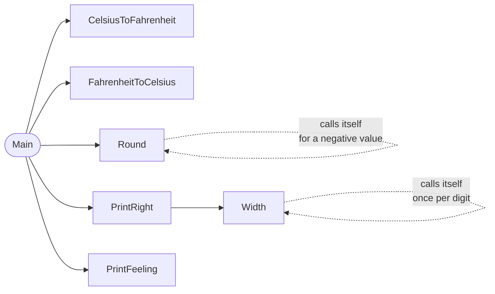

# Temperature

::note
<!-- sync:needs:start -->

**You'll need**: Parts 1–4 — this project is the checkpoint for Functions, and leans on [Function](/docs/learn/function), [Recursion](/docs/learn/recursion) and [Default argument](/docs/learn/default-argument).
<!-- sync:needs:end -->

::

This project prints two conversion tables — Celsius to Fahrenheit and back — with the numbers lined up in columns and a word for how each temperature feels. Then it answers a small puzzle: at which temperature do the two scales show the same number?

It is the checkpoint for [Part 4: Functions](/docs/learn/functions), and the interesting thing about it is not the arithmetic but the **shape**. Every job has its own small function with a name that says what it does, so `Main` reads like a description of the tables rather than a page of formulas.

## How it is put together

`Main` only calls other functions. Here is who calls whom:



| Function                                     | Its one job                                     | Lessons it uses                                                                |
| -------------------------------------------- | ----------------------------------------------- | ------------------------------------------------------------------------------ |
| `CelsiusToFahrenheit`, `FahrenheitToCelsius` | One formula each                                | [Function](/docs/learn/function), [Float](/docs/learn/float)                   |
| `Round`                                      | A `float64` to the nearest whole `int`          | [Recursion](/docs/learn/recursion), [Convert](/docs/learn/convert)             |
| `Width`                                      | How many characters a number takes when printed | [Recursion](/docs/learn/recursion), [Arithmetic](/docs/learn/arithmetic)       |
| `PrintRight`                                 | A number right-aligned in a column              | [Default argument](/docs/learn/default-argument), [Return](/docs/learn/return) |
| `PrintFeeling`                               | A temperature in words                          | [Else if](/docs/learn/else-if)                                                 |
| `Main`                                       | The two tables and the puzzle                   | [While](/docs/learn/while), [For](/docs/learn/for)                             |

## One formula per function

The conversions are one line each. Every literal in them is written with a decimal point, because the parameters are `float64`:

```rux
func CelsiusToFahrenheit(celsius: float64) -> float64 {
    return celsius * 9.0 / 5.0 + 32.0;
}
```

The loops in `Main` count in whole degrees, so each call converts its `int` argument on the way in: `CelsiusToFahrenheit(celsius as float64)`. Rux never turns an `int` into a `float64` by itself.

## Rounding, and a recursive trick for negatives

`as int` alone only drops the fraction: 37.8 would become 37, not 38. Adding 0.5 first fixes that for positive values. For a negative value, `Round` rounds its positive twin and negates the result — a function calling itself once:

```rux
func Round(value: float64) -> int {
    if value < 0.0 {
        return -Round(-value);
    }
    return (value + 0.5) as int;
}
```

Without the negative case, −17.8 + 0.5 is −17.3, which `as int` truncates towards zero to −17 — the wrong way. The first row of the Fahrenheit table, 0 F, is exactly that value: it prints −18 only because of the recursive branch.

## Columns from counting digits

To right-align a number in a column of six, you need to know how wide it will print. `Width` counts digits recursively — one for this digit, plus however many the number divided by ten has — and adds one for a minus sign:

```rux
func Width(value: int) -> int {
    if value < 0 {
        return 1 + Width(-value);
    }
    if value < 10 {
        return 1;
    }
    return 1 + Width(value / 10);
}
```

`PrintRight` then prints the missing spaces before the number. Its `width` parameter has a default, so every call in `Main` can leave it out:

```rux
func PrintRight(value: int, width: int = 6) {
    for i in Width(value)..width {
        Print(" ");
    }
    Print("{}", value);
}
```

If the number is already as wide as the column, `Width(value)..width` is an empty range and the loop simply does not run.

## Asking the function, not knowing the answer

The last loop finds where the scales agree by trying every whole degree from −100 to 100 and asking the conversion function:

```rux
for degrees in -100..=100 {
    if CelsiusToFahrenheit(degrees as float64) == degrees as float64 {
        PrintLine("{} C is also {} F", degrees, degrees);
    }
}
```

Comparing floats with `==` is usually a warning sign (see [Float](/docs/learn/float)), but here both sides are whole numbers that a `float64` holds exactly, so the test is safe. The answer is −40.

## The program

The whole lesson is one package in the [Examples repository](https://github.com/rux-lang/Examples/tree/main/Projects/Temperature). Its comments explain every step.

<!-- sync:program:start -->

```rux [Src/Main.rux]
// Temperature: two conversion tables between Celsius and Fahrenheit, built from small functions.
//
// Each function does one job and has a name that says what. The conversions are one formula
// each; `Round` turns a converted value into whole degrees; `Width` and `PrintRight` line the
// numbers up in columns; `PrintFeeling` puts a temperature into words. `Main` only calls them, so
// it reads like a description of the tables rather than a page of arithmetic.
//
// The two scales meet at exactly one temperature, and the end of the program finds it by asking
// the conversion function, not by knowing the answer.
import Io::{ Print, PrintLine };

func CelsiusToFahrenheit(celsius: float64) -> float64 {
    return celsius * 9.0 / 5.0 + 32.0;
}

func FahrenheitToCelsius(fahrenheit: float64) -> float64 {
    return (fahrenheit - 32.0) * 5.0 / 9.0;
}

// Rounds to the nearest whole degree. `as int` on its own would only drop the fraction, turning
// 37.8 into 37 rather than 38. A negative value is rounded as its positive twin, then negated, so
// -17.8 becomes -18 and not -17.
func Round(value: float64) -> int {
    if value < 0.0 {
        return -Round(-value);
    }
    return (value + 0.5) as int;
}

// How many characters a whole number takes when printed: its digits, plus one for a minus sign.
func Width(value: int) -> int {
    if value < 0 {
        return 1 + Width(-value);
    }
    if value < 10 {
        return 1;
    }
    return 1 + Width(value / 10);
}

// Prints a number right-aligned in a column, by printing spaces first to fill the gap.
func PrintRight(value: int, width: int = 6) {
    for i in Width(value)..width {
        Print(" ");
    }
    Print("{}", value);
}

func PrintFeeling(celsius: int) {
    if celsius <= 0 {
        PrintLine("   frozen");
    } else if celsius < 10 {
        PrintLine("   cold");
    } else if celsius < 20 {
        PrintLine("   cool");
    } else if celsius < 30 {
        PrintLine("   warm");
    } else if celsius < 45 {
        PrintLine("   hot");
    } else if celsius < 100 {
        PrintLine("   too hot to touch");
    } else {
        PrintLine("   boiling");
    }
}

func Main() -> int {
    // Every multiple of 5 Celsius is a whole number of Fahrenheit, so this table is exact.
    PrintLine("     C     F");
    var celsius = -40;
    while celsius <= 100 {
        PrintRight(celsius);
        PrintRight(Round(CelsiusToFahrenheit(celsius as float64)));
        PrintFeeling(celsius);
        celsius += 10;
    }
    PrintLine();

    // The other way round the results have fractions, so they are rounded to whole degrees.
    PrintLine("     F     C");
    var fahrenheit = 0;
    while fahrenheit <= 220 {
        let converted = Round(FahrenheitToCelsius(fahrenheit as float64));
        PrintRight(fahrenheit);
        PrintRight(converted);
        PrintFeeling(converted);
        fahrenheit += 20;
    }
    PrintLine();

    // Where do the scales agree? Try every whole degree and ask.
    for degrees in -100..=100 {
        if CelsiusToFahrenheit(degrees as float64) == degrees as float64 {
            PrintLine("{} C is also {} F", degrees, degrees);
        }
    }
    return 0;
}
```

<!-- sync:program:end -->

## Run it

```sh
cd Examples/Projects/Temperature
rux run
```

<!-- sync:output:start -->

```
     C     F
   -40   -40   frozen
   -30   -22   frozen
   -20    -4   frozen
   -10    14   frozen
     0    32   frozen
    10    50   cool
    20    68   warm
    30    86   hot
    40   104   hot
    50   122   too hot to touch
    60   140   too hot to touch
    70   158   too hot to touch
    80   176   too hot to touch
    90   194   too hot to touch
   100   212   boiling

     F     C
     0   -18   frozen
    20    -7   frozen
    40     4   cold
    60    16   cool
    80    27   warm
   100    38   hot
   120    49   too hot to touch
   140    60   too hot to touch
   160    71   too hot to touch
   180    82   too hot to touch
   200    93   too hot to touch
   220   104   boiling

-40 C is also -40 F
```

<!-- sync:output:end -->

## Common mistakes

::warning
**Passing an `int` where a `float64` is expected.**\
`CelsiusToFahrenheit(celsius)` with an `int` argument is refused: `error: argument 1 to 'CelsiusToFahrenheit' has type 'int', but parameter 'celsius' requires 'float64'`. Convert at the call with `as float64`.
::

::warning
**Writing `9` instead of `9.0` in a float formula.**\
`celsius * 9 / 5 + 32` looks like the same formula, but in a `float64` function it fails with `error: operator '*' cannot combine left operand 'float64' with right operand 'int'` (and the same for `/` and `+`). Write the literals as `9.0`, `5.0` and `32.0`.
::

::warning
**Rounding with `as int` alone.**\
`as int` truncates towards zero. With `return value as int;` in `Round` the program still runs, but 100 F comes out as 37 C instead of 38, and 60 F as 15 instead of 16.
::

## Try it yourself

1. Add a Kelvin column to the first table. Write `CelsiusToKelvin` as its own function rather than doing the sum inside `Main`.
2. Call `PrintRight` with a width of 8 for one column, so the default and an explicit argument are used side by side.
3. Change `PrintFeeling` so it returns the word instead of printing it. What does its return type become, and what changes at the call sites?
4. The puzzle loop only tries whole degrees. Change it to step through every half degree from −100 to 100 and check that −40 is still the only answer.

## Learn more

- [Function](/docs/learn/function), [Recursion](/docs/learn/recursion) and [Default argument](/docs/learn/default-argument)
- [Convert](/docs/learn/convert) — what `as int` does to a fraction
- [Functions](/docs/lang/functions/declaration) in the Rux Reference
- Next project: [Prime](/docs/learn/prime), the checkpoint for Sequences
