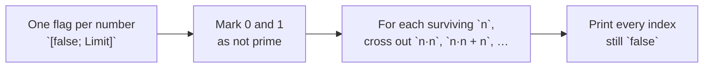

# Prime

::note
<!-- sync:needs:start -->

**You'll need**: Parts 1–5 — this project is the checkpoint for Sequences, and leans on [While](/docs/learn/while), [For](/docs/learn/for) and [Array repeat](/docs/learn/array-repeat).
<!-- sync:needs:end -->

::

A prime is a whole number above 1 that only 1 and itself divide. This project finds every prime below 100 with the **sieve of Eratosthenes**, an algorithm more than two thousand years old and still the way to do it.

The idea fits in one sentence: write down every number, then repeatedly take the smallest one not yet crossed out and cross out all its multiples. Whatever survives is prime. The sieve never divides anything — it only steps along and marks — which is why it beats testing each number for divisors. It is the checkpoint for [Part 5: Sequences](/docs/learn/sequences), because the crossing-out needs an array.

## How it is put together

The program is one `Main` with three steps, all working on a single array of flags:



| Piece                  | Lessons it uses                                                                    |
| ---------------------- | ---------------------------------------------------------------------------------- |
| `const Limit = 100`    | [Const](/docs/learn/const)                                                         |
| `[false; Limit]`       | [Array repeat](/docs/learn/array-repeat), [Array](/docs/learn/array)               |
| The two nested passes  | [While](/docs/learn/while), [Logical](/docs/learn/logical) (`!`)                   |
| Printing the survivors | [For](/docs/learn/for), [Range](/docs/learn/range), [Console](/docs/learn/console) |

## One flag per number

The array's **index** is the number and its **element** says whether that number has been crossed out. An array repeat makes a hundred `false` flags in one expression:

```rux
const Limit = 100;
```

```rux
var crossedOut = [false; Limit];

crossedOut[0] = true;
crossedOut[1] = true;
```

The length of an inline array is part of its type, so it must be known while compiling. That is why the limit is a `const` and not a `let`: a constant can size the array _and_ bound the loops, and changing the one number changes both. The array is `var` because the sieve writes to it.

"Below 100" means the candidates are 0 to 99 — exactly the indices of a 100-element array, and exactly what the half-open range `0..Limit` walks.

## Crossing out multiples

For each number that is still standing, an inner loop steps through its multiples and marks them:

```rux
var n = 2;
while n * n < Limit {
    if !crossedOut[n] {
        var multiple = n * n;
        while multiple < Limit {
            crossedOut[multiple] = true;
            multiple += n;
        }
    }
    n += 1;
}
```

Two shortcuts make this fast, and both rest on the same observation. A multiple `k * n` with `k` smaller than `n` also has the factor `k`, so it was already crossed out during an earlier pass. That means:

- each pass can **start** at `n * n` rather than at `2 * n`, and
- the outer loop can **stop** once `n * n` reaches the limit — such an `n` has no multiples left to visit.

For a limit of 100 the outer loop only runs for `n` from 2 to 9, and only 2, 3, 5 and 7 survive to do any crossing out.

## Reading off the answer

Whatever is still `false` is prime. One `for` over the indices prints them and counts them:

```rux
for i in 0..Limit {
    if !crossedOut[i] {
        Print(" {}", i);
        found += 1;
    }
}
```

## The program

The whole lesson is one package in the [Examples repository](https://github.com/rux-lang/Examples/tree/main/Projects/Prime). Its comments explain every step.

<!-- sync:program:start -->

```rux [Src/Main.rux]
// Finding every prime below a limit with the sieve of Eratosthenes, an algorithm more than two
// thousand years old and still the way to do it.
//
// The idea: write down every number, then repeatedly take the smallest one not yet crossed out
// and cross out all its multiples. Whatever survives is prime. It is faster than testing each
// number for divisors, because it never divides at all; it only steps along and marks.
//
// "Below" means the limit itself is not a candidate: with a limit of 100 the numbers examined are
// 0 to 99. That matches the array, whose indices run from 0 to one less than its length, and the
// half-open range `0..Limit` that walks it.
import Io::{ Print, PrintLine };

// The limit is named once, here. A constant is known at compile time, so it can size the array
// as well as bound the loops, and changing it changes both.
const Limit = 100;

func Main() -> int {
    // One flag per number, indexed by the number itself, none crossed out yet.
    var crossedOut = [false; Limit];

    // 0 and 1 are not prime, and no pass below would cross them out.
    crossedOut[0] = true;
    crossedOut[1] = true;

    // Cross out the multiples of each surviving number. Each pass starts at n * n: a smaller
    // multiple k * n, with k below n, also has the factor k, so the pass for k (or for a prime
    // factor of k) has already crossed it out. For the same reason the passes can stop once
    // n * n reaches the limit, because such an n has no multiples left to visit.
    var n = 2;
    while n * n < Limit {
        if !crossedOut[n] {
            var multiple = n * n;
            while multiple < Limit {
                crossedOut[multiple] = true;
                multiple += n;
            }
        }
        n += 1;
    }

    // Everything still standing is prime.
    var found = 0;
    Print("primes below {}:", Limit);
    for i in 0..Limit {
        if !crossedOut[i] {
            Print(" {}", i);
            found += 1;
        }
    }
    PrintLine();
    PrintLine("{} of them", found);
    return 0;
}
```

<!-- sync:program:end -->

## Run it

```sh
cd Examples/Projects/Prime
rux run
```

<!-- sync:output:start -->

```
primes below 100: 2 3 5 7 11 13 17 19 23 29 31 37 41 43 47 53 59 61 67 71 73 79 83 89 97
25 of them
```

<!-- sync:output:end -->

## Common mistakes

::mistake
**Sizing the array with a run-time value.**\
`let size = 100;` followed by `[false; size]` is refused:

```text
error: array repeat count must be a non-negative compile-time integer
```

An inline array's length is fixed when the program is compiled, so it comes from a literal or a `const`.
::

::mistake
**Declaring the flags with `let`.**\
`let crossedOut = [false; Limit];` makes the array immutable, and every write to it fails with:

```text
error: cannot modify immutable variable 'crossedOut'
```

::

::mistake
**Indexing one past the end.**\
The last valid index is `Limit - 1`. Writing `crossedOut[Limit] = true;` still compiles, but the run stops with the line it happened on and this message:

```text
Panic: index out of range
```

Keep the loops' conditions as `< Limit`, never `<= Limit`.
::

## Try it yourself

1. Raise the limit to 1000. Only one line changes, and the program should report 168 primes.
2. Print the primes ten to a line, the way [FizzBuzz](/docs/learn/fizz-buzz) lays out its answers.
3. Count how many times `crossedOut[multiple] = true;` runs. Then change the inner loop to start at `2 * n` instead of `n * n` and count again — the answer stays the same, but the work does not.
4. Twin primes are pairs that differ by 2, such as 11 and 13. After the sieve, walk the array once more and print every twin pair below the limit.

## Learn more

- [Array repeat](/docs/learn/array-repeat) and [Array](/docs/learn/array) — inline arrays and their fixed length
- [Const](/docs/learn/const) — values the compiler knows
- [Arrays](/docs/lang/arrays/overview) in the Rux Reference
- Next project: [Calculator](/docs/learn/calculator), the checkpoint for Errors
