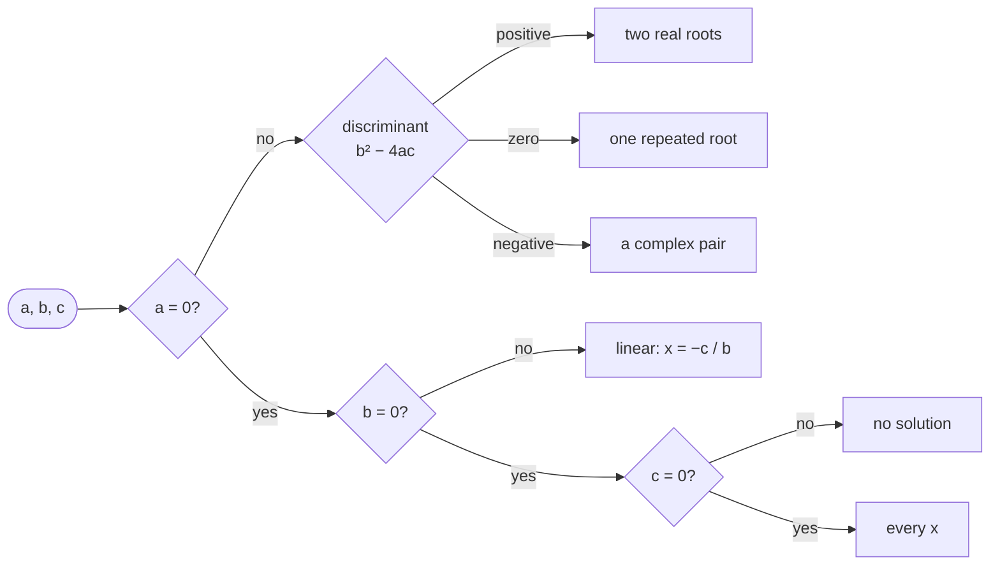

# Quadratic

::note
<!-- sync:needs:start -->

**You'll need**: Parts 1–14 — this project is the checkpoint for Text, and leans on [Input](/docs/learn/input), [Parse](/docs/learn/parse), [String view](/docs/learn/string-view) and [Error variant](/docs/learn/error-variant) — plus [Float special](/docs/learn/float-special) and [Math](/docs/learn/math) from Part 16.
<!-- sync:needs:end -->

::

This program reads three numbers, a, b and c, and solves the equation a x² + b x + c = 0. It is the classic calculation whose **shape** depends on its input: depending on the numbers there are two answers, one, a pair of complex ones, or — when `a` is zero and the equation is not really quadratic at all — one answer, none, or infinitely many.

Like [Circle](/docs/learn/circle), it is a checkpoint for [Part 14: Text](/docs/learn/text), and it reads its input with the same care. What it adds is a decision tree with six leaves, and a lesson in floating-point arithmetic that the textbook formula gets wrong.

## How it is put together

The program splits cleanly into reading and solving:

| Function          | Its job                                                              | Lessons it uses                                                                                                          |
| ----------------- | -------------------------------------------------------------------- | ------------------------------------------------------------------------------------------------------------------------ |
| `ReadCoefficient` | Prompt, read one line, parse it, check it is finite                  | [Input](/docs/learn/input), [Parse](/docs/learn/parse), [String view](/docs/learn/string-view), [Fail](/docs/learn/fail) |
| `Explain`         | One sentence for each `EntryError`                                   | [Error variant](/docs/learn/error-variant)                                                                               |
| `SolveLinear`     | The three cases where `a` is zero                                    | [Else if](/docs/learn/else-if)                                                                                           |
| `SolveQuadratic`  | The discriminant and the three quadratic cases                       | [Math](/docs/learn/math) (`Sqrt`), [Float special](/docs/learn/float-special), [Ternary](/docs/learn/ternary)            |
| `Main`            | Reads a, b and c, stopping at the first bad one, then picks a solver | [Catch](/docs/learn/catch), [Destructor](/docs/learn/destructor)                                                         |

Once the three numbers are in, the cases fall out like this:



## One reader, three times

`ReadCoefficient` prints its own prompt and reuses one builder for every line, so it clears the builder first. Otherwise the second line would be appended to the first:

```rux
func ReadCoefficient(name: char8[..], builder: &var StringBuilder) -> float64 ! EntryError {
    Print("{} = ", name);
    builder.Clear();
```

The rest is [Circle](/docs/learn/circle)'s reader: end of input, read failure, not a number, not finite. In `Main` each call handles its failure on the spot with a `catch` arm that explains and leaves:

```rux
let a = ReadCoefficient("a", builder) catch { error => { Explain(error); return 1; } };
let b = ReadCoefficient("b", builder) catch { error => { Explain(error); return 1; } };
let c = ReadCoefficient("c", builder) catch { error => { Explain(error); return 1; } };
```

The arm `error =>` binds whichever case it was, so a single `Explain` covers them all.

## The degenerate cases

When `a` is zero the quadratic formula would divide by zero, so those inputs never reach it. `SolveLinear` handles them with a three-way chain:

```rux
if b != 0.0 {
    PrintLine("linear, not quadratic: x = {}", -c / b + 0.0);
} else if c != 0.0 {
    PrintLine("inconsistent: {} = 0 is never true, so there is no solution", c);
} else {
    PrintLine("an identity: 0 = 0 holds for every x");
}
```

The `+ 0.0` is the negative-zero fix from Circle: with c = 0, `-c / b` is −0.0, and adding zero makes it print as `0.0`.

## Two real roots without losing one

The textbook formula is (−b ± √disc) / 2a. When b is large and 4ac is small, √disc is almost exactly |b|, and one of the two roots comes from subtracting two nearly equal numbers. Most of their digits cancel, and the rounding error that is left becomes most of the answer.

The program avoids the subtraction. It computes the larger root by **adding** two numbers of the same sign — which never cancels — and gets the other from Vieta's rule, x₁ · x₂ = c / a:

```rux
let root = Sqrt(discriminant);
let q = b >= 0.0 ? -(b + root) / 2.0 : (root - b) / 2.0;
let first = q / a;
let second = c / q;
```

The difference is real. For a = 1, b = 1e8, c = 1 the program prints the small root as `-1.0e-08`, which is right to every digit shown. The textbook formula, written the obvious way, gives `-7.450580596923828e-09` — wrong by a quarter.

## Complex roots

A negative discriminant has no real square root, but the roots still exist as a complex pair: a real part plus or minus an imaginary part. The program prints them as text, dividing by |2a| so that the imaginary part is always positive and the `+` and `-` it prints are the signs it means:

```rux
let real = -b / (2.0 * a) + 0.0;
let twiceA = a < 0.0 ? -2.0 * a : 2.0 * a;
let imaginary = Sqrt(-discriminant) / twiceA;
```

Before any of this, `SolveQuadratic` checks that the discriminant itself is finite: b = 1e200 is a perfectly finite coefficient, but b² is not.

## The program

The whole lesson is one package in the [Examples repository](https://github.com/rux-lang/Examples/tree/main/Projects/Quadratic). Its comments explain every step.

<!-- sync:program:start -->

```rux [Src/Main.rux]
// Solving a x^2 + b x + c = 0, the classic calculation whose *shape* depends on its input.
//
// With `a` not zero it is a quadratic, and the discriminant b^2 - 4ac decides the answer: two
// real roots when it is positive, one repeated root when it is zero, and a complex pair when it
// is negative. With `a` zero it is not a quadratic at all, and the formula would divide by zero:
//
//     a = 0, b != 0           linear, one root x = -c / b
//     a = 0, b = 0, c != 0    inconsistent, no x makes c equal 0
//     a = 0, b = 0, c = 0     an identity, every x is a solution
//
// Reading comes first, and every way it can go wrong is a case of one error variant: the input
// may end early, fail to read, not spell a number, or spell one that is not finite. The parser
// accepts "Inf" and "NaN", because that is how such values print, so finiteness is checked
// separately.
import Allocator::{ Allocator, SystemAllocator };
import Core::IsFinite;
import Format::ParseFloat64;
import Io::{ IoErrorKind, Print, PrintLine, ReadLine };
import Math::Sqrt;
import Text::StringBuilder;

variant EntryError {
    Ended,
    Unreadable,
    NotANumber,
    NotFinite
}

// Reads one coefficient. The builder is reused for every line, so it is cleared first, and the
// view is trimmed so that " 2 " reads as 2.
func ReadCoefficient(name: char8[..], builder: &var StringBuilder) -> float64 ! EntryError {
    Print("{} = ", name);
    builder.Clear();
    match ReadLine(builder) {
        .Success(_) => {},
        .Failure(error) if error.kind == IoErrorKind::EndOfStream => fail EntryError::Ended,
        .Failure(_) => fail EntryError::Unreadable
    }
    // A number past the largest float64 is an `Overflow`, not a malformed one: it is a number,
    // just not a finite float64, so it joins Inf and NaN.
    let value = ParseFloat64(builder.View().Trim()) catch {
        .Overflow(_) => fail EntryError::NotFinite,
        else => fail EntryError::NotANumber
    };
    if !IsFinite(value) {
        fail EntryError::NotFinite;
    }
    return value;
}

// Each report starts on a fresh line, since piped input leaves the cursor after the prompt.
func Explain(error: EntryError) {
    PrintLine();
    match error {
        .Ended => PrintLine("the input ended before all three coefficients were given"),
        .Unreadable => PrintLine("the input could not be read"),
        .NotANumber => PrintLine("that is not a number"),
        .NotFinite => PrintLine(
            "a coefficient must be finite: Inf, NaN and numbers past float64 are refused")
    }
}

func SolveLinear(b: float64, c: float64) {
    if b != 0.0 {
        // Adding zero turns -0 into 0, so c = 0 prints "x = 0.0" rather than "x = -0.0".
        PrintLine("linear, not quadratic: x = {}", -c / b + 0.0);
    } else if c != 0.0 {
        PrintLine("inconsistent: {} = 0 is never true, so there is no solution", c);
    } else {
        PrintLine("an identity: 0 = 0 holds for every x");
    }
}

func SolveQuadratic(a: float64, b: float64, c: float64) {
    // Finite coefficients can still overflow: b = 1e200 makes b^2 infinite.
    let discriminant = b * b - 4.0 * a * c;
    if !IsFinite(discriminant) {
        PrintLine("the coefficients are too large to solve in float64");
        return;
    }

    if discriminant > 0.0 {
        // The textbook formula subtracts two nearly equal numbers when 4ac is small, and loses
        // the smaller root to rounding. Adding numbers of the same sign never cancels, so find
        // the larger root that way, then the other from x1 * x2 = c / a.
        let root = Sqrt(discriminant);
        let q = b >= 0.0 ? -(b + root) / 2.0 : (root - b) / 2.0;
        let first = q / a;
        let second = c / q;
        let low = first < second ? first : second;
        let high = first < second ? second : first;
        PrintLine("two real roots: x1 = {}, x2 = {}", low, high);
    } else if discriminant == 0.0 {
        PrintLine("one repeated root: x = {}", -b / (2.0 * a) + 0.0);
    } else {
        // No real root, but the complex pair is real part +/- imaginary part. Dividing by |2a|
        // keeps the imaginary part positive, so the signs printed are the signs meant.
        let real = -b / (2.0 * a) + 0.0;
        let twiceA = a < 0.0 ? -2.0 * a : 2.0 * a;
        let imaginary = Sqrt(-discriminant) / twiceA;
        PrintLine("complex roots: x = {} + {}i and x = {} - {}i",
            real, imaginary, real, imaginary);
    }
}

func Main() -> int {
    var system = SystemAllocator();
    let allocator: Allocator = system;

    // The builder's destructor returns its memory on every path out of `Main`.
    var builder = StringBuilder(allocator);

    PrintLine("Solving a x^2 + b x + c = 0");
    let a = ReadCoefficient("a", builder) catch { error => { Explain(error); return 1; } };
    let b = ReadCoefficient("b", builder) catch { error => { Explain(error); return 1; } };
    let c = ReadCoefficient("c", builder) catch { error => { Explain(error); return 1; } };
    PrintLine();

    if a == 0.0 {
        SolveLinear(b, c);
    } else {
        SolveQuadratic(a, b, c);
    }
    return 0;
}
```

Besides `Io`, its `Rux.toml` lists `Allocator`, `Core`, `Format`, `Math` and `Text` under `[Dependencies]`.
<!-- sync:program:end -->

## Run it

```sh
cd Examples/Projects/Quadratic
rux run
```

<!-- sync:output:start -->

```
Solving a x^2 + b x + c = 0
a = 1
b = -3
c = 2

two real roots: x1 = 1.0, x2 = 2.0
```

Piped input works too. The typed values are not echoed then, so the prompts run together:

```sh
"1", "2", "5" | rux run
"0", "0", "3" | rux run
"1", "Inf" | rux run
$null | rux run
```

```text
Solving a x^2 + b x + c = 0
a = b = c =
complex roots: x = -1.0 + 2.0i and x = -1.0 - 2.0i
Solving a x^2 + b x + c = 0
a = b = c =
inconsistent: 3.0 = 0 is never true, so there is no solution
Solving a x^2 + b x + c = 0
a = b =
a coefficient must be finite: Inf, NaN and numbers past float64 are refused
Solving a x^2 + b x + c = 0
a =
the input ended before all three coefficients were given
```

Unusable input, including input that ends early, exits with status 1.
<!-- sync:output:end -->

The program waits for three answers. Run it and type a number after each prompt, pressing Enter each time. Try `1`, `2`, `1` for a repeated root, `0`, `2`, `0` for a linear equation, or `1`, `1e8`, `1` to see the careful formula at work. The piped examples above are written for PowerShell; in a POSIX shell, `printf '1\n2\n5\n' | rux run` does the same.

## Common mistakes

::mistake
**Not clearing a reused builder.**\
`ReadLine` appends to the builder, without the line break. Leave out `builder.Clear()` and the answers `1`, `2`, `1` are read as 1, 12 and 121 — each line glued onto the ones before it — so instead of the repeated root −1 the program reports a complex pair, −6 ± 9.2195…i. Nothing fails; the answer is just wrong.
::

::mistake
**Dividing by `a` before checking it.**\
With a = 0 the quadratic formula divides by zero. On floats that does not stop the program — it produces infinity or NaN, and the output is nonsense rather than an error. Decide the shape of the problem first, then calculate.
::

::mistake
**Using the textbook formula for both roots.**\
It compiles and passes every small example, which is what makes it dangerous. The cancellation only shows up when b² is much larger than 4ac, as with b = 1e8 above.
::

## Try it yourself

1. Print the discriminant before the roots, so you can see which branch was taken and why.
2. Change the textbook-formula experiment into a permanent feature: print both the careful roots and the textbook ones, and the difference between them.
3. For two real roots, also print the vertex of the parabola: x = −b / 2a, and y found by putting that x back into the equation.
4. Let the user solve several equations in one run: after printing a result, ask for the next a, b and c, and stop cleanly when the input ends.

## Learn more

- [Float special](/docs/learn/float-special) — infinity, NaN and negative zero
- [Math](/docs/learn/math) — `Sqrt` and its domain
- [Catch](/docs/learn/catch) — handling a failure in place with one arm per case
- Previous project: [Circle](/docs/learn/circle), which reads one number the same way
- Next project: [Word count](/docs/learn/word-count), a checkpoint for Collections
