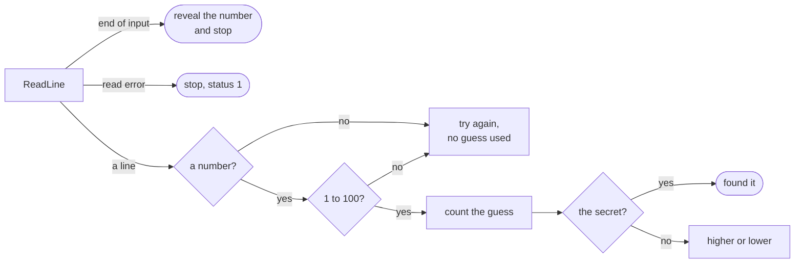

# Guess

::note
<!-- sync:needs:start -->

**You'll need**: Parts 1–20 — this project is a checkpoint for Utilities, and leans on [Entropy](/docs/learn/entropy), [Input](/docs/learn/input) and [Parse](/docs/learn/parse).
<!-- sync:needs:end -->

::

The program thinks of a number from 1 to 100, and you have seven guesses to find it. After each wrong guess it says "higher" or "lower". It is the first project in the course that you **play** rather than just run.

Seven guesses are exactly enough if you play well: halve what is left every time, and seven halvings take a hundred candidates down to one. That is also why the program is strict about what counts as a guess — text that is not a number, or a number outside 1 to 100, is answered and asked again without using a guess up.

It is a checkpoint for [Part 20: Utilities](/docs/learn/utilities), which supplies the random number; the input handling comes from [Part 14: Text](/docs/learn/text).

## How it is put together

All of it lives in `Main`: pick a secret, then loop until the guesses run out. Every line the player types takes one of these paths:



| Piece                            | Lessons it uses                                                                |
| -------------------------------- | ------------------------------------------------------------------------------ |
| A generator seeded from entropy  | [Entropy](/docs/learn/entropy), [Random](/docs/learn/random)                   |
| A secret from 1 to 100           | [Distribution](/docs/learn/distribution) (`UniformInRange`)                    |
| Reading a line, the end of input | [Input](/docs/learn/input), [Guard](/docs/learn/guard)                         |
| Turning the line into a number   | [Parse](/docs/learn/parse), [String view](/docs/learn/string-view)             |
| Skipping a bad guess             | [Catch fallback](/docs/learn/catch-fallback), [Continue](/docs/learn/continue) |
| The hint                         | [Ternary](/docs/learn/ternary)                                                 |

## A different number every game

A seeded generator such as `Pcg64Dxsm` gives the same numbers for the same seed — useful for tests, useless for a game. So the generator is seeded from the operating system's entropy instead. Asking for entropy can fail, and then there is no fair number to pick, so the program says so and stops:

```rux
var generator = PcgFromEntropy() catch {
    else => {
        PrintLine("There is no entropy to pick a number with, so there is no game.");
        return 1;
    }
};
let secret = UniformInRange<Pcg64Dxsm>(generator, 1, 100) as int32;
```

`UniformInRange` returns a `uint64` from 1 to 100 inclusive, every value equally likely. The guesses will be parsed as `int32`, so the secret is converted once here, and every comparison after it is between two `int32`s.

## Four ways the game can end

Each pass of the loop prints a prompt, clears the builder and reads a line. The match on the read is where two of the endings live:

```rux
match ReadLine(builder) {
    .Success(_) => {},
    .Failure(error) if error.kind == IoErrorKind::EndOfStream => {
        PrintLine();
        PrintLine("Leaving already? It was {}.", secret);
        return 0;
    },
    .Failure(_) => {
        PrintLine("The input could not be read.");
        return 1;
    }
}
```

Ending the input is a polite way to give up, so it reveals the number and exits with status 0. A read error is a real fault, so it exits with status 1. The other two endings — found it, and out of guesses — are ordinary `return 0`s further down.

## A guess that does not count

The guess is parsed from the trimmed line. If parsing fails, the `catch` arm prints a message and uses `continue` to start the next pass of the loop — the `catch` is inside the loop, so it can leave the pass, not just the expression:

```rux
let guess = ParseInt32(builder.View().Trim()) catch {
    else => {
        PrintLine("That is not a number. It does not count; try again.");
        continue;
    }
};
if guess < 1 || guess > 100 {
    PrintLine("That is outside 1 to 100. It does not count; try again.");
    continue;
}
used += 1;
```

`used` only grows after both checks, so the prompt keeps saying `guess 1:` until a real guess arrives.

## The hint

The last line of the loop picks between two words with the conditional operator:

```rux
PrintLine("{}", guess < secret ? "higher" : "lower");
```

## The program

The whole lesson is one package in the [Examples repository](https://github.com/rux-lang/Examples/tree/main/Projects/Guess). Its comments explain every step.

<!-- sync:program:start -->

```rux [Src/Main.rux]
// A guessing game: the program picks a number from 1 to 100, and you have seven guesses to find
// it, with a "higher" or "lower" after each one.
//
// Seven is enough if you halve what is left every time, because seven halvings take a hundred
// candidates down to one. So a guess only counts when it is a real one: text that is not a
// number, or a number outside 1 to 100, is answered and asked again without using a guess up.
//
// The game ends in one of four ways, and each is handled on purpose: the number is found, the
// guesses run out, the input ends (Ctrl+Z and Enter on Windows, Ctrl+D elsewhere, or the end of
// piped input), or the input cannot be read at all.
//
// The number comes from a generator seeded from the system's entropy, so every game is
// different. Asking for entropy can fail, and then there is no fair number to pick, so the
// program says so and stops.
import Allocator::{ Allocator, SystemAllocator };
import Format::ParseInt32;
import Io::{ IoErrorKind, Print, PrintLine, ReadLine };
import Random::{ Pcg64Dxsm, PcgFromEntropy, UniformInRange };
import Text::StringBuilder;

const Guesses = 7;

func Main() -> int {
    var generator = PcgFromEntropy() catch {
        else => {
            PrintLine("There is no entropy to pick a number with, so there is no game.");
            return 1;
        }
    };
    let secret = UniformInRange<Pcg64Dxsm>(generator, 1, 100) as int32;

    PrintLine("I am thinking of a number from 1 to 100. You have {} guesses.", Guesses);

    var system = SystemAllocator();
    let allocator: Allocator = system;
    var builder = StringBuilder(allocator);

    var used = 0;
    while used < Guesses {
        Print("guess {}: ", used + 1);
        builder.Clear();
        match ReadLine(builder) {
            .Success(_) => {},
            .Failure(error) if error.kind == IoErrorKind::EndOfStream => {
                PrintLine();
                PrintLine("Leaving already? It was {}.", secret);
                return 0;
            },
            .Failure(_) => {
                PrintLine("The input could not be read.");
                return 1;
            }
        }

        // Spaces around the number are forgiven; anything else that is not a number is not.
        let guess = ParseInt32(builder.View().Trim()) catch {
            else => {
                PrintLine("That is not a number. It does not count; try again.");
                continue;
            }
        };
        if guess < 1 || guess > 100 {
            PrintLine("That is outside 1 to 100. It does not count; try again.");
            continue;
        }
        used += 1;

        if guess == secret {
            PrintLine("Yes, {}! Found in {} of {} guesses.", secret, used, Guesses);
            return 0;
        }
        PrintLine("{}", guess < secret ? "higher" : "lower");
    }
    PrintLine("Out of guesses. It was {}.", secret);
    return 0;
}
```

Besides `Io`, its `Rux.toml` lists `Allocator`, `Format`, `Random` and `Text` under `[Dependencies]`.
<!-- sync:program:end -->

## Run it

```sh
cd Examples/Projects/Guess
rux run
```

<!-- sync:output:start -->

```
I am thinking of a number from 1 to 100. You have 7 guesses.
guess 1: fifty
That is not a number. It does not count; try again.
guess 1: 50
higher
guess 2: 75
higher
guess 3: 88
lower
guess 4: 81
higher
guess 5: 84
Yes, 84! Found in 5 of 7 guesses.
```

Ending the input (Ctrl+Z and Enter on Windows, Ctrl+D elsewhere) leaves the game and reveals the
number. Piped input works too, though the guesses cannot react to the hints:

```sh
1..7 | rux run
```

```text
I am thinking of a number from 1 to 100. You have 7 guesses.
guess 1: higher
guess 2: higher
guess 3: higher
guess 4: higher
guess 5: higher
guess 6: higher
guess 7: higher
Out of guesses. It was 78.
```

<!-- sync:output:end -->

The game waits for you. Run it and type a guess after each prompt, pressing Enter each time. To leave early, end the input — Ctrl+Z and Enter on Windows, Ctrl+D elsewhere — and the program tells you the number. The piped example above is written for PowerShell (`1..7` is the numbers 1 to 7); in a POSIX shell, `seq 1 7 | rux run` does the same. Because the secret is different on every run, your output will differ from the sample.

## Common mistakes

::warning
**Comparing the guess with an unconverted secret.**\
`UniformInRange` returns a `uint64`. Leave out the `as int32` and every comparison with the `int32` guess is refused: `error: operator '==' cannot compare left operand 'int32' with right operand 'uint64'`, and the same for `<`. Convert once, where the value is made.
::

::warning
**Counting a guess before checking it.**\
If `used += 1;` moves above the range check, typing `500` wastes a guess. The program still works — it is just unfair, which in a game is a bug.
::

::warning
**Treating the end of input as an error.**\
Without the guarded `EndOfStream` arm, a player who presses Ctrl+Z (or Ctrl+D) to quit gets "The input could not be read" and exit status 1. The end of the input is expected, so it has its own arm, and it comes before the general `.Failure(_)`.
::

## Try it yourself

1. Let the player choose the upper limit — 10, 100 or 1000 — and work out the number of guesses from it: the smallest `n` with 2ⁿ at least the limit.
2. Keep a list of the guesses so far and refuse a repeated one without counting it.
3. After the game, ask "Play again? (y/n)" and start a new round on `y`, with a new secret.
4. Swap the roles: you think of a number and the program guesses it by halving the range, reading "higher", "lower" or "yes" after each try.

## Learn more

- [Entropy](/docs/learn/entropy) and [Distribution](/docs/learn/distribution) — where the secret comes from
- [Input](/docs/learn/input) and [Parse](/docs/learn/parse) — reading and checking a line
- [Continue](/docs/learn/continue) — skipping the rest of a pass
- Next project: [Age](/docs/learn/age)
