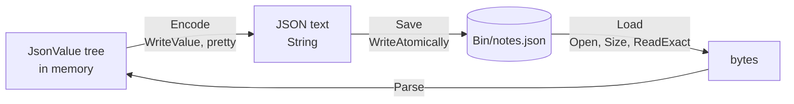

# Notes

::note
<!-- sync:needs:start -->

**You'll need**: Parts 1–21 — this project is the checkpoint for Data formats, and leans on [File](/docs/learn/file), [Atomic file](/docs/learn/atomic-file), [JSON](/docs/learn/json) and [Writing JSON](/docs/learn/json-write).
<!-- sync:needs:end -->

::

A to-do list is only useful if it is still there tomorrow. This program keeps one as JSON in a file: it saves a list, loads it back as if it were a new session, adds a note, saves again, and then deals with the two things that go wrong with real files — one that someone damaged by hand, and one that is not there at all.

It is the checkpoint for [Part 21: Data formats](/docs/learn/data-formats), and it brings together files from [Part 19](/docs/learn/files), JSON from Part 21, and the error handling of [Part 9](/docs/learn/errors) at full strength: five different error types meet in one program.

## How it is put together

Each note is a small JSON object, `{"title": "...", "done": false}`, and the list is a JSON array of them. Saving turns the tree of `JsonValue`s into text and writes it; loading reads the text and parses it back into a tree:



| Function     | Its job                                      | Can fail with                                  | Lessons it uses                                                                                |
| ------------ | -------------------------------------------- | ---------------------------------------------- | ---------------------------------------------------------------------------------------------- |
| `Note`       | Builds one note object                       | `TextError`                                    | [Writing JSON](/docs/learn/json-write), [Move](/docs/learn/move)                               |
| `Encode`     | Turns the tree into indented text            | `FormatError`                                  | [Writing JSON](/docs/learn/json-write), [String builder](/docs/learn/string-builder)           |
| `Save`       | Replaces the file in one step                | `IoError`                                      | [Atomic file](/docs/learn/atomic-file)                                                         |
| `Load`       | Reads the whole file and parses it           | `IoError`, `CollectionError`, `JsonParseError` | [File](/docs/learn/file), [Dynamic array](/docs/learn/dynamic-array), [JSON](/docs/learn/json) |
| `PrintNotes` | Prints the list, tolerating missing members  | nothing                                        | [JSON](/docs/learn/json), [Out parameter](/docs/learn/out-parameter)                           |
| `Main`       | Two sessions, a damaged file, a missing file | all five                                       | [Error sum](/docs/learn/error-sum), [Typed pattern](/docs/learn/typed-pattern)                 |

## Building a note

A note is an object with two members. Building it can fail — copying text into a new `String` needs memory — so every step ends in `?`:

```rux
func Note(allocator: Allocator, title: char8[..], done: bool) -> JsonValue ! TextError {
    var note = JsonValue::Object(allocator);
    note.Insert(String::FromBytes(allocator, "title")?, JsonValue::Text(allocator, title)?);
    note.Insert(String::FromBytes(allocator, "done")?, JsonValue::Boolean(allocator, done));
    return <-note;
}
```

A `JsonValue` owns the memory of everything inside it, so it cannot be copied — only moved. `return <-note;` hands it to the caller.

## Saving whole or not at all

`Save` is one call, and the call is the point:

```rux
func Save(allocator: Allocator, path: Path, text: char8[..]) -> ! IoError {
    WriteAtomically(allocator, path, text)?;
}
```

`WriteAtomically` writes the new text beside the old file and swaps it in only once it is complete. If the program crashes halfway through a save, the old list is still there, whole. Writing over the file directly would risk leaving half a list behind — the one outcome a notes file must never have.

## Loading, step by step

`Load` asks the file how big it is, reads exactly that many bytes into an array of that size, and parses them:

```rux
func Load(allocator: Allocator, path: Path)
    -> JsonValue ! (IoError | CollectionError | JsonParseError) {
    var file = File::Open(allocator, path, OpenOptions::Reading())?;
    let size = file.Size()?;
    var bytes = Array::Filled<char8>(allocator, size as uint, c8' ')?;
    ReadExact(file, bytes.AsMutableSlice())?;
    file.Close()?;
    return Parse(allocator, bytes.AsSlice())?;
}
```

Each line can fail in its own way: opening and reading with an `IoError`, allocating the array with a `CollectionError`, parsing with a `JsonParseError`. The return type lists all three as a sum, and every `?` passes its error through unchanged.

## Reading what may not be there

A file read from disk may have been edited by hand, so `PrintNotes` does not assume a note has both members. `Find` returns a pointer that is `null` when the member is missing:

```rux
let title = (*note).Find(StringView::FromValidated("title"));
let flag = (*note).Find(StringView::FromValidated("done"));
var done = false;
if flag != null {
    (*flag).AsBoolean(@done);
}
```

`AsBoolean` writes its answer through an out-parameter, and leaves `done` alone if the member is not a boolean. A note with no title prints as `(untitled)`.

## Expected failures, and the rest

`Main` is declared to fail with all five error types, so `?` can pass anything up — and a failure then ends the program with status 1. But two failures are **expected**, and those are handled where they happen. A damaged file is a `JsonParseError`, which knows the byte where the text stopped making sense:

```rux
match Load(allocator, path) {
    .Success(_) => PrintLine("the damaged file loaded?"),
    .Failure(error: JsonParseError) =>
        PrintLine("damaged file refused at byte {}: {}", error.Offset(), error),
    .Failure(error) => fail error
}
```

A missing file is an `IoError` of kind `NotFound`, picked out with a typed pattern **and** a guard. In a real program, that arm is where "start a new, empty list" would go:

```rux
.Failure(error: IoError) if error.kind == IoErrorKind::NotFound =>
    PrintLine("no notes file any more: starting a new list would begin here"),
.Failure(error) => fail error
```

In both matches the last arm, `.Failure(error) => fail error`, passes anything unexpected out of `Main`, which ends the program with status 1.

## The program

The whole lesson is one package in the [Examples repository](https://github.com/rux-lang/Examples/tree/main/Projects/Notes). Its comments explain every step.

<!-- sync:program:start -->

```rux [Src/Main.rux]
// Notes: a to-do list that outlives the program, kept as JSON in a file.
//
// Each note is a small JSON object, `{"title": "...", "done": false}`, and the list is an array
// of them. Saving turns the tree of `JsonValue`s into text and writes it to disk; loading reads
// the text back and parses it into a tree again. Between the two, the program could stop and
// start a hundred times, which is the whole point of a file.
//
// A file is also where things go wrong. It may be missing, or it may hold something that is not
// JSON, perhaps because someone edited it by hand. Every step that touches the disk or parses
// text is fallible, and the program handles the two failures it expects — a damaged file and a
// missing one — while `?` hands anything stranger to `Main`, which then ends with status 1.
//
// The file lives in this package's `Bin/` folder, and the program deletes it at the end.
import Allocator::{ Allocator, SystemAllocator };
import Collections::{ Array, CollectionError };
import FileSystem::{ DeleteFile, File, OpenOptions, WriteAtomically };
import Io::{ IoError, IoErrorKind, PrintLine, ReadExact };
import Json::{ JsonParseError, JsonStyle, JsonValue, Parse, WriteValue };
import Path::{ OsString, Path };
import Text::{ FormatError, String, StringBuilder, StringView, TextError, TextWriter };

func Note(allocator: Allocator, title: char8[..], done: bool) -> JsonValue ! TextError {
    var note = JsonValue::Object(allocator);
    note.Insert(String::FromBytes(allocator, "title")?, JsonValue::Text(allocator, title)?);
    note.Insert(String::FromBytes(allocator, "done")?, JsonValue::Boolean(allocator, done));
    return <-note;
}

// Turns the notes into indented JSON text, ready to be written or shown.
func Encode(allocator: Allocator, notes: &JsonValue) -> String ! FormatError {
    var builder = StringBuilder(allocator);
    let sink: &var TextWriter = builder;
    WriteValue(sink, notes, JsonStyle::Pretty())?;
    return builder.IntoString();
}

// Writing atomically means the old file is replaced only once the new one is complete, so a
// crash halfway through a save can never leave half a list behind.
func Save(allocator: Allocator, path: Path, text: char8[..]) -> ! IoError {
    WriteAtomically(allocator, path, text)?;
}

// Asks the file how big it is, reads exactly that many bytes, and parses them.
func Load(allocator: Allocator, path: Path)
    -> JsonValue ! (IoError | CollectionError | JsonParseError) {
    var file = File::Open(allocator, path, OpenOptions::Reading())?;
    let size = file.Size()?;
    var bytes = Array::Filled<char8>(allocator, size as uint, c8' ')?;
    ReadExact(file, bytes.AsMutableSlice())?;
    file.Close()?;
    return Parse(allocator, bytes.AsSlice())?;
}

// A note read from a file might lack a member, so each one is checked before it is read.
func PrintNotes(notes: &JsonValue) {
    for i in 0..notes.Length() {
        let note = notes.At(i);
        let title = (*note).Find(StringView::FromValidated("title"));
        let flag = (*note).Find(StringView::FromValidated("done"));
        var done = false;
        if flag != null {
            (*flag).AsBoolean(@done);
        }
        let mark = done ? "x" : " ";
        if title != null {
            PrintLine("  [{}] {}", mark, (*title).AsText());
        } else {
            PrintLine("  [{}] (untitled)", mark);
        }
    }
}

func Main() -> ! (IoError | TextError | FormatError | CollectionError | JsonParseError) {
    var system = SystemAllocator();
    let allocator: Allocator = system;

    var holder = OsString::FromText(allocator, "Bin/notes.json")?;
    let path = Path::FromView(holder.View());

    // The first session: start a list and save it.
    var notes = JsonValue::Array(allocator);
    notes.Push(Note(allocator, "buy milk", true)?);
    notes.Push(Note(allocator, "water the plants", false)?);
    let first = Encode(allocator, notes)?;
    Save(allocator, path, first.View().Bytes())?;
    PrintLine("saved {} notes to {}", notes.Length(), path);

    // The next session knows nothing but the file: load it, add a note, save it again.
    var loaded = Load(allocator, path)?;
    loaded.Push(Note(allocator, "write a Rux program", false)?);
    let second = Encode(allocator, loaded)?;
    Save(allocator, path, second.View().Bytes())?;
    PrintLine("added a note; the file now reads:");
    PrintLine("{}", second);

    // And one more time, to read the list as a person would.
    let final = Load(allocator, path)?;
    PrintLine("{} notes:", final.Length());
    PrintNotes(final);

    // Someone edits the file by hand and cuts it short. Loading now fails as a parse error, which
    // says where the text stopped making sense.
    Save(allocator, path, "[{\"title\": \"half a note\"")?;
    match Load(allocator, path) {
        .Success(_) => PrintLine("the damaged file loaded?"),
        .Failure(error: JsonParseError) =>
            PrintLine("damaged file refused at byte {}: {}", error.Offset(), error),
        .Failure(error) => fail error
    }

    // Clean up, then show that a missing file is told apart from every other I/O failure.
    DeleteFile(allocator, path)?;
    match Load(allocator, path) {
        .Success(_) => PrintLine("the deleted file loaded?"),
        .Failure(error: IoError) if error.kind == IoErrorKind::NotFound =>
            PrintLine("no notes file any more: starting a new list would begin here"),
        .Failure(error) => fail error
    }
}
```

Besides `Io`, its `Rux.toml` lists `Allocator`, `Collections`, `FileSystem`, `Json`, `Path` and `Text` under `[Dependencies]`.
<!-- sync:program:end -->

## Run it

```sh
cd Examples/Projects/Notes
rux run
```

<!-- sync:output:start -->

```
saved 2 notes to Bin/notes.json
added a note; the file now reads:
[
  {
    "title": "buy milk",
    "done": true
  },
  {
    "title": "water the plants",
    "done": false
  },
  {
    "title": "write a Rux program",
    "done": false
  }
]
3 notes:
  [x] buy milk
  [ ] water the plants
  [ ] write a Rux program
damaged file refused at byte 24: document ended in the middle of a value
no notes file any more: starting a new list would begin here
```

<!-- sync:output:end -->

The file is written to the package's `Bin/` folder, next to the build output, and the program deletes it before it ends, so a second run starts from nothing again.

## Common mistakes

::warning
**Returning a `JsonValue` without moving it.**\
`return note;` is refused: `error: move-only value 'note' requires an explicit '<-' in return`, with the note that `JsonValue` prohibits copying. Write `return <-note;` — see [Move](/docs/learn/move).
::

::warning
**Handling only the failure you were thinking of.**\
Drop the last arm from the damaged-file match and the compiler lists what is left: `error: match on 'JsonValue ! (CollectionError | IoError | JsonParseError)' is not exhaustive; missing .Failure(_: CollectionError), .Failure(_: IoError)`. One catch-all arm that passes the rest on is enough.
::

::warning
**A `?` the function's type does not allow.**\
If `Load` is declared `-> JsonValue ! (IoError | JsonParseError)`, the array allocation stops compiling: `error: '?' propagates error type 'CollectionError', but the enclosing function fails with 'IoError | JsonParseError'`. The sum must name every error its `?`s can carry.
::

## Try it yourself

1. Mark a note as done: load the list, find "water the plants", set its `done` member to `true`, and save it again.
2. Turn the missing-file arm into real behaviour: when the file is not there, start with an empty array instead of failing.
3. Make the program a tiny command-line tool: read one line from the input with [Input](/docs/learn/input), add it as a note, save, and print the list. Remove the `DeleteFile` call so the notes survive between runs.
4. Damage the file differently — a missing comma, a stray `}` — and see what offset and message the parser reports for each.

## Learn more

- [JSON](/docs/learn/json) and [Writing JSON](/docs/learn/json-write)
- [File](/docs/learn/file) and [Atomic file](/docs/learn/atomic-file)
- [Error sum](/docs/learn/error-sum) and [Typed pattern](/docs/learn/typed-pattern) — one function, several kinds of failure
- Next project: [Melody](/docs/learn/melody), the checkpoint for Platform
