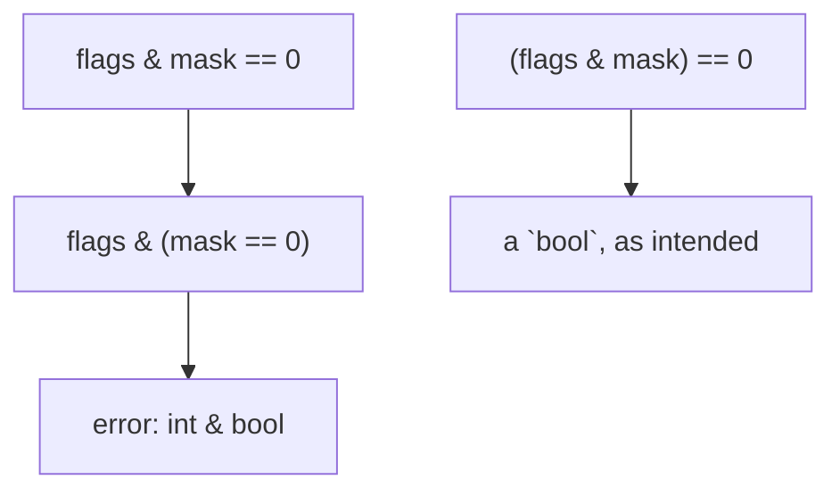

# Expressions

An _expression_ computes a value: a literal, a name, a call, or operators applied to other expressions. This chapter covers the operators; the values they work on are described with their [types](/docs/lang/types/overview).

```rux
let total = price * quantity + shipping;
let ready = count > 0 && !paused;
let label = n % 2 == 0 ? "even" : "odd";
```

## Operators

| Kind                                              | Operators                                 |
| ------------------------------------------------- | ----------------------------------------- |
| [Arithmetic](/docs/lang/expressions/arithmetic)   | `+` `-` `*` `/` `%`, unary `-`            |
| [Comparison](/docs/lang/expressions/comparison)   | `==` `!=` `<` `<=` `>` `>=`               |
| [Logical](/docs/lang/expressions/logical)         | `&&` `\|\|` `!`                           |
| [Bitwise](/docs/lang/expressions/bitwise)         | `&` `\|` `^` `~`                          |
| [Shift](/docs/lang/expressions/shift)             | `<<` `>>` `>>>`                           |
| [Assignment](/docs/lang/expressions/assignment)   | `=` `<-` `+=` `-=` … `>>>=`, `++` `--`    |
| [Conditional](/docs/lang/expressions/conditional) | `c ? a : b`                               |
| [Casts](/docs/lang/expressions/casts)             | `as`                                      |
| [Type tests](/docs/lang/sums/type-tests)          | `is`                                      |
| [Ranges](/docs/lang/ranges/overview)              | `..` `..=` `...`                          |
| [Coalescing](/docs/lang/optionals/coalescing)     | `??`                                      |
| [Propagation](/docs/lang/errors/propagation)      | postfix `?`, `? else (e => …)`            |
| [Recovery](/docs/lang/errors/handling)            | postfix `catch { … }`                     |
| [Pointers](/docs/lang/pointers/overview)          | `@` (address of), unary `*` (dereference) |
| [Moves](/docs/lang/ownership/copy-and-move)       | unary `<-`                                |

There is no unary `+` and no power operator; [Arithmetic](/docs/lang/expressions/arithmetic#no-power-operator) explains what `**` means instead.

## Precedence

When an expression mixes operators, _precedence_ decides how it groups: an operator on a higher level takes its operands before one on a lower level. Parentheses override precedence everywhere. Rux has 17 levels:

| Level | Operators                                                                                                                          | Associativity  |
| ----- | ---------------------------------------------------------------------------------------------------------------------------------- | -------------- |
| 17    | postfix: `.field` `.0` `.Method()` `::Name` `Type { … }` `f<T>()` `f()` `a[i]` `x?` `x? else (e => …)` `x catch { … }` `x++` `x--` | left to right  |
| 16    | prefix: `<-` `!` `-` `~` `*` `@` `++` `--`                                                                                         | right to left  |
| 15    | `as` `is`                                                                                                                          | left to right  |
| 14    | `*` `/` `%`                                                                                                                        | left to right  |
| 13    | `+` `-`                                                                                                                            | left to right  |
| 12    | `<<` `>>` `>>>`                                                                                                                    | left to right  |
| 11    | `<` `<=` `>` `>=`                                                                                                                  | left to right  |
| 10    | `==` `!=`                                                                                                                          | left to right  |
| 9     | `&`                                                                                                                                | left to right  |
| 8     | `^`                                                                                                                                | left to right  |
| 7     | `\|`                                                                                                                               | left to right  |
| 6     | `&&`                                                                                                                               | left to right  |
| 5     | `\|\|`                                                                                                                             | left to right  |
| 4     | `??`                                                                                                                               | right to left  |
| 3     | `c ? a : b`                                                                                                                        | right to left  |
| 2     | `a..b` `a..=b` `a...b` `..b` `..=b` `...b` `a..` `..`                                                                              | does not chain |
| 1     | `=` `<-` `+=` `-=` `*=` `/=` `%=` `&=` `\|=` `^=` `<<=` `>>=` `>>>=`                                                               | right to left  |

Operators on one level group from the left where the table says so: `100 / 10 / 5` is `(100 / 10) / 5`, which is 2. `??` and `? :` group from the right, so `a ?? b ?? c` is `a ?? (b ?? c)`. A range does not chain: `0..1..2` does not parse.

A few entries need a word:

- **Postfix `?` and the conditional `?`.** A `?` written directly after an expression, with no space before it, is postfix [propagation](/docs/lang/errors/propagation). A `?` with whitespace before it opens a [conditional](/docs/lang/expressions/conditional).
- **Casts and tests take a type.** The right side of `as` and `is` is a type, not an expression. It ends before `..`, `|` and `!`, so a sum or fallible target is grouped: `value is (A | B)`.
- **The coalescing fallback may leave.** The right side of `??` may be `fail`, `return`, `break` or `continue` instead of a value — see [Coalescing](/docs/lang/optionals/coalescing).
- **Prefix `&` does not exist.** Taking an address is `@`; `&x` is `error: '&' does not take an address; write '@' to take the address of a value`.

## Consequences

Most of the order matches ordinary arithmetic and needs no thought: `2 + 3 * 4` is 14, and `age >= 18 && age < 65` compares before it combines. A few places are worth knowing by heart.

**Bitwise operators bind more loosely than comparisons.** `x & 1 == 0` is `x & (1 == 0)`, an integer and a `bool`:

```
error: operator '&' cannot combine left operand 'int32' with right operand 'bool8'
```

Write `(x & 1) == 0`.

**`as` binds more tightly than arithmetic.** It converts only the operand next to it, so `a as float64 / b as float64` converts both operands before dividing, and `(a / b) as float64` divides integers first. A prefix operator binds more tightly still: `-x as int64` is `(-x) as int64`.

**Shifts bind more loosely than `+` and `-`.** `1 << 2 + 1` is `1 << 3`, which is 8.

**`==` binds more tightly than `??`.** `value ?? 0 == 0` is `value ?? (0 == 0)`. Write `(value ?? 0) == 0`.

**The conditional binds more loosely than almost everything.** `price - member ? 5 : 0` is `(price - member) ? 5 : 0`. A conditional inside a larger expression is wrapped: `price - (member ? 5 : 0)`.



## Evaluation order

Operands are evaluated from left to right, and so are the arguments of a call: in `Note(1) + Note(2) * Note(3)`, the three calls run in the order they are written, even though the multiplication happens first. `&&`, `||`, `??` and the conditional evaluate their right side only when it is needed — see [Logical](/docs/lang/expressions/logical#short-circuit-evaluation) and [Conditional](/docs/lang/expressions/conditional).

## Operand types

Rux never changes a value's type behind your back. The operands of a binary operator must agree on a type, by these rules:

| Operands                                         | Result                                      |
| ------------------------------------------------ | ------------------------------------------- |
| two values of one type                           | that type                                   |
| an unsuffixed integer literal and an integer     | the integer's type; the literal must fit it |
| two integers of one signedness, different widths | the wider type                              |
| two floating-point values of different widths    | the wider type                              |
| a signed and an unsigned integer                 | an error: convert one with `as`             |
| an integer and a floating-point value            | an error: convert one with `as`             |

```rux
let small: int32 = 1;
let big: int64 = 5000000000;
let sum = small + big;
let doubled = 2 * small;
```

`sum` is an `int64` and `doubled` an `int32`. Mixing signedness is refused with a note saying why:

```
error: operator '+' cannot combine left operand 'uint64' with right operand 'int64'
  note: the operands differ in signedness, so neither converts to the other's type
  help: convert one operand with 'as' to the type the operation should use
```

A literal that does not fit the other operand's type is an error rather than a silent wrap: with `count: uint64`, `count == -1` is `error: integer literal is out of range for type 'uint64'`.

## Statements and values

An assignment is an expression in the grammar but produces no value, so it cannot be used inside another expression — see [Assignment](/docs/lang/expressions/assignment). An expression followed by `;` is an [expression statement](/docs/lang/statements/overview).

## See also

- [Operators and punctuation](/docs/lang/lexical/operators) — how the operator tokens are spelt
- [Statements](/docs/lang/statements/overview) — where expressions are used
- [Operator interfaces](/docs/lang/interfaces/operators) — giving your own types operators
- Learn: [Precedence](/docs/learn/precedence), [Arithmetic](/docs/learn/arithmetic)
