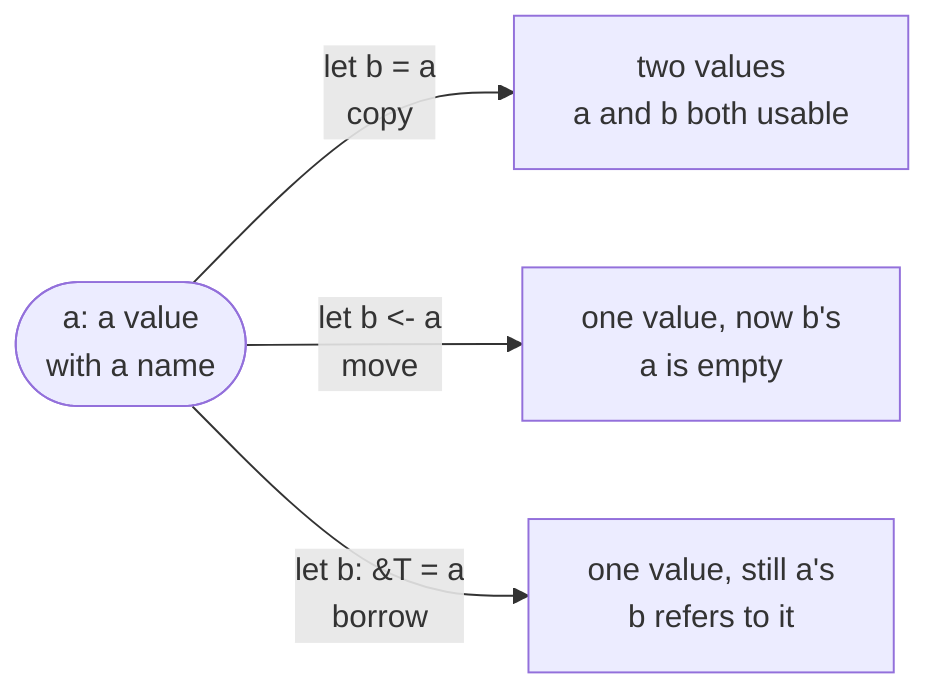

# Ownership

Every value in Rux has exactly one **owner**: a binding, a parameter, a field or element of a larger value, or a temporary that nothing has named yet. The owner decides when the value's life ends, and at that point the compiler [destroys](/docs/lang/ownership/destructors) it — once.

A value passes from one owner to another in one of two ways. A **copy**, written `=`, makes a second, independent value and leaves the source as it was. A **move**, written `<-`, hands the value itself over and leaves the source empty. A [reference](/docs/lang/references/overview) is the third way to reach a value — it borrows without owning, so nothing changes hands.

## Syntax

```text
let name = source;          // bind a copy
let name <- source;         // bind by moving
target = source;            // copy assignment
target <- source;           // move assignment
F(source)                   // pass a copy
F(<-source)                 // move into the parameter
return source;              // return a copy
return <-source;            // move out of the function
Type { field: <-source }    // move into an aggregate
```

`<-` is the move operator in every position: as an assignment operator between two places, and as a prefix on an argument, a return value, a field or element value, a conditional arm, or a `match` subject.

## Copy or move

A named source is **copied** unless it is written with `<-`. Copying never touches the source: both values exist afterwards, and changing one never shows in the other. Moving invalidates the source, suppresses its destruction — the new owner destroys the value instead — and makes every later read of it an error.

```rux
struct Token {
    id: int32;
}

extend Token {
    // No copies: a Token can only be moved.
    func =(self: &var Token, other: &Token);
}

func Consume(token: Token) {
    PrintLine("consumed {}", token.id);
}

func Main() -> int {
    let first = Token { id: 1 };
    let second <- first;       // first is now empty
    Consume(<-second);         // second is now empty
    return 0;
}
```



|              | Copy `=`             | Move `<-`          | Borrow `&T` / `&var T` |
| ------------ | -------------------- | ------------------ | ---------------------- |
| Values after | two                  | one                | one                    |
| The source   | unchanged and usable | empty; reads fail  | still the owner        |
| Destroyed by | each owner, its own  | the new owner only | the original owner     |

Whether a type can be copied or moved at all, and what a copy does, is up to the type: see [Copy and move](/docs/lang/ownership/copy-and-move). Moving works for every type that does not prohibit it, a copyable one included — `let m <- n;` with an `int` `n` leaves `n` empty too.

## Fresh temporaries

A value nobody has named — the result of a call, a literal, a constructor call, or the value a conditional or `match` produces — has no other owner, so it transfers directly. It needs no `<-`, and no copy runs:

```rux
func Make(id: int32) -> Token {
    return Token { id: id };    // a literal: no '<-'
}

func Main() -> int {
    let token = Make(7);        // a call result: no '<-'
    Consume(Make(8));
    return 0;
}
```

The arrow is for values that have a name. It marks, on the line where it happens, which names stop working.

## After a move

Reading a moved-from name is a compile-time error. The note points at the move:

```text
error: value 'first' is used after it was moved
  note: 'first' was moved at …
  help: clone 'first' before moving it if both uses are required
```

A moved-from `var` is empty, not ruined. Assigning it a whole new value makes it usable again:

```rux
var token = Token { id: 1 };
let held <- token;
token <- Token { id: 2 };
PrintLine("token is {} again", token.id);
```

## Moves on some paths

The compiler tracks moves through branches and loops. A value moved on one path of an `if` is unavailable after the `if`, because the compiler cannot know which path ran:

```text
error: value 'token' may have been moved on some control-flow paths
  note: one unavailable path for 'token' originates at …
  help: initialize or preserve 'token' on every path before this use
```

A loop body runs again from where its last pass ended, so a value one pass moves out is not there for the next. Moving an outer local inside a loop body is an error unless the same pass gives it a new value before the loop repeats, or leaves the loop with `break`, `return` or `fail` after the move. The loop's own `for` variable and the locals declared inside the body are fresh on every pass.

```rux
var slot = Token { id: 3 };
for pass in 0..2 {
    let taken <- slot;
    PrintLine("pass {} took {}", pass, taken.id);
    slot <- Token { id: 10 + pass as int32 };    // refilled before the next pass
}
```

At run time a value moved on only some paths is tracked by a drop flag, so it is still destroyed exactly once — see [Destructors](/docs/lang/ownership/destructors#drop-flags).

## What cannot be moved

| Written                 | Error                                                      |
| ----------------------- | ---------------------------------------------------------- |
| `return <-reference;`   | `cannot move a non-owning reference`                       |
| `let a <- value.field;` | `cannot move field 'field' out of droppable value 'value'` |
| `value <- value;`       | `cannot move 'value' into itself`                          |
| `let b <- pinned;`      | `moving type 'Pinned' is prohibited`                       |

A reference owns nothing, so there is nothing to hand over. A single part cannot leave a value on its own; the value is moved whole or [taken apart](/docs/lang/ownership/copy-and-move#partial-moves). A type can [prohibit moving](/docs/lang/ownership/copy-and-move#prohibiting-moves) altogether.

## See also

- [Copy and move](/docs/lang/ownership/copy-and-move) — how a type copies, and how it forbids copying or moving
- [Destructors](/docs/lang/ownership/destructors) — what happens when an owner lets go
- [Defer](/docs/lang/ownership/defer) — cleanup that belongs to a scope rather than a value
- [References](/docs/lang/references/overview) — reaching a value without owning it
- Learn: [Ownership](/docs/learn/ownership), [Copy](/docs/learn/copy), [Move](/docs/learn/move)
