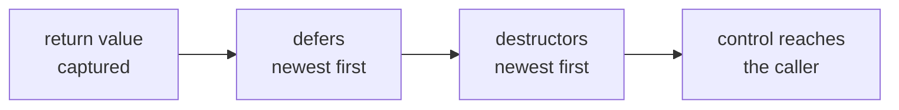

# Defer

A `defer` statement registers a statement now and runs it when the enclosing scope ends, by whichever way it ends. Cleanup written once, on the line after the work it undoes, then covers every exit — including ones added later.

## Syntax

```text
defer statement
```

The deferred part is exactly one statement: an expression statement such as a call, an assignment, or a statement with its own body such as `if`. A bare block is not a statement, so `defer { … }` does not parse:

```text
error: expected an expression before '{'
```

To defer several steps, write several defers — remembering that they run in reverse — put the steps in a function and defer the call, or defer an `if` whose body holds them.

```rux
struct Valve {
    name: char8[..];
}

extend Valve {
    func Open(&self) {
        PrintLine("open {}", self.name);
    }

    func Close(&self) {
        PrintLine("close {}", self.name);
    }
}

func Fill(litres: int32) -> bool {
    let supply = Valve { name: "supply" };
    supply.Open();
    defer supply.Close();

    let drain = Valve { name: "drain" };
    drain.Open();
    defer drain.Close();

    if litres > 100 {
        return false;
    }
    PrintLine("filling {} litres", litres);
    return true;
}
```

Both exits close both valves, the drain first.

## Semantics

**Registration happens at run time.** A `defer` counts only once execution reaches it. A `return` before the `defer` line leaves without running it, and a `defer` inside a branch that is not taken never registers.

**It belongs to its scope.** A deferred statement runs when the block it is written in ends: the function body, the body of an `if`, or one pass of a loop body — so a `defer` in a loop runs once per pass, not once after the loop. The scope may end by reaching its closing brace, by `return`, by `break` or `continue`, by `?` propagating an absence, or by an error leaving it — out of the function through its `throws` channel, or out of a `try` block for its `catch` arms; a `break` or `continue` runs the defers of the pass and of every inner scope it leaves.

**Last registered, first run.** Several defers in one scope run in reverse registration order, and the defers of nested scopes run innermost first.

**It is evaluated when it runs.** A deferred statement reads its variables at the end of the scope, not at the `defer` line, so it sees every change made in between: after `var n = 1; defer Print(n); n = 2;` the deferred call prints `2`.

**Each function has its own.** A function's defers run when that function's scopes end; calling a function never runs, or inherits, the caller's defers. Each instantiation of a generic function has its own as well.

## Return and defer

`return expr;` evaluates `expr` exactly once and keeps the result — performing the copy or move into the return value — **before** any deferred statement runs. Whatever the defers change afterwards, the caller receives the kept value:

```rux
func Countdown() -> int32 {
    var remaining: int32 = 3;
    defer PrintLine("deferred code sees {}", remaining);
    defer remaining = 0;
    return remaining;
}
```

`Countdown()` returns `3`, and the deferred `PrintLine` prints `deferred code sees 0`. The same holds for every part of an aggregate return value. A `return` with no value runs the same defers without capturing anything, and an error that leaves the function through its `throws` channel runs them exactly as a return does, after the error has been captured.

That ordering makes "hand out the current value, then advance" a two-line method:

```rux
struct Dispenser {
    next: int32;
}

extend Dispenser {
    func Take(&var self) -> int32 {
        defer self.next += 1;
        return self.next;
    }
}
```

## Defers and destructors

When a scope ends, its deferred statements run first, newest first, and then its values are [destroyed](/docs/lang/ownership/destructors), newest first. Registration and declaration order are not interleaved:

```rux
func Party() {
    let ada = Guest { name: "Ada" };
    defer PrintLine("lights off");
    let bob = Guest { name: "Bob" };
    defer PrintLine("music off");
}
```


```mermaid
flowchart LR
    r["return value<br/>captured"] --> d["defers<br/>newest first"]
    d --> x["destructors<br/>newest first"]
    x --> c["control reaches<br/>the caller"]
```

`Party` prints `music off`, `lights off`, `Bob leaves`, `Ada leaves`. On a `return`, the full order is: the return value is captured, the defers run, the locals are destroyed.

|            | Destructor `~T`            | `defer`                        |
| ---------- | -------------------------- | ------------------------------ |
| Belongs to | a type — every value of it | one piece of work in one scope |
| Written    | once, in `extend T`        | where the work starts          |
| Runs       | when a value's life ends   | when the enclosing scope ends  |

A destructor cleans up after a value. `defer` is for cleanup that belongs to a piece of work rather than to any one value's life.

## Panics

A [panic](/docs/lang/errors/panics) does not unwind, so no deferred statement runs — not in the panicking function and not in its callers.

## Leaving from a defer

A deferred statement runs while its scope is already being left, so it cannot leave it another way. `return`, `throw` and `?` inside a `defer` are refused, and so are a `break` or `continue` that would leave it; one that leaves a loop written inside the deferred statement is fine:

```
error: 'return' cannot leave a deferred statement
error: '?' cannot leave a deferred statement
error: 'break' cannot leave a deferred statement
```

No error may leave it either, so a call in it that can throw is handled there, with `try?` or `try ... catch`. A bare `try` is refused:

```rux
defer try Close(file) catch { _ => {} };
```

```
error: an error cannot leave a deferred statement
  note: a deferred statement runs while its scope is already being left
  help: handle it with 'catch' or discard it with 'try?'
```

The same holds in a [destructor](/docs/lang/ownership/destructors). A `try` block does not cover the deferred statements written inside it, since they run as its scope is left.

## No `finally`

There is no `finally`: it is reserved and refused with a help that points here. Cleanup that must run on every exit from a `try` block is a `defer` inside the block, or a destructor. When an error leaves a `try` block, the defers registered inside it run and its locals are destroyed before the `catch` arm runs:

```rux
try {
    let file = Open(path);    // the block covers every call in it
    defer Release(file);
    Process(file);
} catch {
    e => Report(e)
}
```

See [Handling errors](/docs/lang/errors/handling).

## See also

- [Destructors](/docs/lang/ownership/destructors) — cleanup that belongs to a value
- [Return](/docs/lang/statements/return) — leaving a function with a value
- [Errors](/docs/lang/errors/overview) — `throw` and `try`, whose errors run defers on the way out
- [Optional propagation](/docs/lang/optionals/propagation) — `?`, which runs defers on the way out
- Learn: [Defer](/docs/learn/defer), [Defer return](/docs/learn/defer-return)
