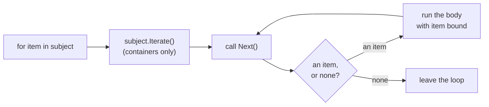

# Iteration

A [`for` loop](/docs/lang/statements/loops) walks an array, a slice or a range directly. Any other subject is driven by a convention of two method shapes: an **iterator** declares `Next`, which hands out one item per call, and a **container** declares `Iterate`, which hands out a fresh iterator.

## The protocol

```text
extend It {
    func Next(self: &var It) -> Item? { … }      // an iterator
}

extend Container {
    func Iterate(self: &Container) -> It { … }   // a container
}
```

| Subject of `for item in subject` | What the loop does                                        |
| -------------------------------- | --------------------------------------------------------- |
| an array, a slice, a range       | built in                                                  |
| a type declaring `Iterate`       | calls `Iterate` once, then drives the iterator it returns |
| a type declaring `Next`          | drives the subject itself                                 |
| anything else                    | `cannot iterate over 'T'`                                 |

The loop calls `Next` once per pass. A present result runs the body with its payload bound to the loop variable; `none` ends the loop.



The same walk written by hand is a `loop` with a [coalescing exit](/docs/lang/optionals/coalescing):

```rux
var countdown = Countdown { remaining: 3 };
loop {
    let second = countdown.Next() ?? break;
    PrintLine("{}", second);
}
```

## Iterators

```rux
struct Countdown {
    remaining: int32;
}

extend Countdown : Iterator {
    func Next(self: &var Countdown) -> int32? {
        if self.remaining == 0 {
            return none;
        }
        let current = self.remaining;
        self.remaining -= 1;
        return current;
    }
}

func Main() -> int {
    for second in (Countdown { remaining: 5 }) {
        Print(" {}", second);
    }
    PrintLine(" liftoff");
    return 0;
}
```

`Next` must take a **writable** receiver, since advancing an iterator changes it, and must return a native optional. The item type is whatever the optional carries:

```text
error: iterator method 'Next' on 'A' must take a mutable receiver
  note: advancing an iterator writes it, so 'Next' cannot borrow its receiver read-only
  help: write the receiver as 'self: &var A'
```

A `Next` returning something else is not an iterator — `cannot iterate over 'B'`, with the note `type 'B' declares 'Next', but not as 'func Next(self: &var B) -> T?' returning a native optional`. A `Next` returning a variant with `Some` and `None` cases is rejected where it is declared, because a loop ends only at the absence of a native optional:

```text
error: iterator method 'Next' on 'It' must return a native optional
  help: return 'Item?' and report the end with 'none'
```

An iterator is consumed as it is read. Once `Next` has reported `none`, it should keep reporting `none`; nothing promises that an iterator can be restarted.

A struct literal written directly after `in` must be parenthesised, as above. Without the parentheses its `{` is taken for the start of the loop body, and the parser stops with `expected ';' after expression, but found ':'`.

::note
**A loop over a named iterator advances a copy.**\
In rux 0.4.0, `for second in countdown` walks a copy of `countdown`, so the variable itself is not moved along: after a loop that stops early, `countdown` is where it started. To resume a walk later, call `Next` directly, as in the `loop` above.
::

## Containers

A container is not an iterator itself. It hands one out, so two loops over the same container walk independently, and the container is unchanged afterwards:

```rux
struct Span {
    limit: int32;
}

extend Span : Iterable {
    func Iterate(self: &Span) -> Countdown {
        return Countdown { remaining: self.limit };
    }
}

func Main() -> int {
    let span = Span { limit: 3 };
    for n in span {
        Print(" {}", n);
    }
    for n in span {
        Print(" {}", n);    // starts again from 3
    }
    PrintLine();
    return 0;
}
```

`Iterate` takes no parameters besides the receiver. It borrows the container read-only — handing out an iterator changes nothing — and the iterator it returns usually borrows from the container in turn, so the container must outlive it and must not be changed while it is in use.

`Iterator` and `Iterable`, from Core, are empty [marker interfaces](/docs/lang/interfaces/core-interfaces#iterator-and-iterable). Writing `: Iterator` or `: Iterable` records the role; the loop goes by the method names and shapes alone and works without them.

## Items

An item may itself be an optional, a fallible, a sum or the unit type. Only the **outer** absence that `Next` returns ends the loop; an absent or failed item is an ordinary value the body receives:

```rux
struct Readings {
    index: int32;
}

extend Readings {
    // Each item is an int32?, so Next returns int32??.
    func Next(self: &var Readings) -> int32?? {
        self.index += 1;
        if self.index > 3 {
            return none;
        }
        if self.index == 2 {
            let missing: int32? = none;
            return missing;
        }
        let present: int32? = self.index * 10;
        return present;
    }
}

func Main() -> int {
    for reading in (Readings { index: 0 }) {
        PrintLine("{}", reading ?? -1);    // 10, -1, 30
    }
    return 0;
}
```

No error channel is added to iteration: a fallible item is data, and the loop continues past a failed one.

## Moves inside a loop

The loop variable and the locals declared in the body are fresh on every pass and may be moved freely. Moving an outer local inside the body is subject to the rule in [Ownership](/docs/lang/ownership/overview#moves-on-some-paths): the same pass must refill it, or leave the loop, after the move.

## See also

- [Loops](/docs/lang/statements/loops) — `for`, `while` and `loop`
- [Optionals](/docs/lang/optionals/overview) — the `T?` that `Next` returns
- [Core interfaces](/docs/lang/interfaces/core-interfaces) — `Iterator` and `Iterable`
- Learn: [Iterator](/docs/learn/iterator), [Iterable](/docs/learn/iterable)
