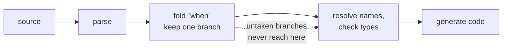

# Compile-Time Evaluation

Part of every Rux program is settled while it is being **compiled**, before any of it runs. Constants are folded to values, `sizeof` and `alignof` to numbers, and a [`when`](/docs/lang/comptime/conditional) keeps one branch and throws the others away unread. The compiler also describes the build itself — the target machine, the build profile, the compiler, the source location and user defines — as ordinary values a program can read. None of this costs anything at run time: by then a compile-time value is a plain constant, and a discarded branch does not exist.

There is no preprocessor and no separate build language. Everything in this chapter is written in Rux and checked by the same compiler.

## What is known at compile time

| Construct                                              | Known while compiling                                                 | Page                                                       |
| ------------------------------------------------------ | --------------------------------------------------------------------- | ---------------------------------------------------------- |
| literals and `const` declarations                      | the value, folded from literals, operators, casts and other constants | [Constants](/docs/lang/bindings/constants)                 |
| `sizeof(T)`, `alignof(T)`                              | a type's size and alignment in bytes, as `uint`                       | [Layout](/docs/lang/memory/layout)                         |
| primitive constants such as `int32::Max`, `uint::Bits` | their values                                                          | [Primitive types](/docs/lang/appendix/primitives)          |
| `#target`, `#build`, `#compiler`, `#source`            | facts about the build and the source location                         | [Context](/docs/lang/comptime/context)                     |
| `#config`                                              | user-defined values from `Rux.toml` or `--define`                     | [Config](/docs/lang/comptime/config)                       |
| `when`                                                 | which branch is compiled                                              | [Conditional compilation](/docs/lang/comptime/conditional) |
| `#Error`, `#Warn`                                      | diagnostics that stop or annotate the build                           | [Diagnostics](/docs/lang/comptime/diagnostics)             |
| `intrinsic` declarations                               | the values and functions the compiler itself supplies                 | [Intrinsics](/docs/lang/comptime/intrinsics)               |

A `const` initializer may use literals, operators, casts, struct literals, other constants, `sizeof`/`alignof`, primitive constants and the scalar fields of the `#` values. A function call is never a compile-time value, even when it could be computed:

```rux
func Square(x: int) -> int { return x * x; }
const Nine = Square(3);
```

```
error: call to 'Square' is not a compile-time value
  help: initialize a constant from literals, operators, casts, and other constants
```

## The `#` values come from `Core`

`#target`, `#build`, `#compiler`, `#source` and `#config`, and the directives `#Error` and `#Warn`, are declared in the `Core` package and imported like any other name:

```rux
import Core::{ #target, #build, #Error };
```

They are not keywords. A package that declares them itself — see [Intrinsics](/docs/lang/comptime/intrinsics) — can stand in for `Core`.

## Compile time and run time

Rux keeps the two kinds of decision visibly apart. A chain is `if`/`else if` throughout or `when`/`else when` throughout, never a mixture, so a reader always knows which branches the compiler has already settled:

|                     | `if`                      | `when`                                        |
| ------------------- | ------------------------- | --------------------------------------------- |
| Decided             | while the program runs    | while the program is compiled                 |
| Condition           | any `bool`                | an expression the compiler can fold           |
| Untaken branch      | compiled and type-checked | parsed, then discarded before name resolution |
| Scope of a branch   | its own                   | none: declarations and bindings stay after it |
| Where it can appear | inside a function body    | between declarations and inside bodies        |



A `#` value read in ordinary code is just as free: `#build.debugAssertions` in an expression compiles to the constant `true` or `false`.

## See also

- [Conditional compilation](/docs/lang/comptime/conditional) — `when` in full
- [Context](/docs/lang/comptime/context) — every field of `#target`, `#build`, `#compiler` and `#source`
- [Config](/docs/lang/comptime/config) — values a build passes in
- [Constants](/docs/lang/bindings/constants) — `const` declarations
- Learn: [Compile time](/docs/learn/compile-time), [When](/docs/learn/when)
