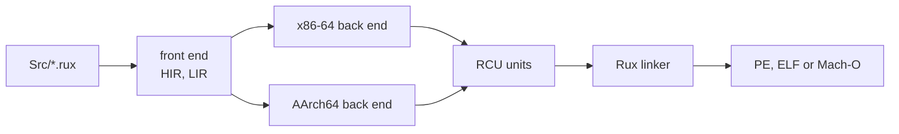

# Rux Compiled Unit

A **Rux Compiled Unit** (RCU, `.rcu`) is the object format of the Rux compiler. Each back end — x86-64 and AArch64 — encodes its instructions itself and stores them, with symbols and relocations, in one RCU per compiled source file. The Rux linker reads the units of a build and writes the target's container: a PE image on Windows, ELF on Linux and FreeBSD, Mach-O on macOS, or a relocatable object or static archive in the target's own format. No external assembler, compiler or linker takes part.

A normal build keeps its units in memory. `rux build --emit rcu` also writes them out, as `Temp/Obj/<file>.rcu`, with a readable dump of each in `Temp/Rcu/<file>.rcu.txt` (see [`rux build`](/docs/cli/build)).



## File layout

All multi-byte integers are **little-endian**, and every field sits at the exact offset listed — there is no implicit padding. The regions follow one another in this order:

```
┌──────────────────────────────────────────┐ offset 0
│ File header                    32 bytes  │
├──────────────────────────────────────────┤ offset 32
│ Section table       section_count × 40   │
├──────────────────────────────────────────┤ 32 + section_count × 40
│ Symbol table         symbol_count × 20   │
├──────────────────────────────────────────┤
│ For each section, in table order:        │
│   raw data        (aligned to section)   │
│   relocations     (aligned to 4)         │
├──────────────────────────────────────────┤
│ String table      string_table_size      │
├──────────────────────────────────────────┤
│ Rux metadata  64 bytes (aligned to 8)    │ when present
└──────────────────────────────────────────┘
```

Every gap introduced by alignment is filled with `0x00`. A reader needs only the header to find everything else.

## File header

| Offset | Size | Type    | Field               | Meaning                                                          |
| ------ | ---- | ------- | ------------------- | ---------------------------------------------------------------- |
| 0      | 4    | `u8[4]` | `magic`             | `52 43 55 00` — `"RCU\0"`                                        |
| 4      | 2    | `u16`   | `version`           | `(major << 8) \| minor`; this format is 1.0, `0x0100`            |
| 6      | 1    | `u8`    | `arch`              | target architecture — see below                                  |
| 7      | 1    | `u8`    | `flags`             | bit 0 `F_HAS_METADATA`; bits 1–7 are `0`                         |
| 8      | 2    | `u16`   | `section_count`     | entries in the section table                                     |
| 10     | 2    | `u16`   | `_reserved`         | `0`                                                              |
| 12     | 4    | `u32`   | `symbol_count`      | entries in the symbol table                                      |
| 16     | 4    | `u32`   | `string_table_off`  | file offset of the string table                                  |
| 20     | 4    | `u32`   | `string_table_size` | its size in bytes                                                |
| 24     | 4    | `u32`   | `metadata_offset`   | file offset of the metadata block, or `0` when there is none     |
| 28     | 4    | `u32`   | `checksum`          | CRC-32C of the whole file, computed with these four bytes as `0` |

| `arch` | Architecture           |
| ------ | ---------------------- |
| `0x00` | unknown                |
| `0x01` | x86-64, little-endian  |
| `0x02` | AArch64, little-endian |

The architecture byte names the processor only. Operating system and calling convention are not recorded: the instruction bytes were generated for one target, and the linker is told which one it is linking for. A unit is only meaningful to a link for the same architecture, and the linker rejects any other.

A reader must reject a file whose magic differs, and should reject one whose major version is newer than it understands.

## Section table

`section_count` entries of 40 bytes, starting at offset 32.

| Offset | Size | Type      | Field          | Meaning                                                    |
| ------ | ---- | --------- | -------------- | ---------------------------------------------------------- |
| 0      | 8    | `char[8]` | `name`         | ASCII name, at most 7 characters, padded with `\0`         |
| 8      | 4    | `u32`     | `type`         | section type                                               |
| 12     | 4    | `u32`     | `flags`        | section flags                                              |
| 16     | 4    | `u32`     | `raw_offset`   | file offset of the section's bytes, aligned to `alignment` |
| 20     | 4    | `u32`     | `raw_size`     | number of bytes stored                                     |
| 24     | 4    | `u32`     | `virtual_size` | size in memory: `raw_size`, or `1` for an empty section    |
| 28     | 2    | `u16`     | `alignment`    | required alignment, a power of two                         |
| 30     | 2    | `u16`     | `reloc_count`  | relocation entries for this section                        |
| 32     | 4    | `u32`     | `reloc_offset` | file offset of those entries, or `0` when there are none   |
| 36     | 4    | `u32`     | `_reserved`    | `0`                                                        |

An empty section still has a `raw_offset` — the aligned position its bytes would start at.

| `type` | Constant     | Contents                                    |
| ------ | ------------ | ------------------------------------------- |
| `0`    | `SEC_NULL`   | an unused entry                             |
| `1`    | `SEC_TEXT`   | machine code                                |
| `2`    | `SEC_DATA`   | initialized writable data                   |
| `3`    | `SEC_RODATA` | read-only data: literals, constant tables   |
| `4`    | `SEC_BSS`    | zero-initialized data, with no bytes stored |
| `5`    | `SEC_META`   | Rux-specific metadata                       |

| Bit | Constant     | Meaning                         |
| --- | ------------ | ------------------------------- |
| 0   | `SF_ALLOC`   | occupies memory at run time     |
| 1   | `SF_EXEC`    | executable                      |
| 2   | `SF_READ`    | readable                        |
| 3   | `SF_WRITE`   | writable                        |
| 4   | `SF_MERGE`   | identical entries may be merged |
| 5   | `SF_STRINGS` | holds NUL-terminated strings    |

Both back ends emit the same three sections, always in this order:

| Index | Name      | Type         | Flags                             | Alignment | Contents                               |
| ----- | --------- | ------------ | --------------------------------- | --------- | -------------------------------------- |
| 0     | `.text`   | `SEC_TEXT`   | `SF_ALLOC \| SF_EXEC \| SF_READ`  | 16        | functions, including `asm func` bodies |
| 1     | `.rodata` | `SEC_RODATA` | `SF_ALLOC \| SF_READ`             | 8         | string literals and constant data      |
| 2     | `.data`   | `SEC_DATA`   | `SF_ALLOC \| SF_READ \| SF_WRITE` | 8         | writable data                          |

## Symbol table

`symbol_count` entries of 20 bytes, starting right after the section table.

| Offset | Size | Type  | Field           | Meaning                                                                                                                   |
| ------ | ---- | ----- | --------------- | ------------------------------------------------------------------------------------------------------------------------- |
| 0      | 4    | `u32` | `name_off`      | string-table offset of the name                                                                                           |
| 4      | 4    | `u32` | `value`         | offset within the section; the value itself for an absolute symbol                                                        |
| 8      | 4    | `u32` | `size`          | size in bytes, `0` when unknown                                                                                           |
| 12     | 2    | `u16` | `section_idx`   | owning section; `0xFFFF` for an external symbol, `0xFFFE` for an absolute one                                             |
| 14     | 1    | `u8`  | `kind`          | symbol kind                                                                                                               |
| 15     | 1    | `u8`  | `visibility`    | symbol binding                                                                                                            |
| 16     | 4    | `u32` | `type_name_off` | string-table offset of a type spelling — a function's result type, such as `"int32"`, or a constant's type; `0` when none |

| `kind` | Constant          | Meaning                                        |
| ------ | ----------------- | ---------------------------------------------- |
| `0`    | `SYM_UNKNOWN`     | unclassified                                   |
| `1`    | `SYM_FUNC`        | a function defined in this unit                |
| `2`    | `SYM_DATA`        | writable data defined in this unit             |
| `3`    | `SYM_CONST`       | read-only data defined in this unit            |
| `4`    | `SYM_SECTION`     | a section                                      |
| `5`    | `SYM_FILE`        | a source file name                             |
| `6`    | `SYM_EXTERN_FUNC` | a function this unit calls but does not define |
| `7`    | `SYM_EXTERN_DATA` | data this unit uses but does not define        |

An external symbol has `section_idx = 0xFFFF` and `value = 0`; it is a reference to a definition in another unit of the link or, for an `extern` declaration, to a shared library.

| `visibility` | Constant       | Meaning                                                                                                                            |
| ------------ | -------------- | ---------------------------------------------------------------------------------------------------------------------------------- |
| `0`          | `VIS_LOCAL`    | a package-private definition                                                                                                       |
| `1`          | `VIS_GLOBAL`   | a public definition of a dependency, linkable across units but not part of the artifact's interface; also every external reference |
| `2`          | `VIS_WEAK`     | a definition another unit's global definition overrides                                                                            |
| `3`          | `VIS_EXPORTED` | a public definition of the package being built — what a library artifact publishes                                                 |

The linker binds each reference to exactly one definition and reports a duplicate or a missing one. An executable's root is `Main`; a library's roots are its exported definitions.

## Relocations

Each section's relocations are an array of 16-byte entries at `reloc_offset`.

| Offset | Size | Type  | Field            | Meaning                                         |
| ------ | ---- | ----- | ---------------- | ----------------------------------------------- |
| 0      | 4    | `u32` | `section_offset` | where in the section the field to patch begins  |
| 4      | 4    | `u32` | `symbol_index`   | the symbol whose address is used                |
| 8      | 2    | `u16` | `type`           | relocation type                                 |
| 10     | 2    | `u16` | `_reserved`      | `0`                                             |
| 12     | 4    | `i32` | `addend`         | a signed constant added to the symbol's address |

In the formulas, `S` is the symbol's address, `A` the addend and `P` the address of the patched field. Types below 16 patch a whole little-endian field and are architecture-neutral; types from 16 patch bit fields of one AArch64 instruction word and keep the names of their ELF counterparts.

| Type      | Name                        | Patches                       | Value                                                                                             |
| --------- | --------------------------- | ----------------------------- | ------------------------------------------------------------------------------------------------- |
| `0`       | `NONE`                      | nothing                       | —                                                                                                 |
| `1`       | `ABS_64`                    | 64-bit field                  | `S + A`                                                                                           |
| `2`       | `ABS_32`                    | 32-bit field                  | `S + A`, which must fit in 32 bits                                                                |
| `3`       | `REL_32`                    | 32-bit field                  | `S + A − (P + 4)`, a signed 32-bit displacement — x86-64 `call`, `jmp`, `jcc`, `[rip + …]`        |
| `16`      | `AARCH64_CALL26`            | `bl` imm26                    | `(S + A − P) >> 2`                                                                                |
| `17`      | `AARCH64_JUMP26`            | `b` imm26                     | `(S + A − P) >> 2`                                                                                |
| `18`      | `AARCH64_CONDBR19`          | `b.cond`, `cbz`, `cbnz` imm19 | `(S + A − P) >> 2`                                                                                |
| `19`      | `AARCH64_TSTBR14`           | `tbz`, `tbnz` imm14           | `(S + A − P) >> 2`                                                                                |
| `20`      | `AARCH64_ADR_PREL_PG_HI21`  | `adrp` immhi:immlo            | `(page(S + A) − page(P)) >> 12`, `page(x) = x & ~0xFFF`                                           |
| `21`      | `AARCH64_ADD_ABS_LO12_NC`   | `add` imm12                   | `(S + A) & 0xFFF`                                                                                 |
| `22`      | `AARCH64_LDST_ABS_LO12_NC`  | load/store imm12              | `((S + A) & 0xFFF) >> scale`, where `scale` is the access size; the address must be aligned to it |
| `23`–`26` | `AARCH64_MOVW_UABS_G0`…`G3` | `movz`/`movk` imm16           | bits 0–15, 16–31, 32–47 or 48–63 of `S + A`                                                       |
| `27`      | `AARCH64_PREL32`            | 32-bit field                  | `S + A − P`, signed                                                                               |
| `28`      | `AARCH64_PREL64`            | 64-bit field                  | `S + A − P`                                                                                       |

A displacement that does not fit its field, or a misaligned load/store target, is a link error that names the symbol.

## String table

A flat block of NUL-terminated UTF-8 strings. Offset `0` is always the empty string, so a `0` offset anywhere means "no name". Each distinct string is stored once. The writer interns, in this order: the source path, the package name, each symbol's name and type spelling, and the section names. Symbol and section names are printable ASCII; the source path may be any UTF-8.

## Metadata

When `F_HAS_METADATA` is set, a 64-byte block sits at `metadata_offset`, aligned to 8. The compiler writes it into every unit.

| Offset | Size | Type     | Field              | Meaning                                                                     |
| ------ | ---- | -------- | ------------------ | --------------------------------------------------------------------------- |
| 0      | 4    | `u8[4]`  | `magic`            | `4D 45 54 41` — `"META"`                                                    |
| 4      | 4    | `u32`    | `block_size`       | `64`                                                                        |
| 8      | 4    | `u32`    | `source_path_off`  | string-table offset of the source file's path                               |
| 12     | 4    | `u32`    | `package_name_off` | string-table offset of the package name                                     |
| 16     | 8    | `u64`    | `build_timestamp`  | the build's start, in Unix seconds — the same instant as `#build.timestamp` |
| 24     | 4    | `u32`    | `rux_version`      | the compiler version, `(major << 16) \| (minor << 8) \| patch`              |
| 28     | 4    | `u32`    | `compiler_flags`   | reserved; written as `0`                                                    |
| 32     | 32   | `u8[32]` | `source_hash`      | reserved for a SHA-256 of the source; written as zeros                      |

## Checksum

`checksum` is a CRC-32C — the Castagnoli polynomial, reflected form `0x82F63B78`, initial value and final XOR `0xFFFFFFFF` — over every byte of the file, with the checksum field itself counted as four zero bytes. It is computed last, after every other field is written. It is deliberately not the IEEE CRC-32 of ZIP, so the two are not interchangeable.

## Example

`Src/Main.rux` of a package called `Math`:

```rux
func Add(a: int32, b: int32) -> int32 {
    return a + b;
}

func Main() -> int {
    return Add(3, 4) as int;
}
```

`rux build --emit rcu --target linux-x86_64` writes `Temp/Obj/Main.rcu`, whose dump begins:

```
; RCU  Rux Compiled Unit  v1.0
; Architecture: x86-64
; Package:       Math
; Rux version:   0.4.0

Sections: 3
  [ 0]  .text       flags:AER    align:16    data:239B  relocs:1
  [ 1]  .rodata     flags:AR     align:8     data:0B  relocs:0
  [ 2]  .data       flags:ARW    align:8     data:0B  relocs:0

Symbols: 2
  [  0]  Add     .text+0x0000  size=150     FUNC      LOCAL   "int32"
  [  1]  Main    .text+0x0096  size=89      FUNC      LOCAL   "int"

Relocations (.text):
  [  0]  off=0x00CE  sym[0]=Add  REL_32  addend=0
```

The one relocation is the `call Add` inside `Main`: four placeholder bytes at `.text + 0xCE` that the linker replaces with `Add − (P + 4)`. Built for `linux-aarch64` instead, the same call is a `bl` patched by an `AARCH64_CALL26` relocation.

With a source path of 120 bytes, the file is laid out as follows:

| Offset  | Region                             | Size                                                                                    |
| ------- | ---------------------------------- | --------------------------------------------------------------------------------------- |
| `0x000` | header                             | 32                                                                                      |
| `0x020` | section table, 3 entries           | 120                                                                                     |
| `0x098` | symbol table, 2 entries            | 40                                                                                      |
| `0x0C0` | `.text` bytes (aligned to 16)      | 239                                                                                     |
| `0x1B0` | `.text` relocations (aligned to 4) | 16                                                                                      |
| `0x1C0` | `.rodata`, `.data` (empty)         | 0 — both `raw_offset`s are `0x1C0`                                                      |
| `0x1C0` | string table                       | 166: `\0`, the path, `Math`, `Add`, `int32`, `Main`, `int`, `.text`, `.rodata`, `.data` |
| `0x268` | metadata (aligned to 8)            | 64                                                                                      |
| `0x2A8` | end of file                        |                                                                                         |

and its header reads:

```
52 43 55 00   magic              "RCU\0"
00 01         version            0x0100
01            arch               x86-64
01            flags              F_HAS_METADATA
03 00         section_count      3
00 00         _reserved
02 00 00 00   symbol_count       2
C0 01 00 00   string_table_off   0x1C0
A6 00 00 00   string_table_size  166
68 02 00 00   metadata_offset    0x268
xx xx xx xx   checksum           CRC-32C, computed last
```

## See also

- [Assembly](/docs/lang/ffi/assembly) — `asm func` bodies, whose symbols become relocations
- [`rux build`](/docs/cli/build) — `--emit rcu` and the other inspection outputs
- [Linking](/docs/lang/ffi/linking) — external symbols bound to shared libraries
